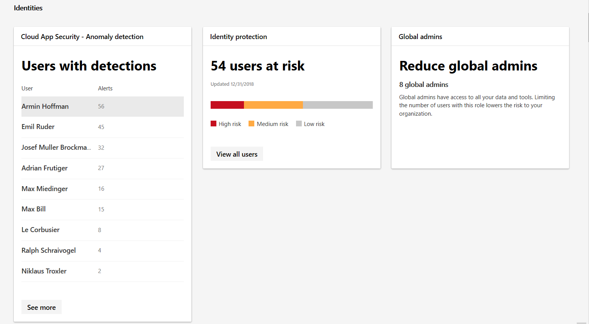
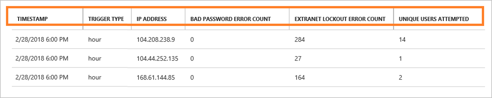

## Build IT awareness

Microsoft 365 security monitoring capabilities help to expand visibility and awareness of potential security breaches. These tools enable you to monitor suspicious activities and observe patterns that could indicate an attempted or successful identity compromise or an internal attack.

### Microsoft 365 security center

The Microsoft 365 security center enables you to monitor the identities in your organization and track suspect or risky behaviors. In the security center Identities category, you can identify:

- User accounts with the most detected anomalies
- Users that Conditional Access policies identify as being at risk
- How many global admins there are in your organization

*Screenshot of the Microsoft 365 security center identities category*

### Azure AD Identity Protection

*Screenshot of Azure AD Identity Protection*

Azure AD Identity Protection helps you discover potential vulnerabilities in your organization’s user identities. It detects potential risks such as leaked credentials, concurrent activities in different locations by a single user, and sign-ins from malware-infected devices, anonymous or suspicious IP addresses, and unknown locations.

### Azure AD Connect Health

Azure AD Connect Health offers insights and visibility of suspicious activity in your on-premises identity infrastructure. It gathers analytics on authentication traffic and reports on the number of failed authentication attempts and their associated IP addresses.

In a hybrid environment, you can use Azure AD Connect to configure federation between on-premises Active Directory Federation Services (AD FS) and Azure AD. Because AD FS provides authentication services, it's important to monitor its authentication traffic for risky events.

*Screenshot of Azure AD Connect Health report*

### Learn more

- [What is Azure Active Directory Identity Protection?](https://docs.microsoft.com/azure/active-directory/identity-protection/overview-v2)
- [What is Azure AD Connect Health?](https://docs.microsoft.com/azure/active-directory/hybrid/whatis-azure-ad-connect#what-is-azure-ad-connect-health)
