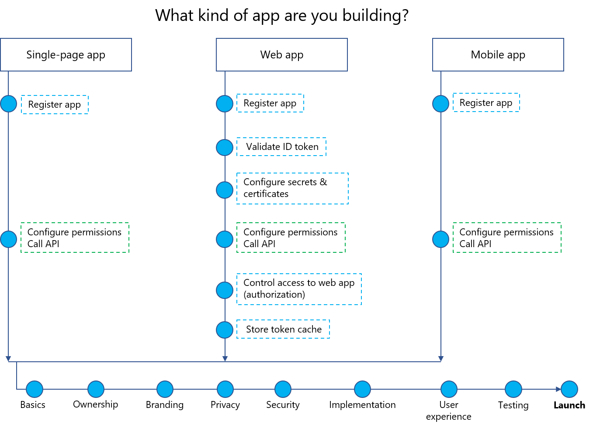

## Help developers become security allies

### The DevOps model

Until recently, identity management, application development, and security operations teams often worked independently. The security team was responsible for ensuring that applications met security requirements once app development was far advanced, or even after launch.

Many organizations have now adopted the DevOps model in which operations, security, and development teams collaborate throughout the development lifecycle. Because IT professionals have traditionally exercised leadership in elevating organization-wide security awareness, they are well positioned to help developers to integrate Azure AD identity services during cloud app design and build.

### The Microsoft identity platform

Organization app developers can use Azure AD identity and access management capabilities to add access control functionality to their applications. These include verifying a user’s group membership, role, or administrative unit membership.

With Microsoft identity platform, developers can build apps that sign in Azure AD identities and call Microsoft application programming interfaces (APIs), such as Microsoft Graph, or custom APIs. Applications registered with Microsoft identity platform can integrate with such Azure AD resources as passwordless authentication, step-up authentication, and Conditional Access.

*App development flowchart shows where to call identity security APIs*

### Learn more

- [Microsoft identity platform (v2.0) overview](https://docs.microsoft.com/azure/active-directory/develop/v2-overview)
