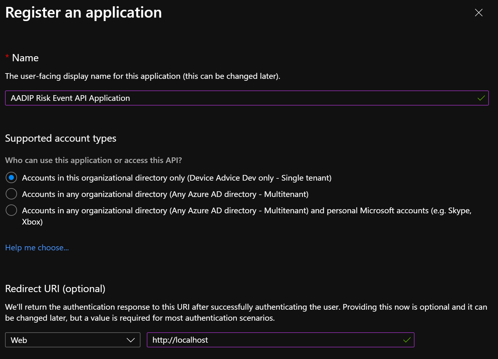
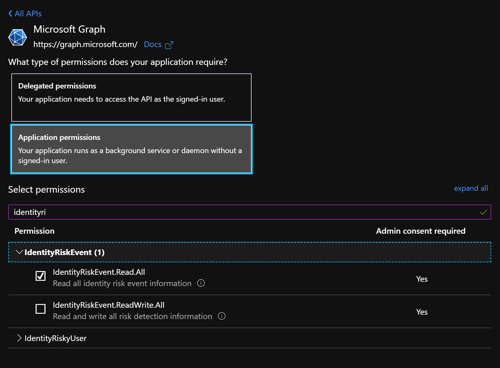
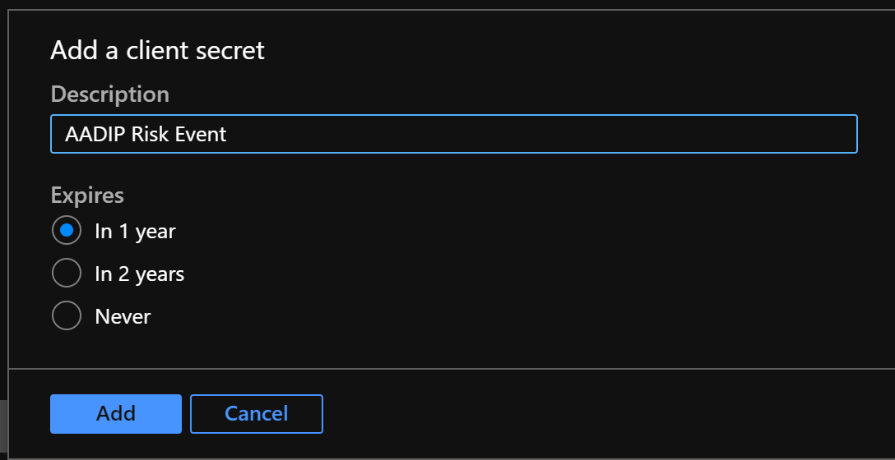
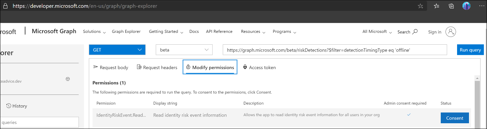
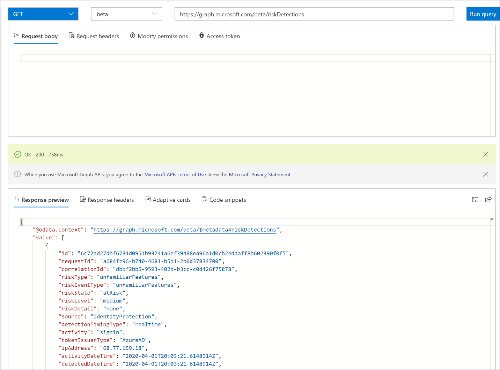

Signals generated by and fed to Identity Protection can be further fed into tools like Conditional Access to make access decisions or fed back to a security information and event management (SIEM) tool for further investigation based on your organization's enforced policies. Microsoft Graph APIs also allow organizations to collect data from Identity Protection for further processing.

Microsoft Graph is the Microsoft unified API endpoint and the home of Azure Active Directory Identity Protection APIs. There are three APIs that expose information about risky users and sign-ins. 
- The first API, riskDetection, allows you to query Microsoft Graph for a list of both user and sign-in linked risk detections and associated information about the detection. 
- The second API, riskyUsers, allows you to query Microsoft Graph for information about users that Identity Protection detected as risk. 
- The third API, signIn, allows you to query Microsoft Graph for information on Azure AD sign-ins with specific properties related to risk state, detail, and level. 

To query Azure AD IP APIs, an application must be created within Azure AD with the appropriate permissions:
1.	Start by registering an application with [redirect uri](http://localhost?azure-portal=true).

     

2.	Select API permissions under the newly registered application. Select **Microsoft Graph and Application permissions**. Then select the **IdentityRiskEvent.Read.All permission**:
   
     

3.	Once the permissions are provided to the application, select **Certificates & secrets** and create a new **client secret** with **1 year** expiration.

     

With the information collected from these steps, you can now collect information on the Azure AD Identity Protection events of your users. The following script is a sample PowerShell script for collecting identity risk detections:

```azurepowershell
$ClientID       = "<your client ID here>"        # Should be a ~36 hex character string; insert your info here
$ClientSecret   = "<your client secret here>"    # Should be a ~44 character string; insert your info here
$tenantdomain   = "<your tenant domain here>"    # For example, contoso.onmicrosoft.com

$loginURL       = "https://login.microsoft.com"
$resource       = "https://graph.microsoft.com"

$body       = @{grant_type="client_credentials";resource=$resource;client_id=$ClientID;client_secret=$ClientSecret}
$oauth      = Invoke-RestMethod -Method Post -Uri $loginURL/$tenantdomain/oauth2/token?api-version=1.0 -Body $body

Write-Output $oauth

if ($oauth.access_token -ne $null) {
        $headerParams = @{'Authorization'="$($oauth.token_type) $($oauth.access_token)"}

        $url = "https://graph.microsoft.com/beta/identityRiskEvents"
        Write-Output $url

        $myReport = (Invoke-WebRequest -UseBasicParsing -Headers $headerParams -Uri $url)

        foreach ($event in ($myReport.Content | ConvertFrom-Json).value) {
            Write-Output $event
        }

} else {
        Write-Host "ERROR: No Access Token"
}
```

You can also leverage the Microsoft Graph Explorer to query the same information. When you first log in to the Graph Explorer, you're required to accept permissions to run queries. If you had previously accepted the permissions, you can find the new IdentityRiskEvent read permissions under Modify permissions:
  
  

Once you have approved the permissions for Azure AD IP Protection APIs provided to the previously created application, you can run a query to pull the API data. For example, selecting **Get, beta**, and typing **https://graph.microsoft.com/beta/riskDetections** will provide all the risk detections that Azure AD Identity Protection has discovered:

   

The following sections provide two sample scenarios and queries you can leverage.

### Get offline risk detections (riskDetection API)

With Identity Protection sign-in risk policies, you can apply conditions when risk is detected in real time. But what about detections that are discovered offline? To understand what detections occurred offline, and therefore would not have triggered the sign-in risk policy, you can query the riskDetection API.

`GET https://graph.microsoft.com/beta/riskDetections?$filter=detectionTimingType eq 'offline'`

### Get users who successfully passed an MFA challenge triggered by risky sign-ins policy (riskyUsers API)

To understand the impact Identity Protection risk-based policies have on your organization, you can query all the users who successfully passed an MFA challenge triggered by a risky sign-ins policy. This information can help you understand which users Identity Protection may have falsely detected at as risk and which of your legitimate users may be performing actions that the AI deems risky.

`GET https://graph.microsoft.com/beta/riskyUsers?$filter=riskDetail eq 'userPassedMFADrivenByRiskBasedPolicy'`

