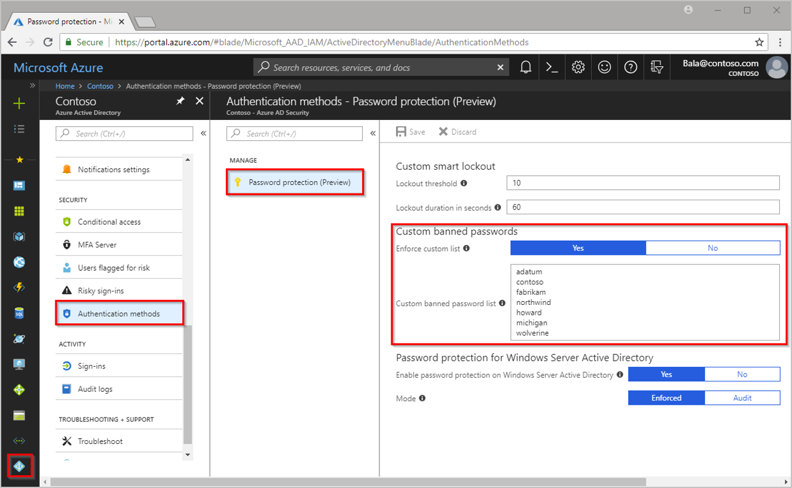

# Increase user security awareness

## Business use case

When Christina creates a new password, Azure AD password protection automatically prevents her from picking commonly used weak or compromised passwords. You can add words to the banned password list. This helps Christina comply with the organization’s best practices when she resets her password.

## Elevate users' awareness

With Azure AD, you can make it easier for users to adhere to organization security policies while elevating their awareness of identity security best practices. You can use several methods to accomplish this goal:

- **Enable user self-service password reset.** Use Azure AD self-service password reset (SSPR) to allow users to unlock their passwords or accounts without help desk intervention. SSPR tracks when users reset their passwords and alerts you of any misuse.
- **Prevent users from choosing weak passwords.** Use Azure AD password protection to guide users towards choosing more secure passwords. You can customize the default banned password list to ensure that users exclude the organization’s name, location, products, branding, or other terms from their passwords.
- **Transition to passwordless authentication.** Shift users toward a simple and secure sign-on experience with passwordless authentication. For example, by using the Microsoft Authenticator app users won’t need to enter a password to sign in to any Azure AD-synced account on their mobile devices.

*Screenshot of banned password list in Azure AD password protection*

## Resources

- [How it works: Azure AD self-service password reset](https://docs.microsoft.com/azure/active-directory/authentication/concept-sspr-howitworks)
- [Eliminate bad passwords in your organization](https://docs.microsoft.com/azure/active-directory/authentication/concept-password-ban-bad)
- [What is passwordless?](https://docs.microsoft.com/azure/active-directory/authentication/concept-authentication-passwordless#microsoft-authenticator-app)
