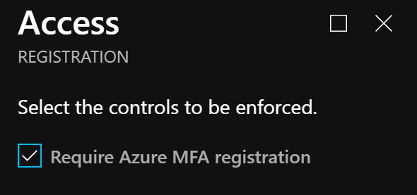
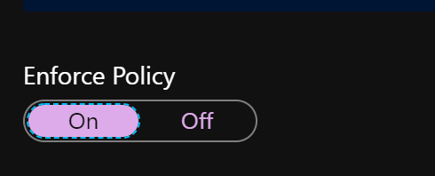
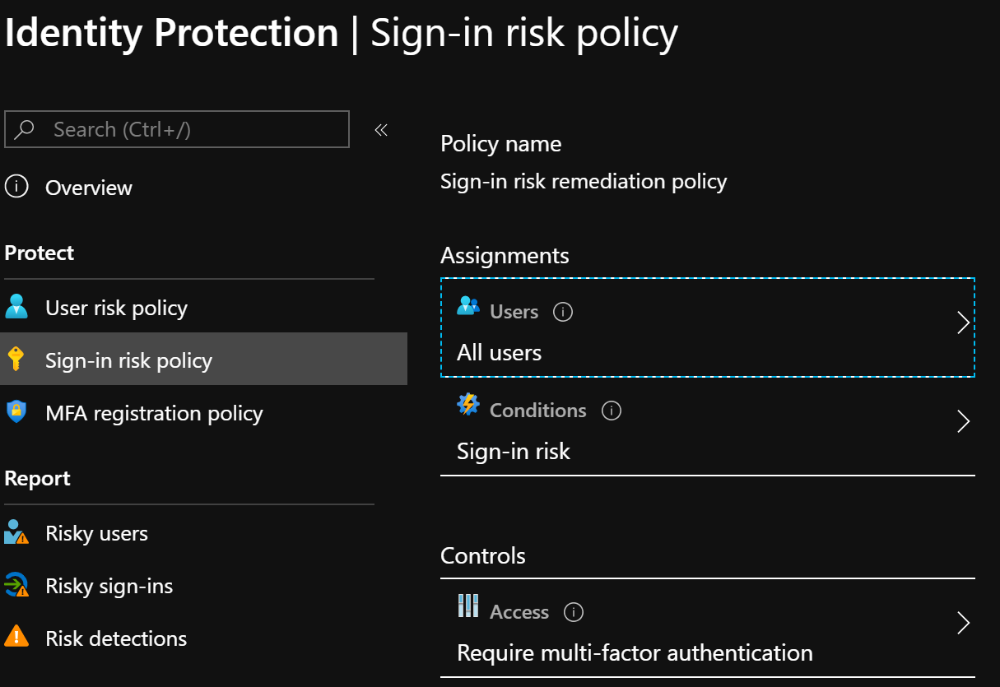
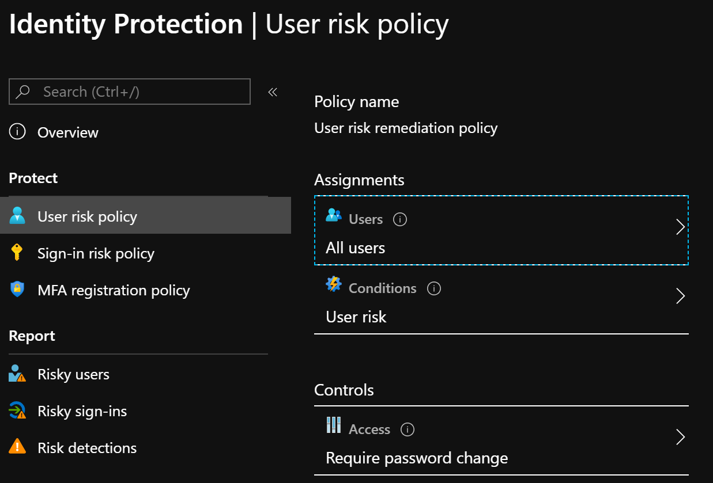
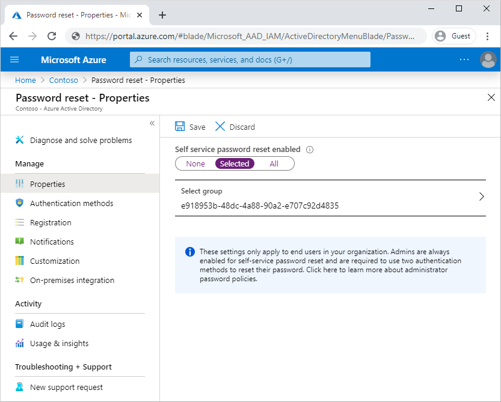
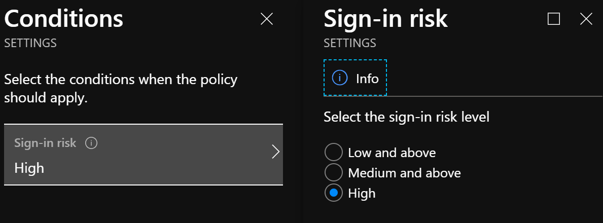
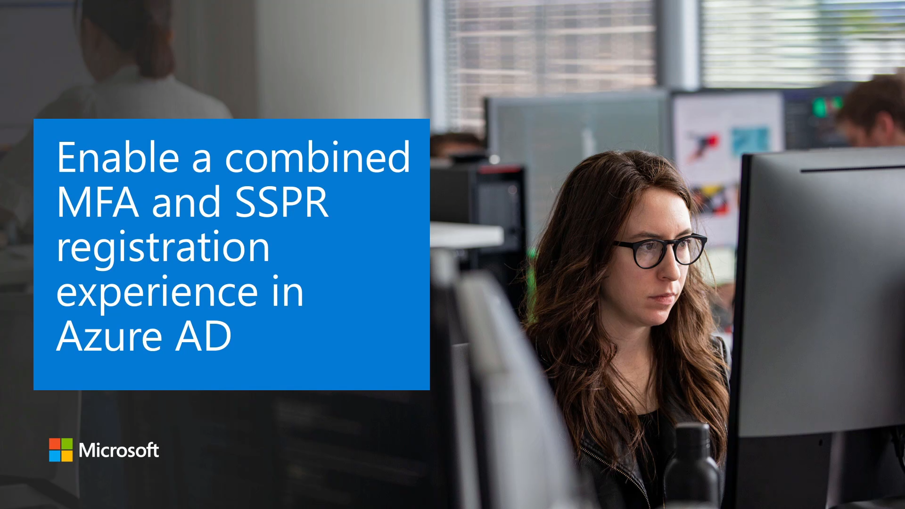

Enabling the Identity Protection policy requiring multi-factor authentication registration and then targeting all users ensures they can use Azure MFA to self-remediate in the future. Configuring this policy provides users a 14-day period to register.  At the end of the 14-day period, all users are required to register.

To enable the policy:

1. Open the Azure AD Identity Protection blade in the Azure portal, and select **MFA registration policy**:

     

2. By default, the Access control to require MFA registration will be enabled. Leave this option selected.

     

3. Select **On** under **Enforce Policy** to require users to register for MFA.

     

At sign-in to any Azure AD-integrated application, the user gets a notification about the requirement to set up the account for multi-factor authentication. This policy is also triggered in the Windows 10 Out-of-Box Experience for new users with a new device.

  

An administrator can configure a policy for sign-in risks in the Azure AD Identity Protection blade, which requires users to verify their identity through MFA.
  
 

## The user experience

Affected users are notified when they try to sign in and trigger a policy, for example, when the user is informed that something unusual was detected about their sign-in, such as signing in from a new location, device, or app.

  

The user is then required to prove their identity by completing Azure MFA with one of their previously registered methods.

## Forcing password changes

User risk policies in Azure AD Identity Protection allow you to require a password change based on risk.

 

To improve the experience, you can enable self-service password reset so users can complete this process without help desk involvement. In the Azure Active Directory portal, you can configure self-service password reset for no one, a set of Azure AD groups, or the entire organization.

  

Then, when a user affected by the user risk policy is informed that their account security is at risk because of suspicious activity or leaked credentials, they are prompted to prove their identity though Azure MFA and forced to change their password.

  

Both sign-in and user Azure AD Identity Protection risk policies allow the configuration of risk levels that trigger the additional verifications noted above. Risk levels in Identity Protection are based on the precision of the detection and powered by Microsoft’s machine learning. To customize what experience users are presented, administrators can include/exclude certain users/groups from the User Risk and Sign-In Risk Policies. Administrators cannot change what “triggers” result in high, medium, or low risks.

  

Now that you’ve read about creating security best practices, let’s walk through the experience of enabling a combined multi-factor authentication and self-service password reset registration for your end users.

### Explore how to enable a combined MFA and SSPR registration experience in Azure AD

View a [video version](https://www.microsoft.com/videoplayer/embed/RE4C7zQ) of the interactive guide (captions available in more languages).

  

Be sure to click the full-screen option in the video player. When you're done, use the **Back** arrow in your browser to come back to this page. 
