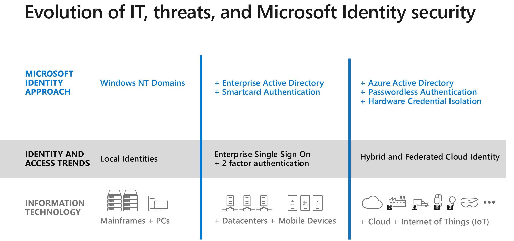

In the past, IT secured the perimeter around the physical corporate network, like guards protecting the walls of a castle. With today’s mobile devices, cloud computing, and Internet of Things (IoT), identity and access management must secure on-premises and cloud identities and manage access to sensitive information inside and outside the corporate network. 

Microsoft first addressed identity and access management with Windows NT Domains to consolidate on-premises accounts. Later it developed Active Directory, smartcard authentication, and support for third party multi-factor authentication (MFA).  

Threats such as sophisticated credential theft, social engineering, and password database compromises, have increased risk to your users’ identities.

Microsoft 365 takes a comprehensive approach:  

- Azure Active Directory (Azure AD) for unified identity management to manage and secure single sign-on at scale.  
- Passwordless authentication, such as integrated phone authentication (Microsoft Authenticator) and biometrics (Windows Hello), for user convenience and productivity.
- Hardware credential isolation, such as trusted platform module (TPM) and security keys for simple and secure authentication on shared devices.
