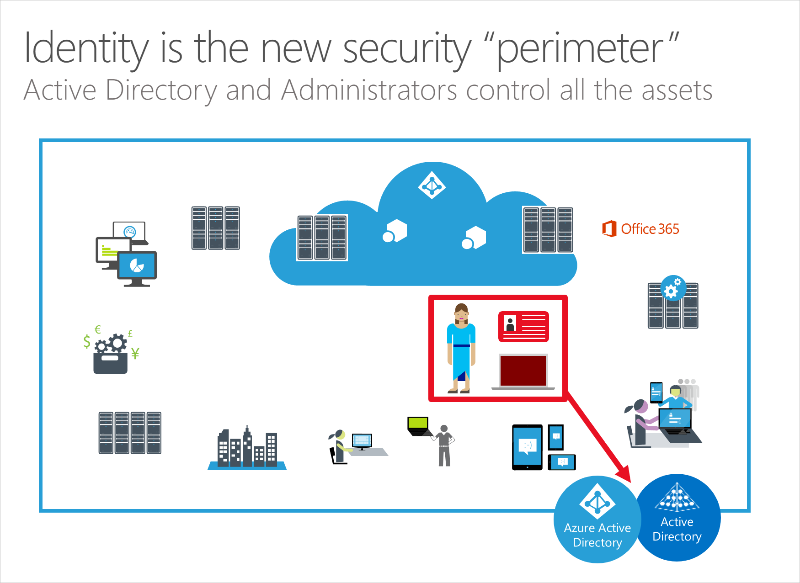

Whether your assets are hosted on-premises or in the cloud, the security **perimeter** that separates users and data from outside threats can no longer be drawn using network lines. The perimeter is now drawn by identity components of authentication and authorization that span across all your devices, services, hosts, and networks.

While the network perimeter keeps a basic security role, it can no longer guide the security defense strategy because:

- Adversaries have demonstrated a consistent and ongoing ability to penetrate network perimeters using phishing attacks.
- Organizational data, devices, and users often exist and operate outside traditional network boundaries (whether sanctioned by IT or not).
- Port and protocol definitions and exceptions have failed to keep up with the complexity of services, applications, devices, and data.

Organizations need to adopt different security philosophies and mindsets that are based on rigorous management of authentication and authorization, not firewall rules and exceptions.

Administrators are in control and need protection. The most important identities to protect are the administrators of on-premises and cloud systems, especially identity systems like Active Directory and Azure Active Directory. These administrators have access to all the data hosted on their systems and should be protected, monitored, and restricted appropriate with their high level of responsibility.
