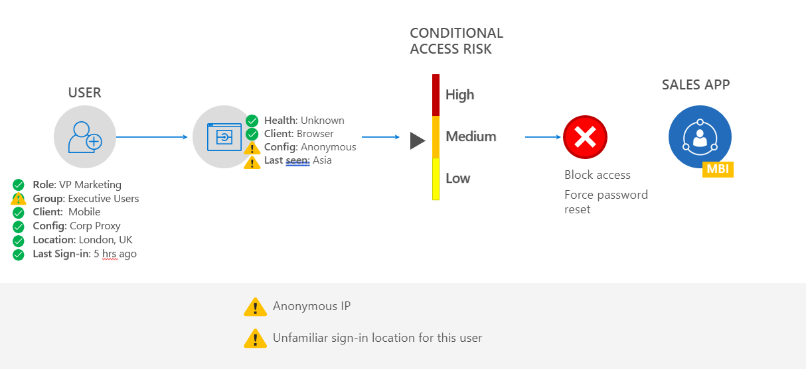

# A modern identity and access management strategy 

Christina is a division VP at Contoso and travels frequently to visit the five offices that she manages across the US, UK, Canada, and parts of China. She handles highly sensitive information via connecting to corporate assets from unknown wireless networks. Classic security protocols assumed a castle under siege approach from hackers. However, Christina is out in the field and needs the same protection as though she were working in her corporate office.  Her company needs security that understands her typical behavior as a user and detects when her user or device risk is elevated. If Christina’s user credentials or device are compromised, how can IT automatically enforce additional layers of authentication to keep the organization safe? 

## Identity is the new perimeter 

Identity is the new central defense and point of control. It secures your organization’s data across multiple applications, locations, and devices while delivering a comprehensive identity and access management strategy.   

The corporate network remains the initial defense system, but now there’s an additional layer of protection, a personal set of armor, tied directly to your users’ personal data and behaviors.   

Using identity as the new control plane ensures that each time users attempt to access data from the network, their personal and device data are reviewed and authenticated.  

Suppose Christina attempts to access corporate resources via her registered device.  Azure AD monitors her typical user data and validates her device based on your policy configuration to determine that this access would have a low business impact (LBI) to the network.  

Suppose Christina attempts to access the network on a device through an anonymous IP address that is outside of her expected location. Based on your policy configuration, Microsoft 365 can detect an elevated medium business impact (MBI) and require Christina to independently confirm and authenticate her identity through an alternate method, such as multi-factor authentication.   

If the device itself is compromised, as shown above, Microsoft 365 will judge it not healthy enough to access the network.  

Microsoft 365 responds to the detected access risk: 

•	Microsoft Defender can detect and remediate health threats (such as malware) on the device.  

•	Microsoft Intune can send remediation instructions to Christina guide her towards removing the problem. 
