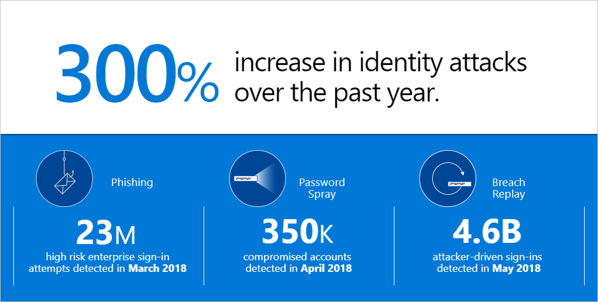
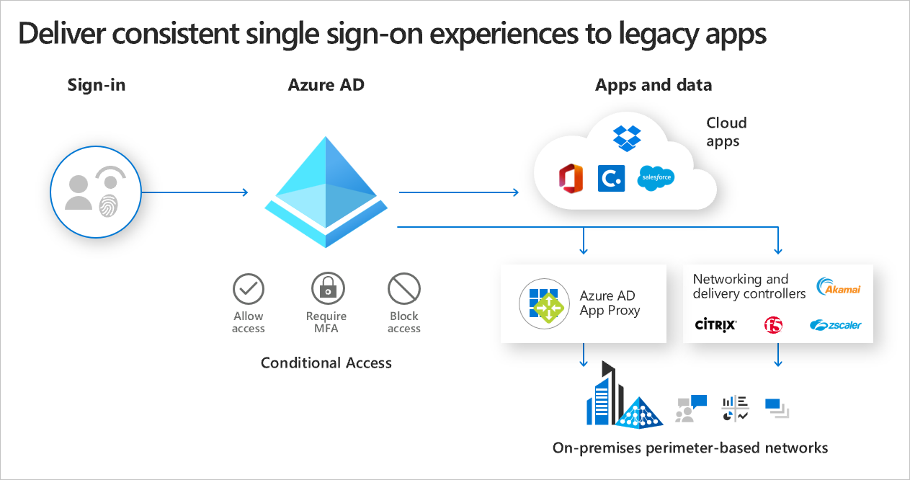

Today, analyst firms report that the average enterprise’s employees collectively use more than 300 software-as-a-service applications (and some estimates are much higher). That number is rapidly expanding. Between the hyper-growth of these apps, the rate at which they change and the business demand to harness new cloud capabilities for business transformation, it’s challenging to keep up. Relying on an on-premises identity solution as the control point makes connecting to all these cloud applications a nearly impossible task. If you include all the user devices, guest accounts, and connected objects,  you have a management and security nightmare.

With cloud-based identity as the control point, you can help users be more productive by providing access to apps and devices that are on-premises or in the cloud from virtually anywhere and do so with incredible agility. Whether you’re just getting started on your cloud journey or want to accelerate your identity modernization, Azure AD can help you connect all your applications to achieve your business productivity and security goals.

