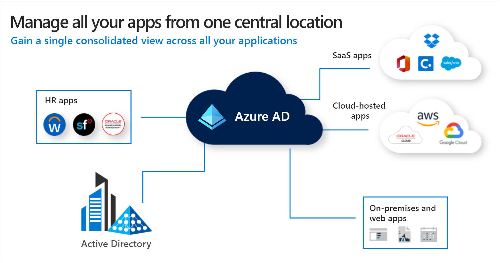

**Azure Active Directory (Azure AD)** is Microsoft’s next evolution of identity and access management solutions for the cloud. Microsoft introduced Active Directory Domain Services in Windows 2000 to give organizations the ability to manage multiple on-premises infrastructure components and systems using a single identity per user. Azure AD takes this approach to the next level by providing organizations with an Identity as a Service (IDaaS). Azure Active Directory (Azure AD) helps your employees sign in and access:

- External resources, such as Microsoft Office 365, the Azure portal, and thousands of other SaaS applications.
- Internal resources, such as apps on your corporate network and intranet, along with any cloud apps developed by your own organization.

Most IT administrators are familiar with Active Directory Domain Services concepts. The following table outlines the differences and similarities between Active Directory concepts and Azure Active Directory.

|Concept   | Active Directory  | Azure Active Directory  |
|---|---|---|
| **Users**  |   |   |
| Admin management  | Organizations will use a combination of domains, organizational units, and groups in AD to delegate administrative rights to manage the directory and resources it controls.  | Azure AD provides built-in roles with its role-based access control (RBAC) system, with limited support for creating custom roles to delegate privileged access to the identity system, the apps, and resources it controls. Managing roles can be enhanced with Privileged Identity Management (PIM) to provide just-in-time, time-restricted, or workflow-based access to privileged roles.
|
| Credential management  | Credentials in Active Directory is based on passwords, certificate authentication, and smartcard authentication. Passwords are managed using password policies that are based on password length, expiry, and complexity.  | Azure AD uses intelligent password protection for cloud and on-premises. Protection includes smart lockout plus blocking common and custom password phrases and substitutions. Azure AD significantly boosts security through multi-factor authentication and passwordless technologies, like FIDO2. Azure AD reduces support costs by providing users with a self-service password reset system.|
|  **Apps** |   |   |
| Infrastructure apps  | Active Directory forms the basis for many infrastructure on-premises components, for example, DNS, DHCP, IPSec, WiFi, NPS, and VPN access.  | In a new cloud world, Azure AD is the new control plane for accessing apps versus relying on networking controls. When users authenticate, conditional access (CA) will control which users will have access to which apps under required conditions.  |
|  SaaS apps | Active Directory doesn't support SaaS apps natively and requires federation systems, such as AD FS.  | SaaS apps supporting OAuth2, SAML, and WS-* authentication can be integrated to use Azure AD for authentication.  |
| **Devices** |   |   |
| Mobile  | Active Directory doesn't natively support mobile devices without third-party solutions.  | Microsoft’s mobile device management solution, Microsoft Intune, is integrated with Azure AD. Microsoft Intune provides device state information to the identity system to evaluate during authentication.  |
| Windows desktops | Active Directory provides the ability to domain join Windows devices to manage them using Group Policy, System Center Configuration Manager, or other third-party solutions.  | Windows devices can be joined to Azure AD. Conditional access can check if a device is Azure AD joined as part of the authentication process. Windows devices can also be managed with Microsoft Intune. In this case, conditional access, will consider whether a device is complaint (for example, up-to-date security patches and virus signatures) before allowing access to the apps.  |

With Microsoft's access and information protection solutions, you can deploy and configure access to corporate resources across your on-premises environment and cloud applications. And you can do it while protecting corporate information. The following are scenarios provided by the latest identity and access technologies:

- Secure access to company resources from any location on any device
- Join to Workplace from Any Device for SSO and Seamless Second Factor Authentication Across Company Applications
- Manage Risk with Additional Multi-Factor Authentication for Sensitive Applications
- Manage Risk with Conditional Access Control
- Configure Certificate Enrollment Web Service for certificate key-based renewal on a custom port
