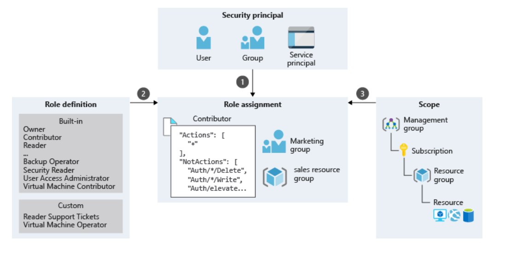

# Single sign-on overview 

## Business use case 

Christina has a desktop at the office, but while traveling for work, Christina signs into her Surface laptop, iPhone, Surface, Office 365 apps, Salesforce, and a handful of custom on-premises apps and databases. She also uses Spotify, WhatsApp, and Netflix when she is on the road. She knows it’s not safe to use the same password, but she can’t keep track of a dozen highly secure credentials, so she often reuses the same password. How would you enable Christina to sign in once with one account to access domain-joined devices, company resources, SaaS and web applications?  

## What is single sign-on 

Single sign-on (SSO) is an authentication process for a single-entry access to access domain-joined devices, company resources, software as a service (SaaS) applications, and web applications. Administrators can centralize user account management, and automatically add or remove user access to applications based on group membership. 

### Plan an SSO deployment 

Before you deploy SSO in your organization, you should:  

* Determine how end-users will access their SSO-enabled applications, provision SaaS cloud apps, and craft your communications to match your selection. 

* Determine whether cloud authentication or federated authentication is the best method for your organization. The authentication method is a critical component of an organization’s presence in the cloud because it controls access to all cloud data and resources.  

Plan your SSO configuration. For example, you can: 

* Support applications that require multiple sign-in fields 

* Customize the labels of username and password fields 

* Allow a business group member to assign specified usernames and passwords to users. 

* Plan role-based access 

## What is role-based access 

Role-based access control (RBAC) is an authorization system that helps you manage who has access to which Azure resources, what they can do with those resources, and what areas they have access to. RBAC allows you to segregate duties within your organizations and grant only the amount of access to users that they need to perform their jobs. You control access to your resources using RBAC by creating role assignments that define a security principle (identity), role definition (a series of permissions), and scope (who, what, where). 

## Role definition and scope 

A role definition is a collection of permissions that lists the operations that can be performed, such as read, write, and delete. Roles can be high-level, like owner, or specific, like virtual machine reader. 

A scope is the defined list of resources the role has access.  This is helpful when you want to make someone a website contributor, but only for one resource group. 

In the following example, the Marketing group has been assigned the Contributor role at the sales resource group scope. 

 

# Learn more 

[Understand role definitions for Azure resources]()