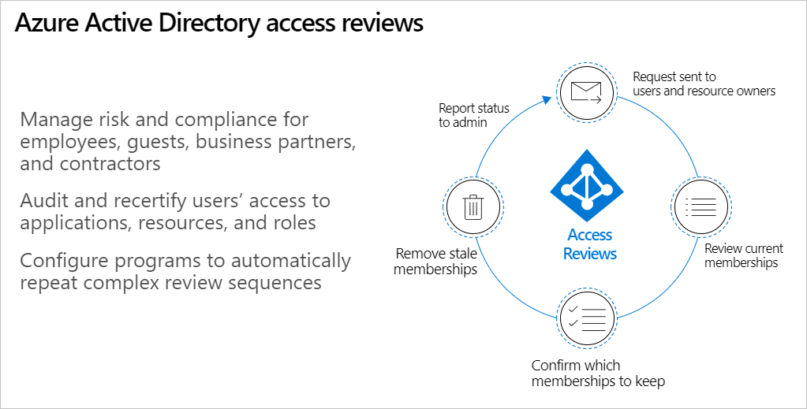

Azure Active Directory (AD) lets you collaborate internally as well as externally. Users can join groups, invite guests, connect to cloud apps, and work remotely from their work or personal devices. The convenience of self-service however, has led to a need for better access management capabilities.

How do you:

- Ensure new employees have the right access to be productive?
- Ensure access is removed when people—especially guests—leave or change teams? 
- Ensure access rights aren't excessive, which can indicate a lack of control over access and lead to audit findings?
- Engage with resource owners to ensure they regularly review who has access to their resources?

To help you address these questions, Azure AD has developed a capability called **access reviews**.

Azure AD access reviews help you recertify and audit users' access to resources,  ensuring that their access is appropriate and reviewed on a regular basis.  Access reviews enable organizations to efficiently address excess access risks and provide more visibility about them to users in departments beyond IT.  If you're only concerned about guests, then access reviews make it easy to scope the review for guests only.

To understand how Azure AD access reviews help you manage access, consider four sets of users:

- **Members of Office groups**. Office 365 users can create as many groups as they wish. Access reviews allow you to manage membership of those groups.
- **Members of security groups**. Access reviews help you manage users both cloud-only or synchronized from on-prem to cloud who should or shouldn't be in a group.
- **Users who have been directly assigned to an application**.
- **Guest users**. If you're only concerned about guests who have been invited to your directory, we make it easy to scope the review to be on guests only.

## Flexibility in reviewer assignments

Azure AD access review provides flexibility in how you assign the reviewers.  You can assign the owners of a group directly so they can review the access of a group.  Or you can select multiple specific individuals as reviewers.

## When to use access reviews

Azure AD Access Reviews can be used in a variety of circumstances:

- **Too many users in privileged roles**. It's a good idea to check how many users have administrative access, how many of them are Global Administrators, and if there are any invited guests or partners that have not been removed when their tasks are complete.
- **When automation is not feasible**. You can create rules for dynamic membership in security groups or Office 365 Groups. But sometimes HR data is not in Azure AD, or users still need access after leaving the group. You can then create a review of that group to ensure those who still need it have continued access.
- **When a group is repurposed**. If you have a group that is going to be synced to Azure AD, it would be useful to ask the group owner to review the group membership prior to the group being used in a different risk context.
- **For business critical data access**. For certain resources, you might require people outside of IT to regularly sign out and justify why they need continued access.
- **To maintain a policy's exception list**. As the IT administrator, you can manage policy exceptions, avoid policy error exceptions, and provide auditors with proof that these exceptions are reviewed regularly.
- **To confirm group owners still need guests in their groups**. Employee access might be automated with some on-premises access management, but that’s not the case for guests. If a group gives guests access to business sensitive content, then it's the group owner's responsibility to confirm the guests still have a legitimate business need for access.

You can set up recurring access reviews of users at set frequencies such as weekly, monthly, quarterly, or annually, and the reviewers will be notified at the start of each review. A user-friendly interface and smart recommendations make approving or denying access easy. 
