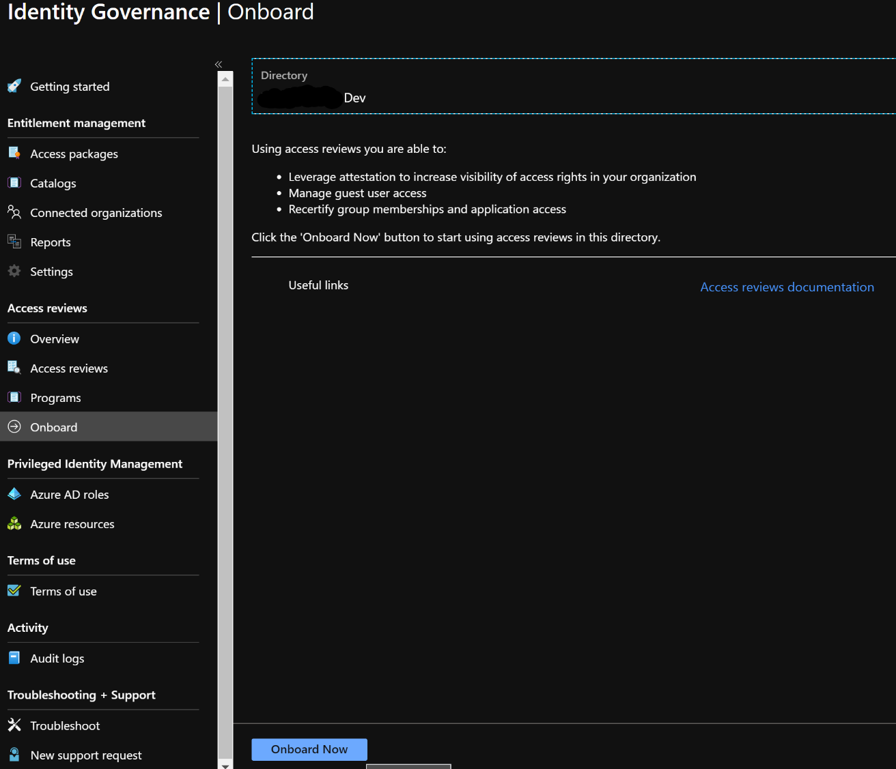
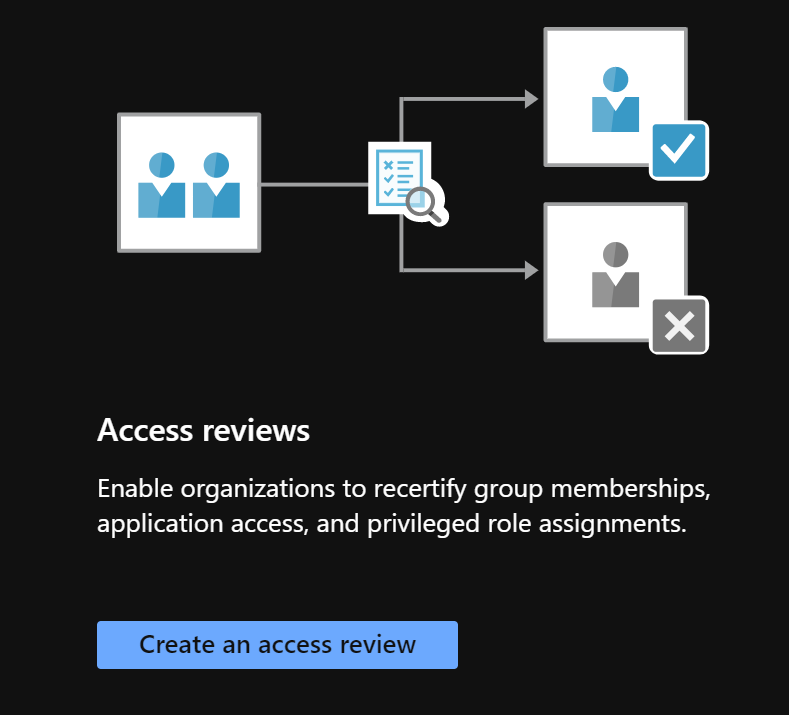
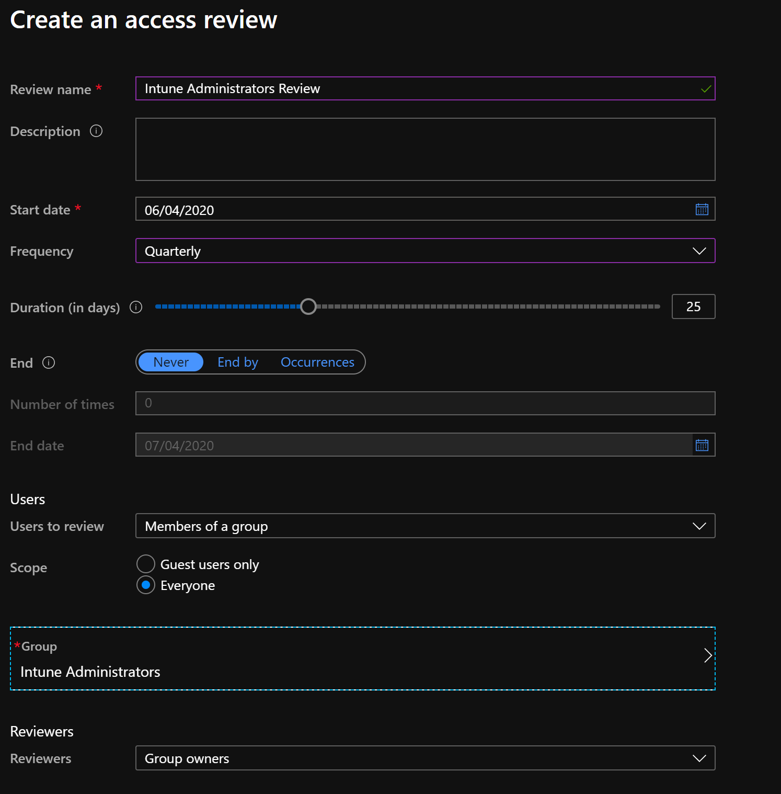
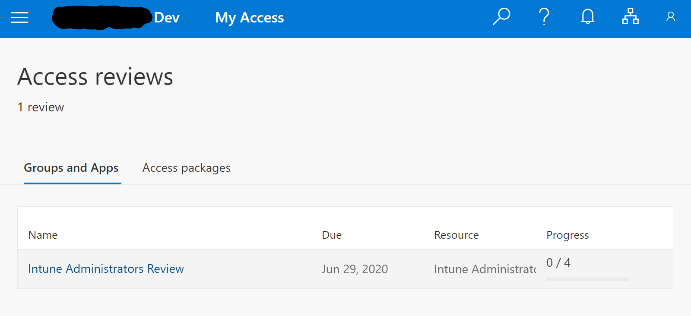
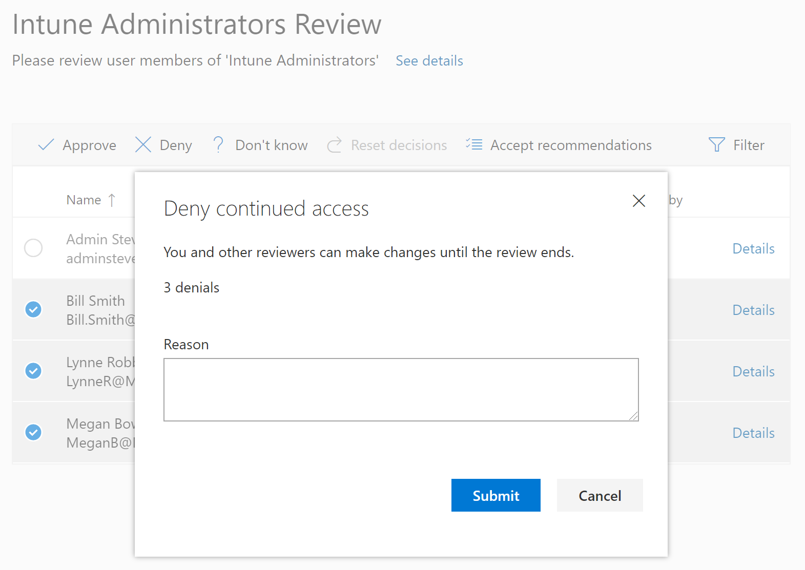
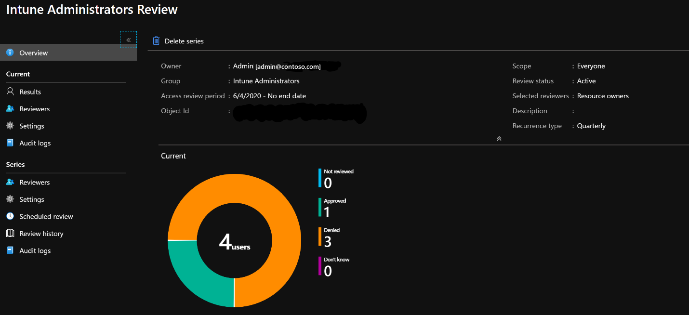

With Azure Active Directory (Azure AD), you can easily ensure that users have appropriate access. You can ask the users themselves or a decision maker to participate in an access review and recertify (or attest) to users' access. The reviewers can give their input on each user's need for continued access based on suggestions from Azure AD. When an access review is finished, you can then make changes and remove access from users who no longer need it.

## Begin an access review

To begin an access review, select the Azure AD group or application you want to manage access to. Decide whether you want individual users to review their own access, or one or more users review access for everyone. Then:

1. Navigate to the **Identity Governance** page.

   

2. If this is your first time using access reviews, select **Onboard** and **Onboard Now**.

   

3. Select **Create an access review** from the Getting started page

   

4. On the Access Review screen, provide a **name**, **Start date**, **frequency/duration**, and **end date**. These settings will apply to either members of a group or users assigned to an application. Select the group or application along with the reviewers:

   

5. Once the review is created, the access review will initialize and then start on the assigned date. 

   

6. Reviewers assigned to the access review will receive an email from Microsoft, prompting them to review access:

   

7. On the Access review page, they can select either the groups and apps that require access reviews, or the access packages:

   

8. Once the reviewer has opened the access review, they are able to approve or deny the access. Here three users are selected and denied for access to the Intune Administrators group:

   

9. The Identity Governance access review pane then updates with the results of the access review, and users denied access are removed from the group.

   
