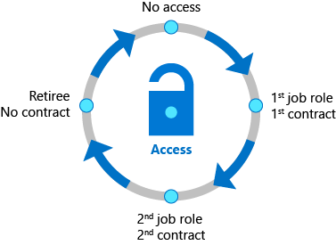

Lifecycle management is the foundation for identity governance. Effective governance at scale requires modernizing the identity lifecycle management infrastructure for applications. 

 

Identity governance adjusts permissions as users pass through different phases in their jobs, such as new roles and new projects. Identity governance allows you to automate the identity lifecycle to save costs as users join or leave groups.  

Access Lifecycle 

Organizations need a streamlined process to manage access beyond what was initially provisioned for a user identity. You need to develop and enforce access policy and controls on an ongoing basis. 

  

You can use Conditional Access to validate a user’s current role against your organization’s access policy.  You can regularly review users’ access rights by using Azure AD access reviews. 

## Learn More 

- [Azure AD access reviews](https://docs.microsoft.com/azure/active-directory/governance/access-reviews-overview)
