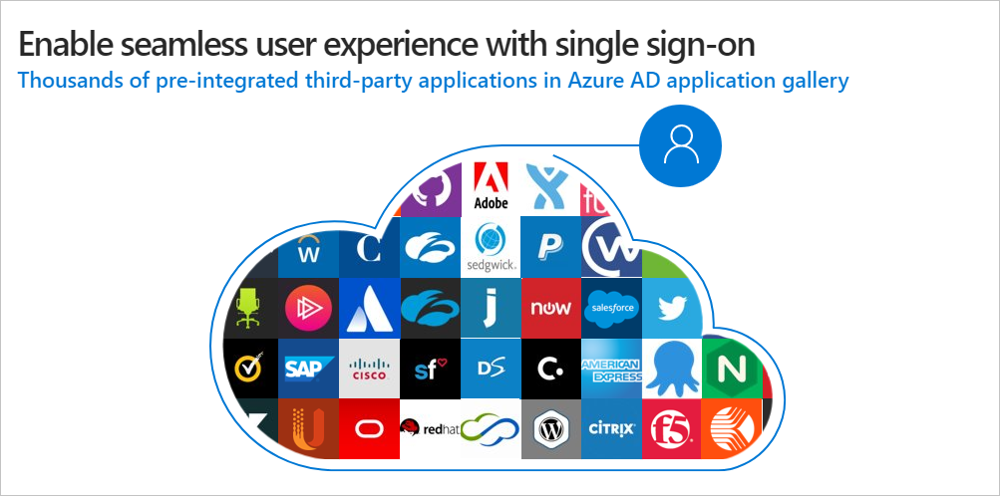

## Sign on seamlessly to all connected apps

Single sign-on (SSO) adds security and convenience for signing onto applications in Azure Active Directory (Azure AD). 

**With single sign-on**, users sign on once to access domain-joined devices, company resources, software as a service (SaaS) applications, and web applications. After signing on, the user can launch applications from the Office 365 portal or the Azure AD MyApps access panel. Administrators can centralize user account management and automatically add or remove user access to applications based on group membership.

**Without single sign-on**, by contrast, users must remember application-specific passwords and log into each application individually. IT staff needs to create and update user accounts for each application such as Office 365, Box, and Salesforce. 

## Configure single sign-on

There are several ways to configure an application for single sign-on, depending on how the application is configured for authentication.

- Cloud applications use OpenID Connect, OAuth, SAML, password-based, linked, or disabled methods for single sign-on.
- On-premises applications use password-based, Integrated Windows Authentication, header-based, linked, or disabled methods for single sign-on. The on-premises choices work when applications are configured for Application Proxy. Azure AD Application Proxy is a feature of Azure AD that supports SSO and enables users to access on-premises web applications from a remote client, removing the need for a VPN or a reverse proxy. 
