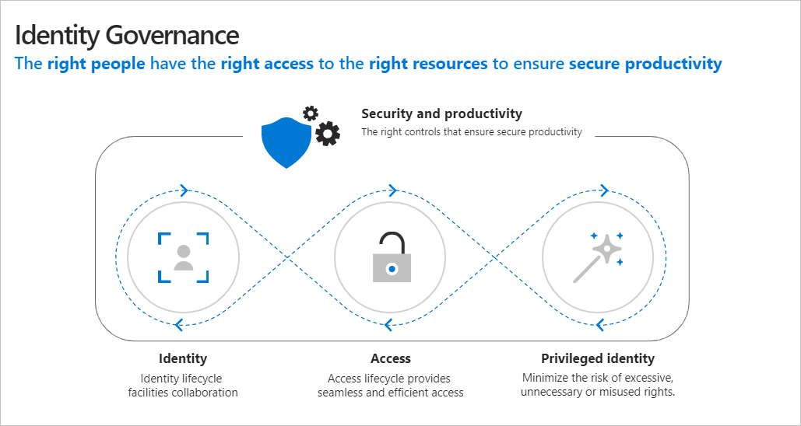
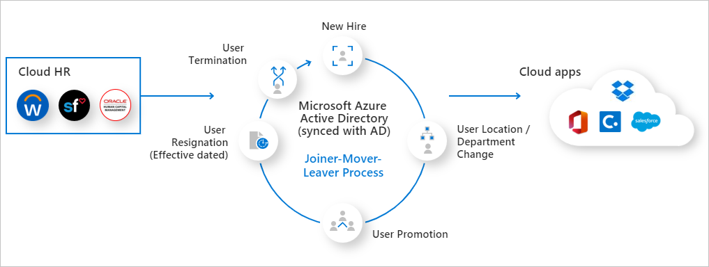

Azure Active Directory (Azure AD) Identity Governance allows you to balance your organization's need for both security and employee productivity. Azure AD ensures the right people have the right access to the right resources. Azure AD and Enterprise Mobility + Security features allow you to mitigate access risk by protecting, monitoring, and auditing access to critical assets -- while ensuring employee and business partner productivity.

Access is easy to grant but much harder to keep track of. Not only do you need to track who is given access to what resources, you also need to be able to revoke access in a timely manner when it is no longer needed. Plus, access controls should apply to both internal and external users.

Azure AD Identity Governance helps manage access using the following capabilities:

- Ensuring that only authorized users have access based on policies.
- Providing employees and guest users with workflows to request access.
- Establishing regular access reviews to validate if access if still needed.
- Establishing effective controls with time-limited access for privileged roles assignments.

### Explore how to enable business-to-business collaboration in Azure AD

View a [video version](https://www.microsoft.com/videoplayer/embed/RE4ChU3) of the interactive guide (captions available in more languages).

  

Be sure to click the full-screen option in the video player. When you're done, use the **Back** arrow in your browser to come back to this page. 

Identity Governance helps organizations achieve a balance between productivity and security.  Just as important as how quickly can a new person access the resources they need, is how should that person’s access change when they leave. Identity lifecycle management is the foundation of Identity Governance. And effective governance at scale requires modernizing the identity lifecycle management infrastructure for applications.

