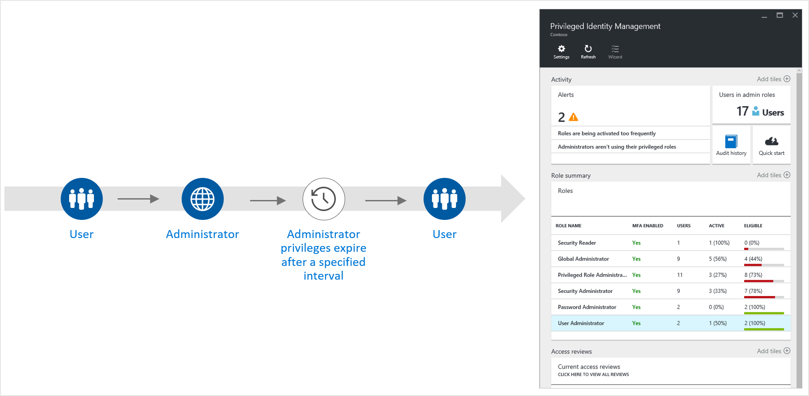
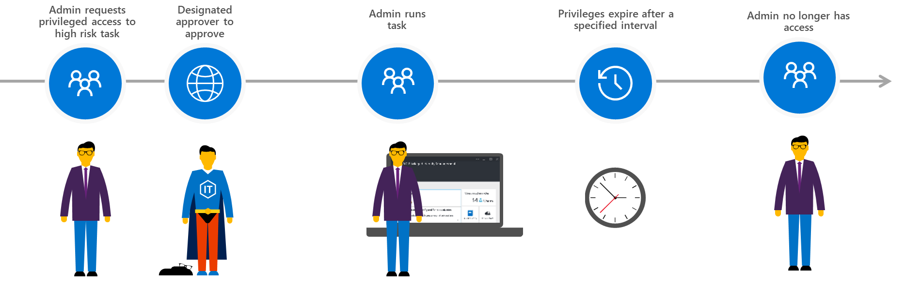

Administrator accounts often have perpetual rights to perform sensitive tasks. If a privileged account is ever compromised or misused, a malicious actor has access to confidential resources and configuration settings.

### Manage, control, and monitor role-based access

Azure AD Privilege Identity Management (PIM) enables you to reduce the risk of excessive, unnecessary, or misused access to sensitive data while allowing users to retain privileged access to the information they need to perform their roles. With PIM, you can perform the following actions:

- Allow just-in-time access to privileged roles.
- Limit the access time to files or systems.
- Enforce multi-factor authentication to access data.
- Receive notifications when privileged roles are activated.
- Conduct access reviews to confirm which users still require privileged roles.

For example, you can use PIM to elevate Christina's privileges so she can access sensitive data or configuration settings. Christine can request the privileged access when needed. Each time she requests access, she must obtain approval from another assigned administrator or prove her identity by using multi-factor authentication. You configure PIM so that her privileged access role expires after a fixed time. If attackers steal her credentials, PIM blocks their access attempts.

*With Azure AD Privileged Identity Management you can configure role-based, time-limited administrator privileges*

### Manage task-based access in Office 365

With privileged access management (PAM), you can control who performs administrative tasks in Office 365. PAM helps protect against breaches of accounts that have continuing access to sensitive data or crucial configuration settings. It also helps defend against the vulnerabilities of persistent administrative access, allowing your organization to operate without users having standing privileges.

*With privileged access management you can grant administrators time-limited privileges to complete a high risk task*

For example, suppose Christina wants privileges to create a journal rule in Exchange Online. The journal rule would record and retain certain sent and received emails to fulfill the organization’s compliance requirements.

When you enforce privileged access management, Christina must request just-in-time access to complete the journal rule within a specified time. Once you grant access, the activity is logged in the Office 365 Security and Compliance Center to prevent any unapproved activity from going undetected.

### Learn more

- [What is Azure AD Privileged Identity Management?](https://docs.microsoft.com/azure/active-directory/privileged-identity-management/pim-configure)
- [Privileged access management in Office 365](https://docs.microsoft.com/office365/securitycompliance/privileged-access-management-overview)
