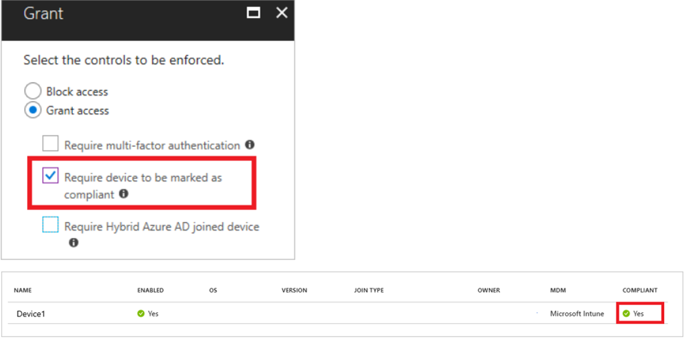

When considering access management for administrator accounts, you must balance security and productivity. Productivity increases when administrators can use supported devices to access your cloud resources. You don't want devices with unknown protection levels to access sensitive resources. You should require that users can only access these resources by using a managed device.

### Ensure that administrators use compliant devices

In Microsoft 365, a managed device is one that is registered with Azure AD. The registered device must be a Hybrid Azure AD joined device or a device marked as compliant.

With Azure AD Conditional Access, you can require administrators to register their mobile devices with Azure AD. You can also configure Microsoft Intune to ensure that administrators' devices meet your organization's compliance policies.

A device that Azure AD marks as compliant ensures that it:

- Is managed by your organization.
- Complies with company security requirements.

*Conditional Access control granting access to a compliant device*

### Learn more

- [How To: Require managed devices for cloud app access with Conditional Access](https://docs.microsoft.com/azure/active-directory/conditional-access/require-managed-devices)
- [Set rules on devices to allow access to resources in your organization using Intune](https://docs.microsoft.com/intune/device-compliance-get-started)
