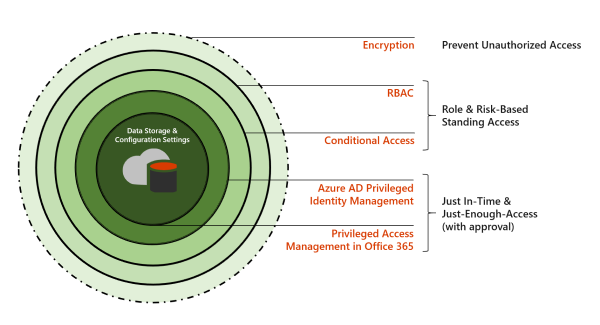

## Enhance security for administrator accounts

### Business use case

As a senior manager, Christina has administrator privileges. She occasionally needs to access the HR database to review the personnel records of her direct reports. If someone steals her credentials, that information is at risk. You must increase security measures on Christina’s account to protect employee data against unauthorized access.

### Methods for enhancing security

Microsoft 365 security architecture provides an integrated and layered approach to securing administrator accounts. The following are best practices.

- **Protect at the role level.** Use Azure AD Privileged Identity Management (PIM) to apply protection at the role level while allowing administrators to perform multiple tasks.
- **Protect at the task level.** Use privileged access management to control access to Office 365 data at the task level.
- **Secure devices.** Set Conditional Access policy to require that devices that administrators use are compliant and patched with the most recent software and antivirus definitions.
- **Isolate identities.** Create dedicated accounts for users with administrative privileges that are separate from those users’ information worker identities.

The remainder of this module looks at each of these methods in more detail.
