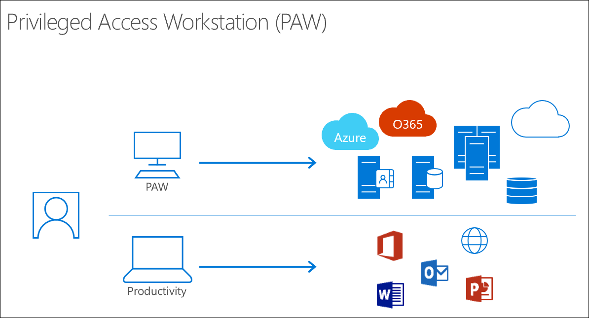

## Secure devices
For sensitive tasks, Privileged Access Workstations (PAWs) provide a dedicated operating system that is protected from Internet attacks and threat vectors. Separating these sensitive tasks and accounts from daily use workstations and devices provides very strong protection from phishing attacks, application and OS vulnerabilities, various impersonation attacks, and credential theft attacks such as keystroke logging, Pass-the-Hash, and Pass-The-Ticket. 

 

In simplest terms, PAWs are hardened and locked down workstations designed to provide high security assurances for sensitive accounts and tasks. PAWs are recommended for administration of identity systems, cloud services, and private cloud fabric as well as sensitive business functions.

In order to provide the greatest security, PAWs should always run the most up-to-date and secure operating system available. Microsoft strongly recommends Windows 10 Enterprise, which includes several additional security features (in particular, Credential Guard and Device Guard) not available in other editions. 

PAW security controls are focused on mitigating high impact and high probability risks of compromise. These include mitigating attacks on the environment and risks that can decrease the effectiveness of PAW controls over time:
- **Internet attacks**. Most attacks originate directly or indirectly from internet sources and use the internet for exfiltration and command and control (C2). Isolating the PAW from the open internet is critical to ensuring it’s not compromised.
- **Usability risk**. If a PAW is too difficult to use for daily tasks, administrators will find workarounds to make their jobs easier. Frequently, these workarounds open the workstation and accounts to significant security risks, so it's critical to involve and empower PAWs users to mitigate these usability issues securely. 
- **Environment risks**. Because other computers and accounts in the environment are exposed to risks directly or indirectly, a PAW must be protected against attacks from those compromised assets in the production environment. This requires minimizing the use of management tools and accounts that have access to the PAWs. 
- **Supply chain tampering**. While it's impossible to remove all possible risks of tampering in the supply chain for hardware and software, taking a few key actions can mitigate readily available attack vectors, including validating the integrity of all installation media and using a trusted and reputable supplier for hardware and software.
- **Physical attacks**. Because PAWs can be physically mobile and used outside of physically secure facilities, they must be protected against attacks that leverage unauthorized physical access to the computer.

Microsoft uses the PAW architectural approach on both its own systems as well as on those of its customers. Microsoft uses administrative workstations internally in several capacities including administration of Microsoft IT infrastructure, Microsoft cloud fabric infrastructure development and operations, and other high value assets.
