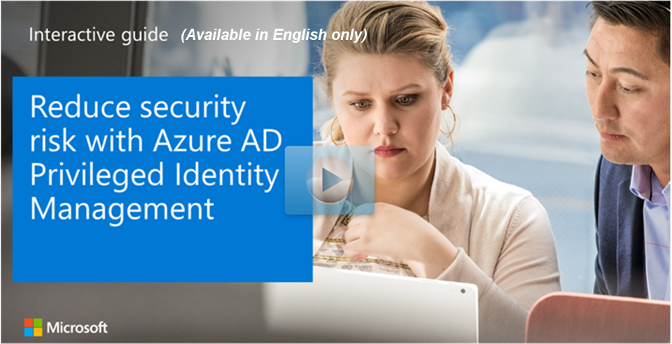

You can further protect administrator accounts that access sensitive data by creating dedicated accounts for these users solely to perform tasks that require privileged access. Then restrict these accounts from performing non-administrative tasks, such as personal email.

For example, you assign Christina a dedicated account ChristinaAdmin@contoso.com to perform her administrative tasks. This account is separate from Christina's non-administrative account, Christina@contoso.com, which she uses for non-administrative tasks and communications with partners and clients. In this way, her administrator account credentials are not exposed externally.

## Use Privileged Identity Management to identify privileged roles

You can also use Azure AD Privileged Identity Management (PIM) to identify accounts that are in privileged roles. View the users in PIM who have these roles:
- Global administrator
- Privileged role administrator
- Exchange Online administrator
- SharePoint Online administrator

 Remove any accounts that are no longer needed in those roles. Then categorize the remaining accounts that are assigned to admin roles as follows:

- Accounts individually assigned to administrators for non-administrative purposes
- Accounts individually assigned to administrators for administrative tasks only
- Shared roles across multiple users

*Azure AD Privileged Identity Management dashboard*

### Explore how to reduce security risk with Privileged Identity Management

View a [video version](https://www.microsoft.com/videoplayer/embed/RE44vAQ) of the interactive guide (captions available in more languages).

  

Be sure to click the full-screen option in the video player. When you're done, use the **Back** arrow in your browser to come back to this page. 

## Learn more

[Securing privileged access for hybrid and cloud deployments in Azure AD](https://docs.microsoft.com/azure/active-directory/users-groups-roles/directory-admin-roles-secure#general-preparation)
