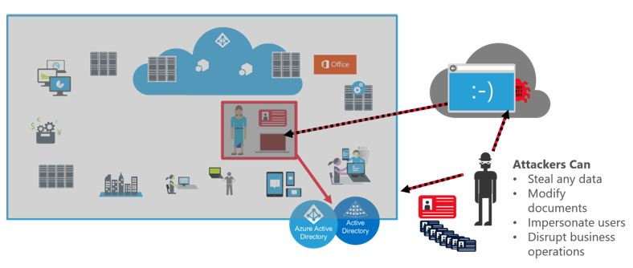
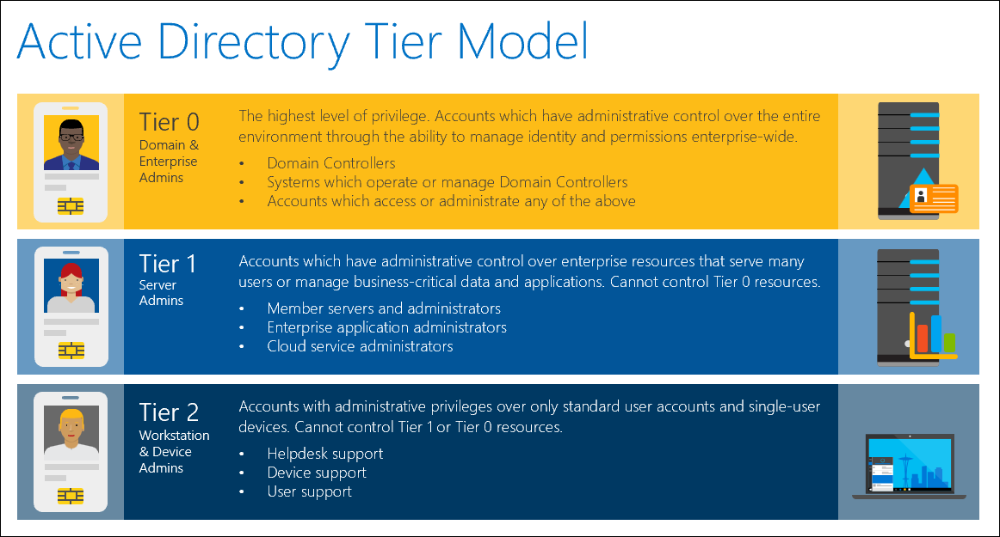

Securing privileged access is a critical first step to securing business assets in a modern organization. The security of business assets in an IT organization depends on the integrity of the privileged accounts used for administration, management, and development. Privileged accounts like administrators of Active Directory Domain Services have direct or indirect access to most or all assets in an IT organization, making a compromise of these accounts a significant business risk. Cyber-attackers often target these accounts and other elements of privileged access using credential theft attacks like Pass-the-Hash and Pass-the-Ticket. An attacker that gains control of an administrative account can use those privileges to increase their impact in the target organization as depicted below:

 
 
Protecting privileged access against determined adversaries requires you to take a complete and thoughtful approach to isolate these systems from risks. 

To help separate internet risks (phishing attacks, web browsing) from privileged access account risks, create a dedicated account for all personnel with privileged access. Administrators should not be browsing the web, checking their email, or doing day to day productivity tasks with highly privileged accounts.
 
 

Implementing a tiered model can prevent an escalation of privilege path for an attacker who is using stolen credentials. The tier model is defined by the following rules:
- Each administrative resource (group, account, servers, workstation, Active Directory object, or application) are classified as only one tier. 
- Personnel with responsibilities at multiple tiers have separate administrative accounts created for each required tier. Any account that currently logs on to multiple tiers are split into multiple accounts, each of which fits within only one tier definition. These accounts are also required to have different passwords. 
- Administrative accounts may not control higher-tier resources through administrative access such as access control lists (ACLs), application agents, or control of service accounts. Accounts that control a higher tier may not log on to lower-tier computers because logging on to such a computer might expose and inadvertently grant control of the account credentials and privileges assigned to that account. Under some specific exceptions, a feature that supports Remote Desktop Protocol (RDP) with restricted admin mode could be used without exposing credentials. 
- Administrative accounts may control lower-tier resources as required by their role, but only through management interfaces that are at the higher tier and that do not expose credentials—for example, domain admin accounts (tier 0) managing server admin Active Directory account objects (tier 1) through Active Directory management consoles on a domain controller (tier 0).

To further prevent the risk of escalated credentials, consider the following recommended practices:
- Do not use the same password for domain and local accounts.
- Limit valid lifetime of credentials. In other words, balance usability (time between entering credentials) and security (credential exposure duration).
- Protocol considerations including:
    - Kerberos natively expires reusable credentials (ticket granting ticket lifetime and renewal lifetime).
    - NTLM credential (NT hash) is valid until password changes.
- Various options grant and expire privileges, each with caveats:
    - Group membership
    - Dynamic account creation
    - Scripted actions

Although the previous information focuses on Active Directory environments, much of the same guidance applies to securing Azure Active Directory admin accounts. For example, Microsoft recommends creating dedicated Microsoft 365 global administrator accounts that are used only when necessary, and that those accounts be secured via multi-factor authentication. Additionally, for privileged access, Azure Active Directory admin accounts can leverage just-in-time privileges through Azure AD Privileged Identity Management to ensure administrative credentials are only being used when required.

For Azure Active Directory, also consider creating emergency access--or “break glass”--accounts. Emergency access accounts help restrict privileged access within an Azure AD organization. These accounts are highly privileged and aren't assigned to specific individuals. Emergency access accounts are limited to "break glass" scenarios where normal administrative accounts can't be used (such as if a federated on-premises identity provider isn’t available). If you don't see any global admin cloud-only accounts using the *.onmicrosoft.com domain (for "break glass" emergency access), create at least two of these accounts.
 
