Just in time (JIT) access is a model in which users receive temporary permissions to perform privileged tasks which prevents malicious or unauthorized users from gaining access after the permissions have expired. Access is granted only when users need it.

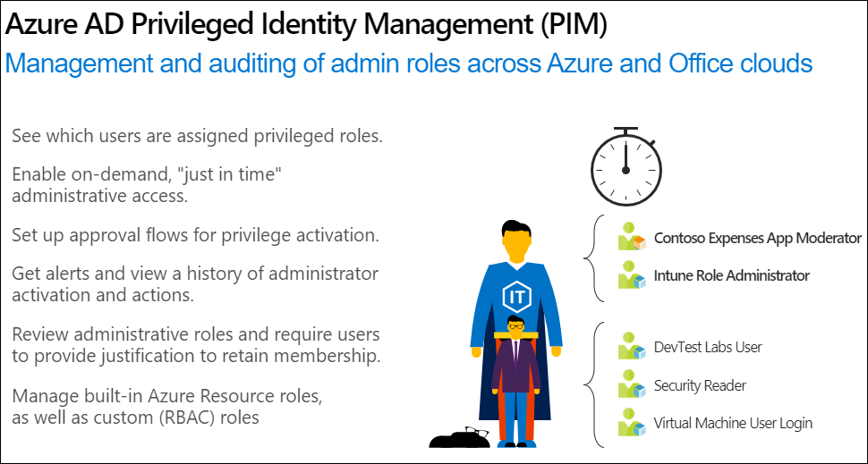 

Azure AD Privileged Identity Management helps you manage privileged administrative roles across Azure AD, Azure resources, and other Microsoft Online Services. (For Active Directory Domain Services, use Microsoft Identity Manager's Privileged Access Manager capability). In a world where privileged identities are assigned and forgotten, Privileged Identity Management provides solutions like just-in-time access, request approval workflows, and fully integrated access reviews so you can identify, uncover, and prevent malicious activities of privileged roles in real time. Deploying Privileged Identity Management to manage your privileged roles throughout your organization greatly reduces risk while surfacing valuable insights about the activities of your privileged roles.

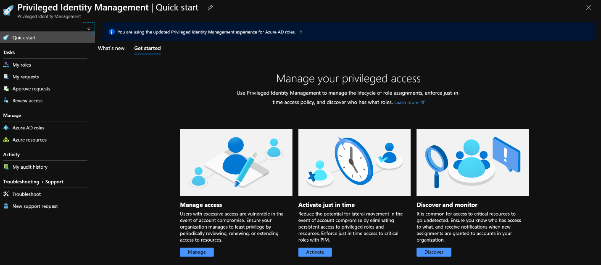 

## Manage risk
You can secure your organization by enforcing the principles of least privilege and just-in-time access. By minimizing the number of permanent assignments of users to privileged roles and enforcing approvals and MFA for elevation, you greatly reduce security risks related to privileged access. Enforcing least privilege and just-in-time access will also allow you to view a history of access to privileged roles so you can track down security issues as they happen.

## Address compliance and governance 
Deploying Privileged Identity Management creates an environment for on-going identity governance. Just-in-time elevation of privileged identities provides a way for Privileged Identity Management to keep track of privileged access activities in your organization. You can also view and receive notifications for all assignments of permanent and eligible roles. Through access review, you can regularly audit and remove unnecessary privileged identities and make sure your organization complies with the most rigorous identity, access, and security standards.

## Steps to enable Privileged Identity Management
First, you need to set up Privileged Identity Management so that users are eligible for privileged roles. In the Azure Portal:
1.	Open the **Azure AD Privileged Identity Management blade**.
2.	Select **Azure AD roles** and then **Role settings**:

    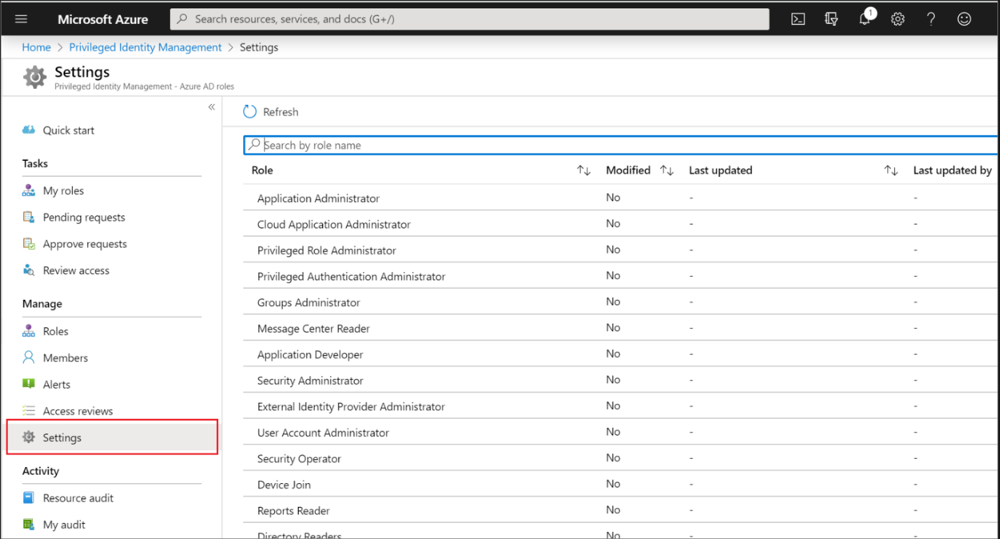 

3.	Select the role you would like to require just in time privileges. Here, we selected the Intune Administrator role:

     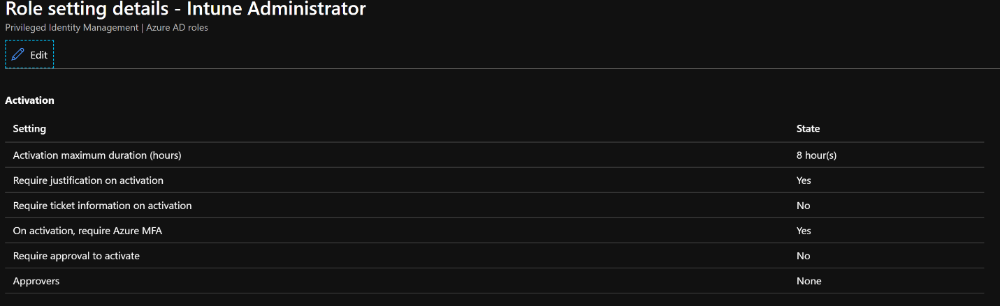 

4.	Click **Edit** to identify the tasks required to receive privileges. Here, we set the maximum activation duration to 8 hours, required Azure MFA for activation, and required justification. We also required an approver to activate.

     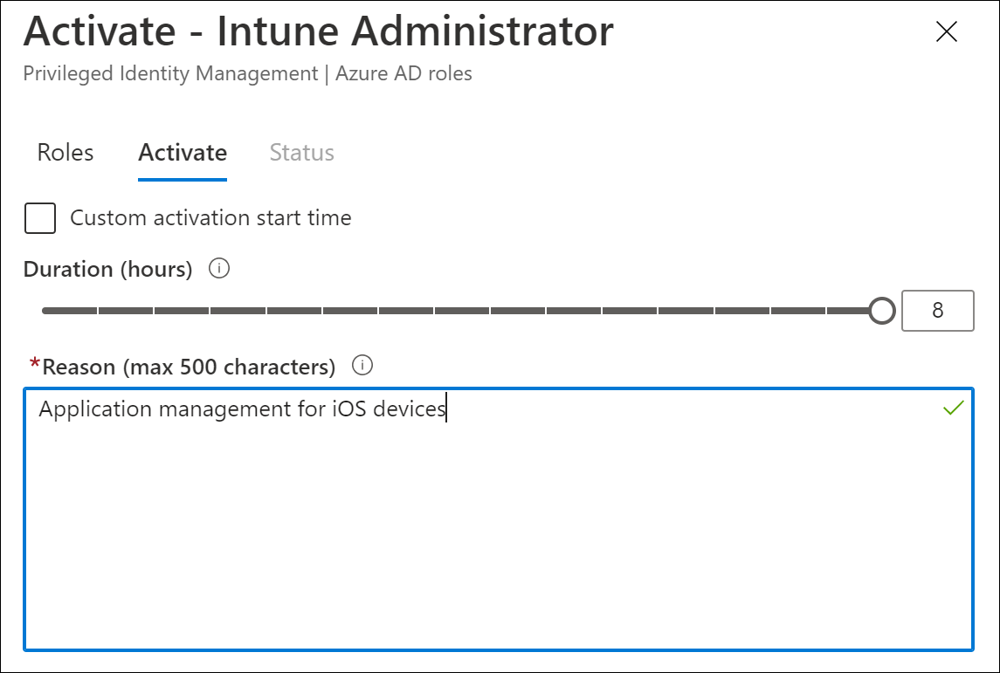 

    When assigning a privileged identity-managed role, you can choose from those two assignment types – **eligible** and **active**. Eligible assignments require the member of the role to perform an action to use the role. Actions might include performing a multi-factor authentication (MFA) check, providing a business justification, or requesting approval from designated approvers. Active assignments don't require the member to perform any action to use the role. Members assigned as active have privileges assigned at all times. In the **roles** settings, we can configure the expiration duration for both of these assignment types.

     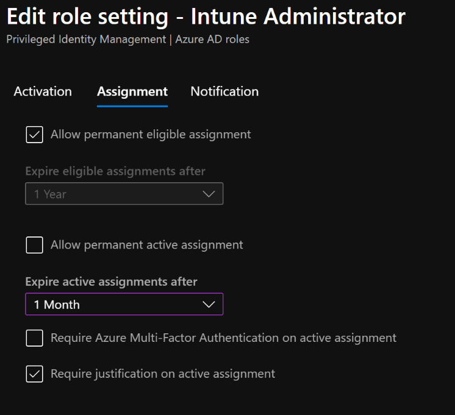 

5.	Provide notification rules, such that the appropriate members of your organization are aware of the permissions users have.

     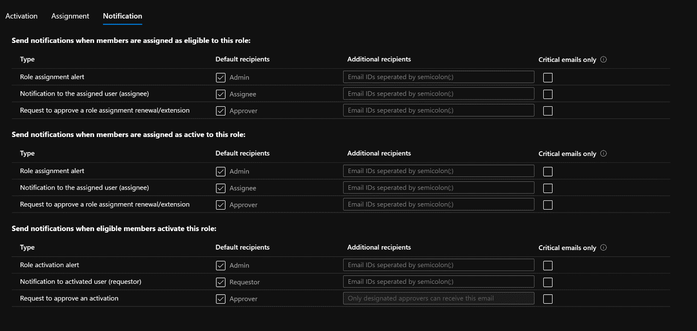 

6.	Now that you’ve configured and updated the settings for a role, in the Privileged Identity Management pane, add a member to the role by selecting **Roles -> + Add Assignments**. Then, select the role to be configured and members to assign.

     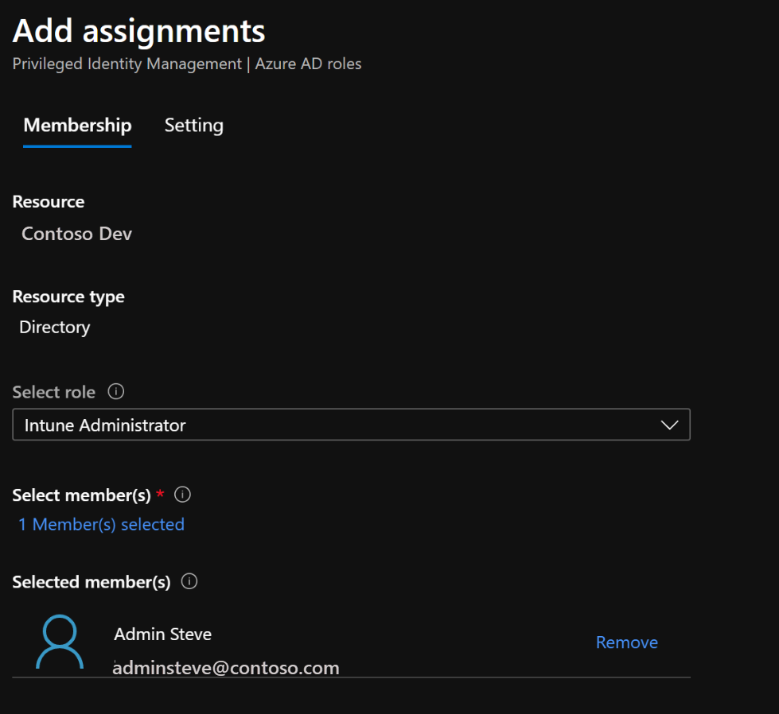 

7.	Then provide the assignment type:

     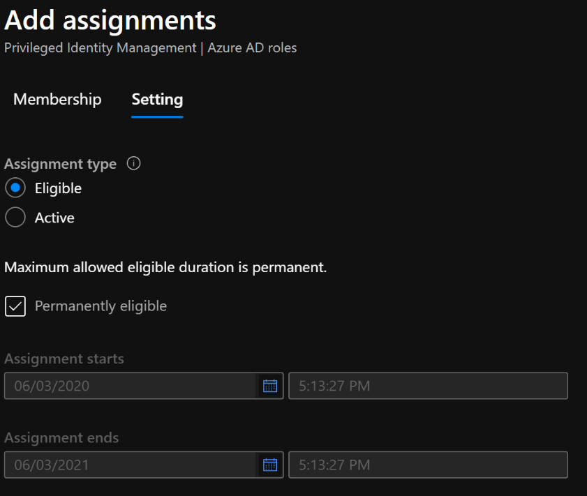 

8.	Click **assign**. 

Now when the assigned users log in to the Privileged Identity Management blade of the Azure portal, they will be able to Activate the roles they were assigned:

 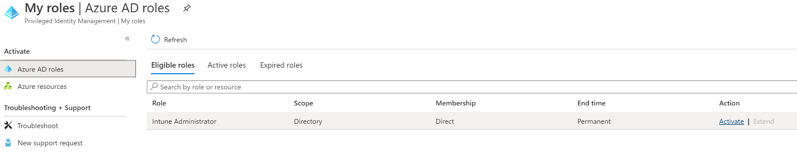 

Because of the settings we configured, to activate the Intune administrator role users need to provide a justification:

 

The approver will then receive a notification and can approve the request by selecting Approve Requests in the Privileged identity Management portal:

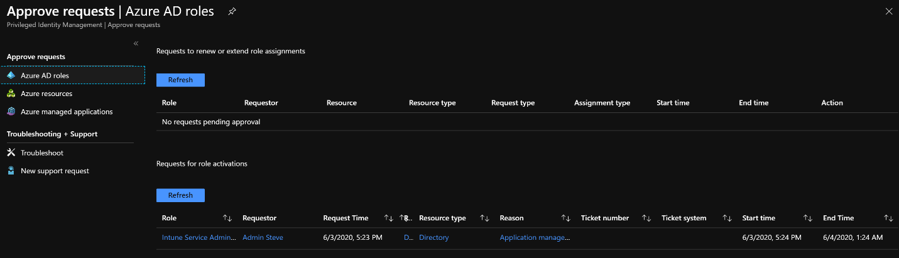 

After reviewing the justification that the user provided, the approver can approve the request and also provide their own justification:

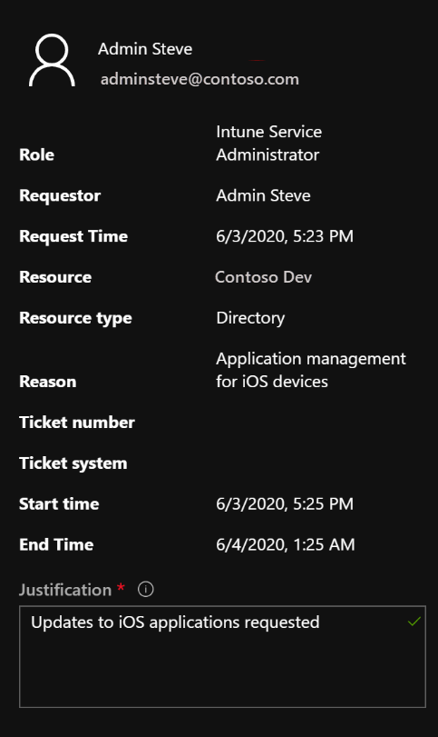 

Then the user sees the role as Active within Privileged Identity Management and can access the assigned resources.

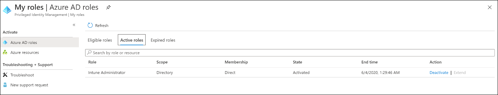 