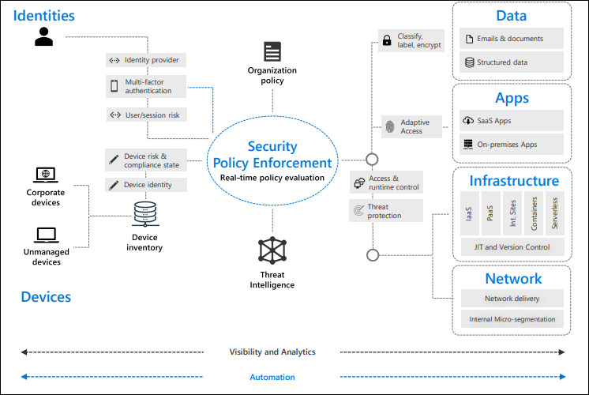

A Zero Trust approach should extend throughout the entire digital estate and serve as an integrated security philosophy and end-to-end strategy. This is done by implementing Zero Trust controls and technologies across six foundational elements:
- Identities
- Devices
- Applications
- Data
- Infrastructure
- Networks

Each of these six foundational elements is a source of signal, a control plane for enforcement, and a critical resource to be defended. This makes each an important area on which to focus investment.

 

## Identities 
Whether they represent people, services, or IOT devices, define the Zero Trust control plane by identities. When an identity attempts to access a resource, we need to verify it with strong authentication, ensure access is compliant and typical for that identity, and follow least privilege access principles.

## Devices 
Once an identity has been granted access to a resource, data can flow to a variety of different devices—from IoT devices to smartphones, BYOD to partner-managed devices, and on-premises workloads to cloud hosted servers. This diversity creates a massive attack surface area, requiring we monitor and enforce device health and compliance for secure access.

## Applications 
Applications and APIs provide the interface by which data is consumed. They may be legacy on-premises, lift-and-shifted to cloud workloads, or modern SaaS applications. Controls and technologies should be applied to discover Shadow IT, ensure appropriate in-app permissions, gate access based on real-time analytics, monitor for abnormal behavior, control of user actions, and validate secure configuration options.

## Data 
Ultimately, security teams are focused on protecting data. Where possible, data should remain safe even when it leaves the devices, apps, infrastructure, and networks the organization controls. Data should be classified, labeled, and encrypted, and access restricted based on those attributes.

## Infrastructure 
Infrastructure (whether on-premises servers, cloud-based VMs, containers, or micro-services) represents a critical threat vector. Assess for version, configuration, and JIT access to harden defense, use telemetry to detect attacks and anomalies, and automatically block and flag risky behavior and take protective actions.

## Networks 
All data is ultimately accessed over network infrastructure. Networking controls can provide critical “in pipe” controls to enhance visibility and help prevent attackers from moving laterally across the network. Networks should be segmented (including deeper in-network micro segmentation), and real-time threat protection, end-to-end encryption, monitoring, and analytics should be employed.

