>[!IMPORTANT]
>Threat protection product names in Microsoft are changing. [Read more about this and other updates](https://www.microsoft.com/security/blog/?p=91813). We'll be updating names in products and in the Learn content in the near future.

A Zero Trust strategy requires that you verify explicitly, use least privileged access principles, and assume breach. Azure Active Directory can act as the policy decision point to enforce your access policies based on user, device, target resource, and environment insights. 

To do this, we need to put Azure Active Directory in the path of every access request—connecting every user and every app or resource through this identity control plane. In addition to productivity gains and improved user experiences from single sign-on (SSO) and consistent policy guardrails, connecting all users and apps provides Azure AD with the signal to make the best possible decisions about the authentication/authorization risk.

## Connect your users, groups, and devices

Maintaining a healthy pipeline of your employees’ identities as well as the necessary security artifacts (groups for authorization and devices for extra access policy controls) puts you in the best place to use consistent identities and controls, which your on-premises and in the cloud users already benefit from. We strongly prefer an authentication method that primarily uses Azure AD (to provide you the best brute force, DDoS, and password spray protection). 

## Integrate all your applications with Azure AD

SSO is not only a convenient feature for users, but it’s also a security posture, as it prevents users from leaving copies of their credentials in various apps and helps them avoid getting used to surrendering their credentials due to excessive prompting.

### Explore how to provide secure remote access to on-premises applications with Azure AD Application Proxy

View a [video version](https://www.microsoft.com/videoplayer/embed/RE4C2jQ) of the interactive guide (captions available in more languages).

<a href="https://mslearn.cloudguides.com/guides/Provide%20secure%20remote%20access%20to%20on-premises%20applications%20with%20Azure%20AD%20Application%20Proxy">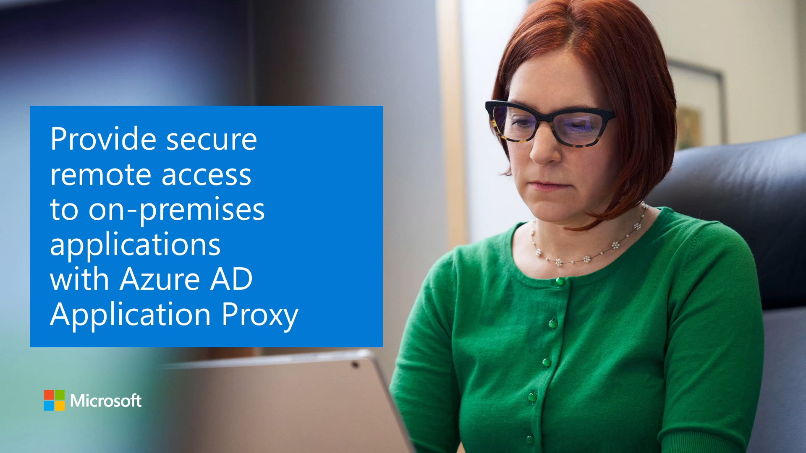</a>  

Be sure to click the full-screen option in the video player. When you're done, use the **Back** arrow in your browser to come back to this page. 

## Automate provisioning to applications

Once you have your users’ identities in Azure AD, you can use Azure AD to automate provisioning those user identities into your various cloud applications. 
G
## Get your logging and reporting in order

Be sure to analyze the logs from Azure AD either in Azure or using a SIEM system of choice.

## Enact Zero Trust principles

Once you have the Azure AD foundation in order, you can begin enacting the principles of Zero Trust.

First principle--*verify explicitly*--provide Azure AD with a rich set of credentials and controls that it can use to verify users:

- Roll out Azure multi-factor authentication (MFA).
- Enable Azure AD Hybrid Join or Azure AD Join.
- Enable Microsoft Intune for managing users mobile devices (EMS).
- Start rolling out passwordless credentials.

Second principle--*use least privilege access*--use the following tools to give the right access at the right time:

- Conditional Access to require access controls.
- Secure privileged access with privileged identity management.
- Restrict user consent to applications.
- Manage entitlements to streamline access request and approval.	

Third principle--*assume breach*--consider configuring the following tools to protect your organization:

- Deploy Azure AD Password Protection.
- Block legacy authentication.
- Enable identity protection.
- Enable restricted session to use in access decisions.
- Enable Conditional Access integration with Microsoft Cloud App Security.
- Enable Microsoft Cloud App Security integration with identity protection.
- Integrate Azure Advanced Threat Protection with Microsoft Cloud App Security.
- Enable Microsoft Defender ATP.

Within your organization, consider creating a Conditional Access policy requiring Azure multi-factor authentication for administrators for quick wins in your journey towards Zero Trust. To create a Conditional Access policy:

1. Within Azure AD, create a new Conditional Access policy with Directory roles targeted. 
2. If your organization has a “break-glass” global administrator account, remember to add the account to the **Exclude** section. In the following screenshot, the global administrator role is selected. Consider also adding these roles:

    - Authentication Administrator
    - Billing administrator
    - Conditional Access administrator
    - Exchange administrator
    - Helpdesk administrator
    - Password administrator
    - Security administrator
    - SharePoint administrator
    - User administrator

    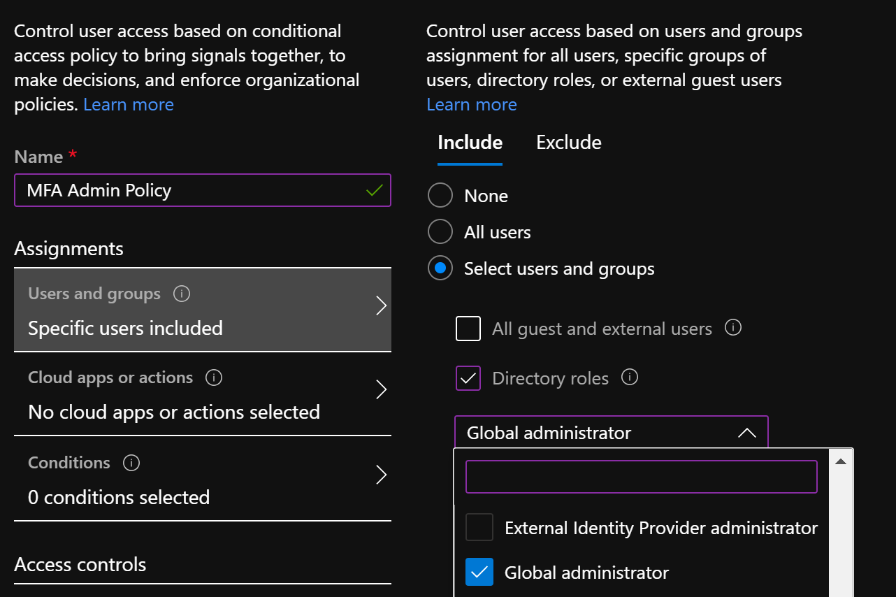 

3.	For Cloud apps or actions, select **All cloud apps**:
 
    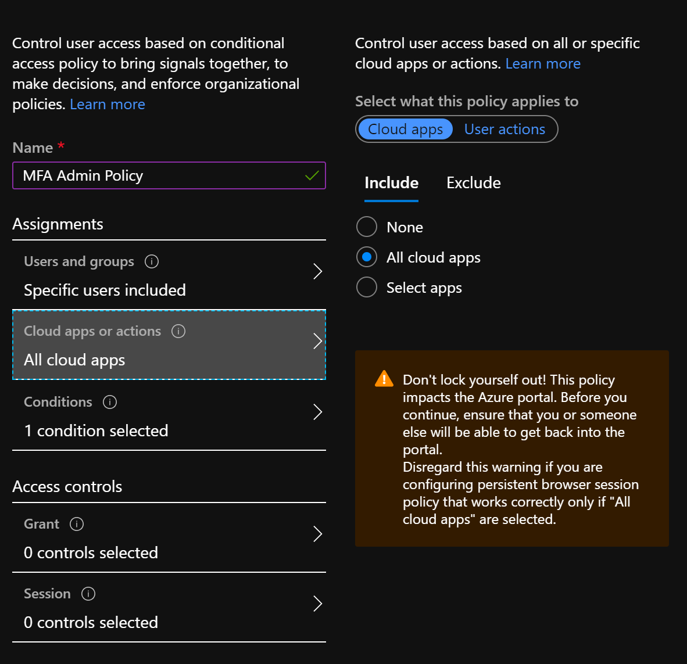 

4.	Then under **Conditions > Client apps (Preview)**, select **Yes** to also target apps that don’t use Modern Authentication:
 
    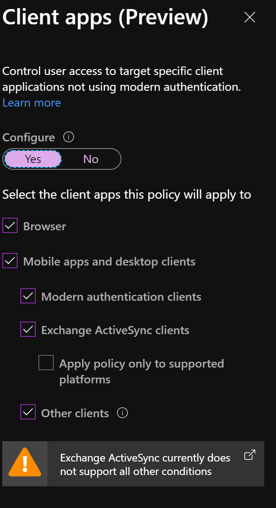  
 
5.	Under **Access controls**, set **Grant Access to Require Multi-factor authentication**:
 
    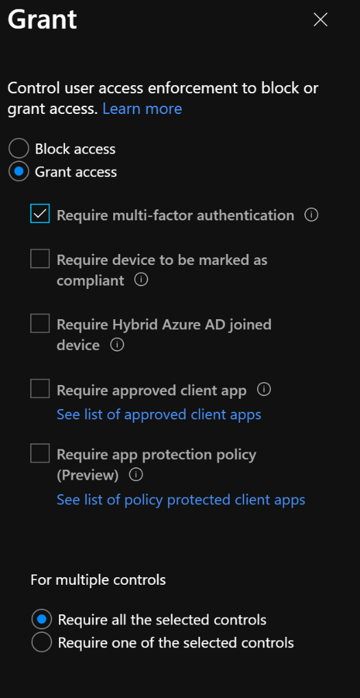 

To enable Azure AD Identity Protection User risk and Sign-in risk policies to allow access but require self-service password reset or multi-factor authentication:
 
 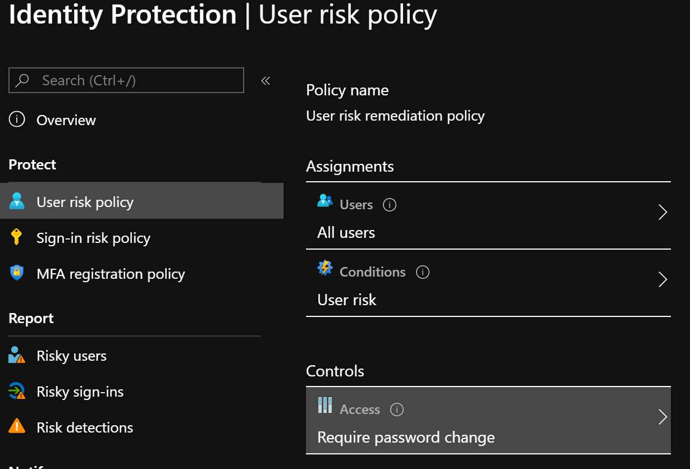 

To create an Intune Mobile Application Management (MAM) without enrollment policy to protect organization data on mobile devices:

1.	Within the Intune portal, select **Client Apps -> App protection policies -> + Create policy -> your targeted platform**:

     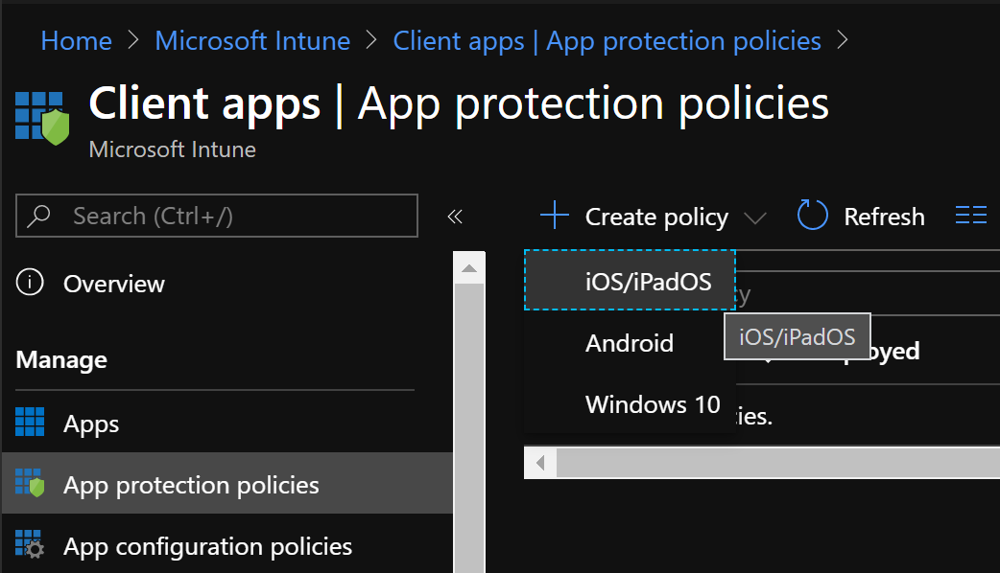 

2.	After naming the policy, select from the list of available applications:

     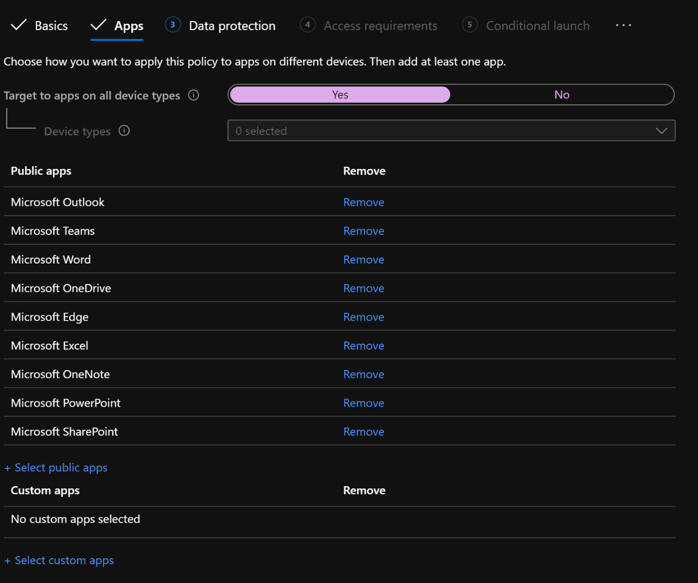 

3.	Under **Data protection**, select the controls you would like to implement. If the applications are already being used on mobile devices, consider limiting the amount of controls to reduce the amount of help-desk calls. 

    For iOS devices, consider the following settings: 
    - Blocking backup of org data to iTunes
    - Restricting data sharing to only policy-managed apps
    - Preventing “save as” of org data (by restricting save as functionality to OneDrive for Business or SharePoint)
    - Restricting cut/copy/paste to policy-managed apps with paste in. 

    Policy-managed apps are the ones selected in the previous step. 

     > [!NOTE]
     > “Encrypt org data” is set to Require by default, which will prompt a user to create a PIN (and enable TouchID/FaceID) to unlock their device if they have not done so already.
  
     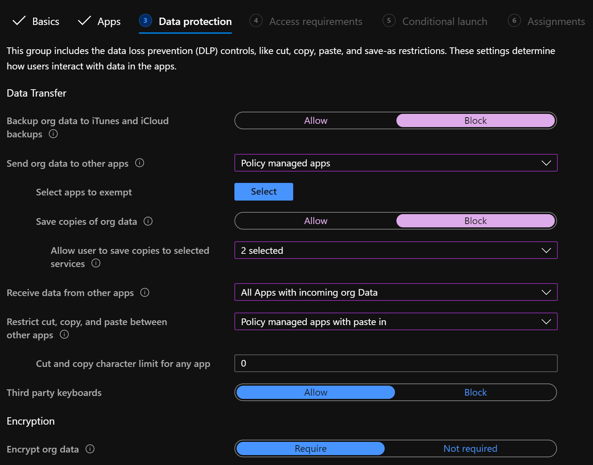 

4.	Under Access requirements, you can configure a PIN or sign-in for accessing the targeted applications, as well as a timeout to recheck for the PIN/sign-in:

     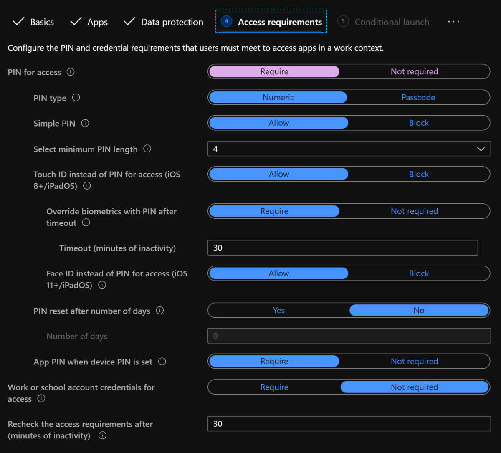 

5.	Finally, configure conditional launch settings that further protect the data on the device. Consider leaving the default options.

     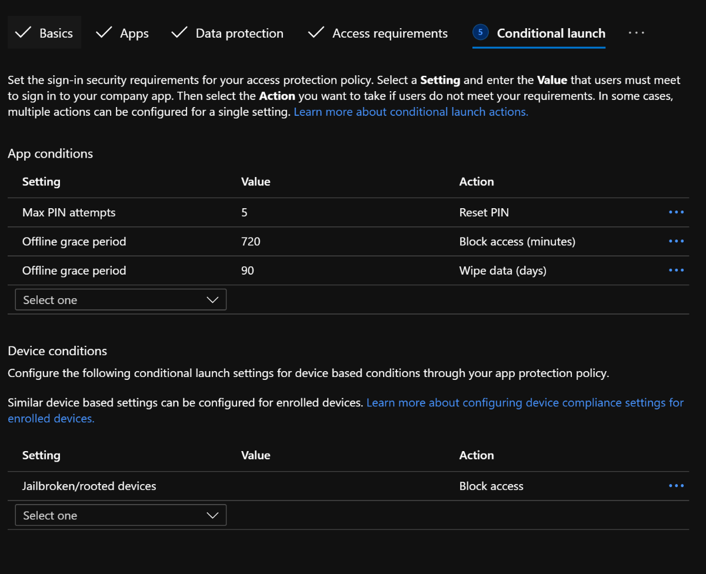 

Once all of the MAM protection settings have been configured, you must target Users who will receive the policy. With MAM policies, there is no end-user configuration required. The policy will automatically be applied when a user logs in to a targeted application on their mobile device. The end user will just see a notification that the application is protected:
 
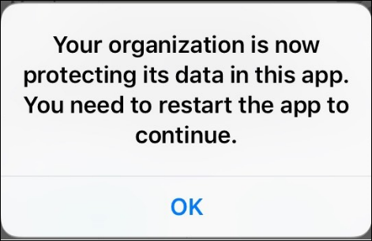
