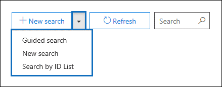
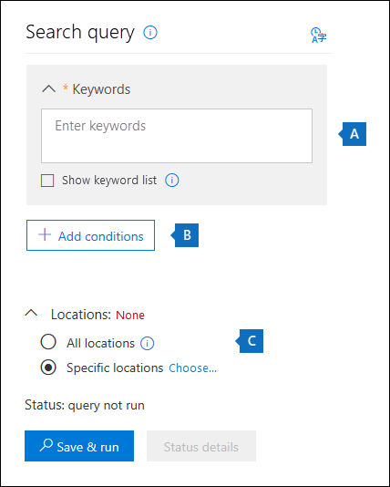

The Content Search tool in the Microsoft 365 Defender portal helps you quickly find email in Exchange mailboxes, documents in SharePoint sites and OneDrive locations, and instant messaging conversations in Skype for Business. After you find what you're looking for, you can export and download the results to your local computer. If you're using Content Search as part of your response to an email attack on your organization, you can delete the emails returned by your search from user mailboxes.

Use Content Search to search for items in these services:

- Exchange Online mailboxes and public folders
- SharePoint Online sites and OneDrive for Business accounts
- Skype for Business conversations
- Microsoft Teams
- Microsoft 365 Groups
- Yammer Groups

## Create a search

The Content Search tool is available in the Microsoft 365 Defender portal. Use the following steps to create your first search.

>[!NOTE]
> Before you can create a retention tag (or any of the procedures in this unit), you need to be a member of the eDiscovery Manager role group.

1. Go to the Microsoft 365 Defender portal at <https://security.microsoft.com/>, and sign in using your Microsoft 365 credentials.
1. Click **Search > Content search**.
1. On the **Search** page, click the arrow next to **+ New search**.
   
1. Choose which kind of search you want to run:
   - **Guided search** - a wizard guides you through your search.
   - **New search** - create a search without the help of the search wizard. This is the default.
   - **Search by ID List** - search for specific email messages or mailbox items. You'll use a list of Exchange IDs to identify which items to search for.

   For this unit, we'll create a basic new search, so select **New search**.
1. Enter the terms you want to search for in **Keywords**. You can use keywords, message properties (like the date a message was sent or received), or document properties (like file name). You can use Boolean operators AND, OR, NOT, and NEAR to create complex queries. If you don't enter any keywords, all content found in the search location is included in the search results.
1. Add search conditions to narrow your search. Any condition you specify here is connected to the keywords you're searching for. That means that an item has to satisfy both the keyword query **and** the search condition to be included in the results.
1. Set where to perform the search. You can choose to search all locations or just a subset of locations. If you choose **Specific locations**, you'll be prompted to choose which locations from a list of available locations.
   
1. After you've set up your search query, click **Save & run**.
1. Enter a name and optional description for the search. The name of the search has to be unique in your organization.
1. Click **Save** to start the search.

Depending on how you have the preview setting configured, the search results are either displayed on the screen or you have to click **Preview results** to view them. We'll set your preview preferences next.

## Preview search results

You can control how your search results are displayed. After you run a new search or open an existing search, click **Individual results** to see the preview configuration. You have two choices:

- **Preview results automatically**: Search results are  displayed in the results pane immediately after you a run a search.
- **Preview results manually**: Placeholder results are displayed in the results pane. To see the actual results, you have to select **Preview results**. This is the default setting. It helps enhance search performance by not automatically displaying the search results when you open an existing search.

## View information and statistics about a search

After you create and run a content search, you can view statistics about the estimated search results.

This includes the following:

- A summary of the search results
- Query statistics such as the number of content locations with items that match the search query
- The name of content locations that have the most matching items.

You can display statistics for one or more content searches. This lets you quickly compare the results for multiple searches and make decisions about the effectiveness of your search queries.

To view search statistics:

1. On the **Content search** page, click **Open**, and then select the specific search that you want to view the statistic for.
1. On the flyout page, click **Open query**.
1. In **Individual results**, click **Search statistics**.
1. In **Type**, choose the option that matches the search statistics you want to view:
    - **Summary**: The default setting. Displays the following information:
      - The name of the content search
      - The type of content location
      - The number of content locations
      - The total number of items, across all locations, that match the search query.
      - The total size of all items found in each location.
    - **Queries**: Displays statistics about the search query:
      - The name of the content search
      - The type of content location
      - The part of the search query that the statistics apply to. **Primary** indicates that the statistics apply to the entire search query.
      - The actual search query.
      - The total size of all items found in each location.
      - The number of content locations
      - The total number of items, across all locations, that match the search query.
      - The total size of all items found in each location.
    - **Top locations**: Displays statistics about the number of items that match the search query in each content location. The top 1,000 locations are displayed.

You can also download the search statistics and keyword statistics to a CSV file. This lets you use the filtering and sorting features in Excel to compare results, and prepare reports for your search results.

## Export search results

You can export search results to a local computer as PST files or as individual messages (.msg files). When you export content from SharePoint and OneDrive sites, copies of native Office documents are exported. There are also other documents and reports that are included with the exported search results. You can also export the search results report and not the actual items.

To export search results:

1. On the **Content search** page, click the search that you want to export the search results for, and then click **More > Export results**
1. Follow the instructions to specify the export options.

## Learn more

[Content Search in Microsoft 365](/microsoft-365/compliance/content-search?azure-portal=true)
