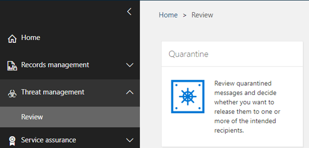

Quarantine holds potentially dangerous or unwanted messages. The quarantined item can be viewed either by the user to whom it was sent or by an admin.

You view and manage quarantined messages in PowerShell or in the Security & Compliance Center.

To the Security & Compliance Center to manage quarantined email messages:

1.	In the Security and Compliance Center, go to **Threat Management > Review > Quarantine**.
   
2.	Verify that **View quarantined** is set to the default value **email**.
3.	Set sorting and filtering, as required.
4.	After you’ve selected a message, you can perform several actions, including reporting the message to Microsoft or releasing it to the original recipient. If you take no action, the message will be deleted after the default quarantine retention period expires.

## Learn more
[Manage quarantined messages and files as an admin](https://docs.microsoft.com/microsoft-365/security/office-365-security/manage-quarantined-messages-and-files?view=o365-worldwide?azure-portal=true)