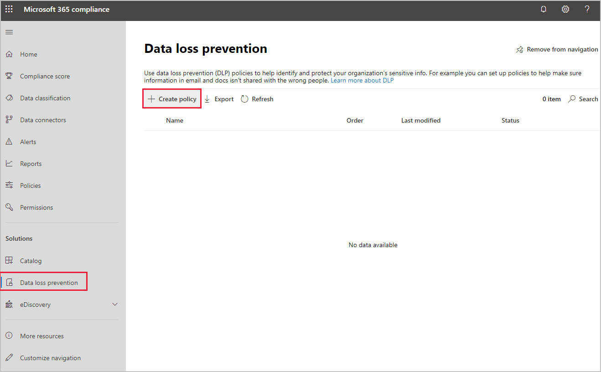
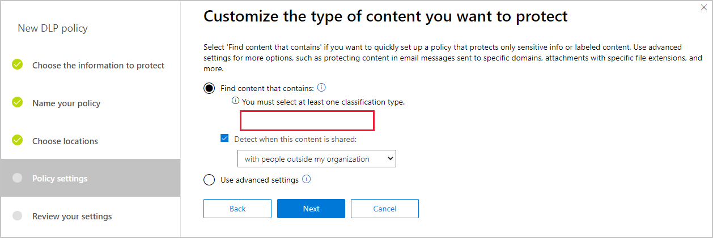
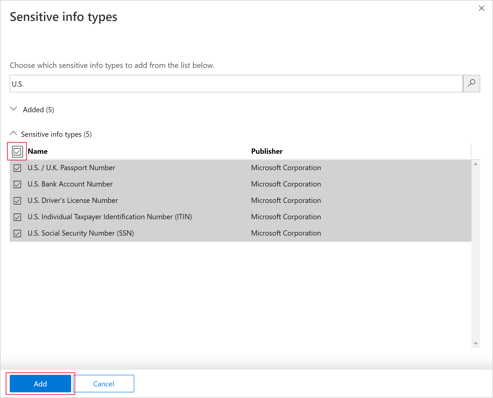
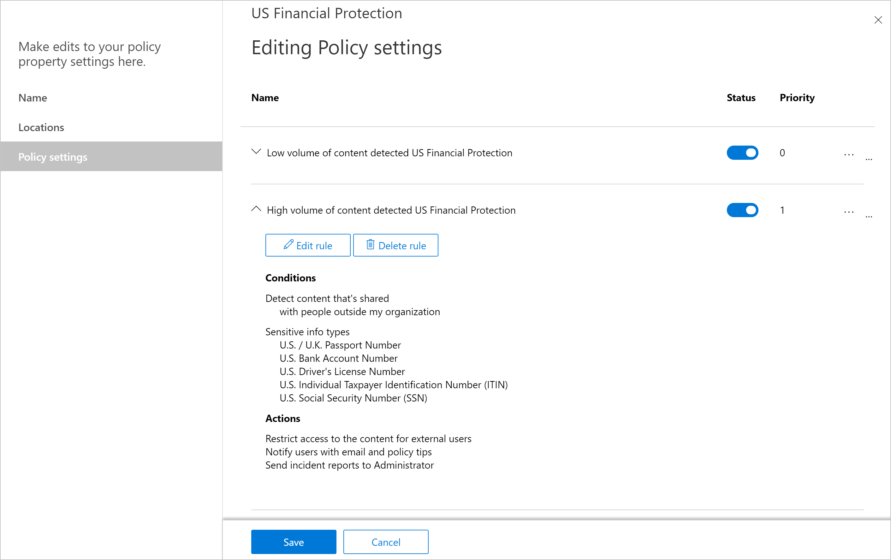
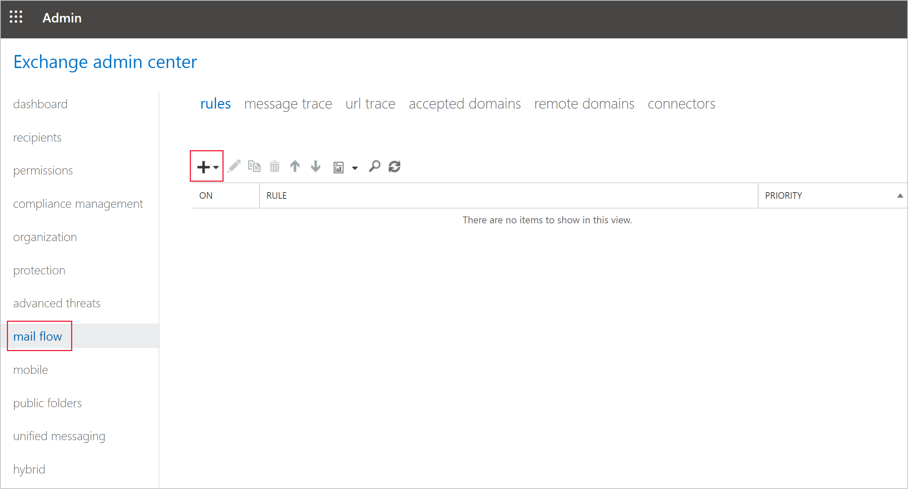
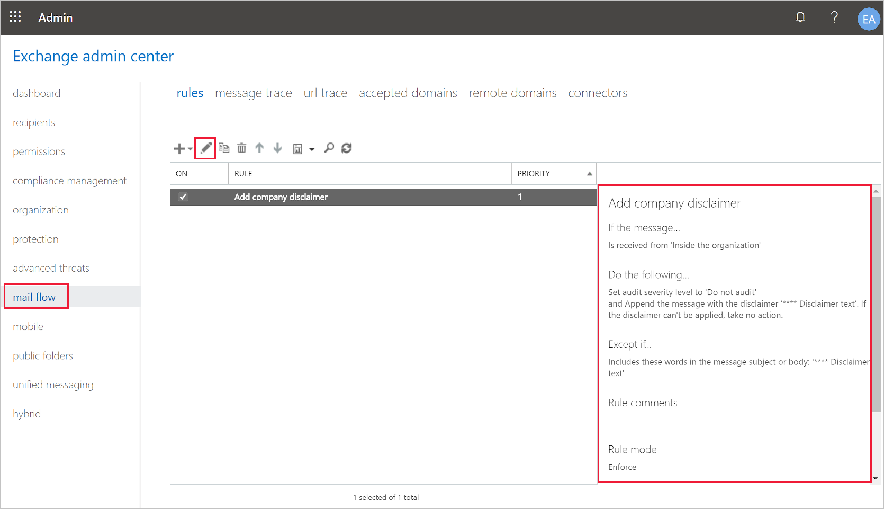
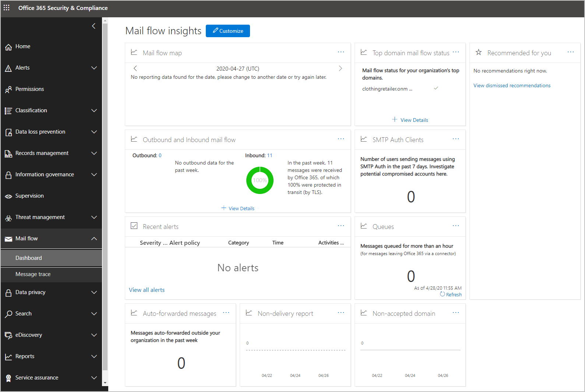

You can use transport rules, also known as mail flow rules, to automatically process messages through your Exchange Online organization. These transport rules are similar to Outlook inbox rules, except they're applied to messages before they reach users' inboxes. Because transport rules run on the server, they can use more complex logic, take a wider range of actions, and handle different kinds of exceptions.

## Components of a mail rule

There are four components to a mail rule:

- Conditions
- Exceptions
- Actions
- Properties

### Conditions and exceptions

Before a rule is triggered, it needs to meet  conditions that you specify. You can use conditions and exceptions to identify the messages to which you want to apply actions. These identifiers include:

|Identifiers|Notes|
|-|-|
|Senders|Rules specify that the sender is a specific person, or the person is located internally or externally, or is in a group, or their IP address is in a specific range. |
|Recipients|Similar rules to senders.|
|Subject or body|You specify that the subject or body contains words, or exactly matches a given string.|
|Attachments|Exchange can look in the contents of attachments; rules can match on filenames, or file extensions, or if the size of an attachment is greater than, or equal to, a value.|
|Any recipients|You specify rules that match on any of the recipients of an email, matching where the recipients include words, or match specific addresses.|
|Message properties|Rules match on the classification or importance of a message.|
|Message headers|You specify that the header should include a list of words, or matches an exact string, or matches a pattern of text.|

Conditions are matched first. These messages are then checked against any exceptions you've specified. The resulting messages are then passed on to have actions applied to them.  

### Actions

There's a long list of actions that can be applied to the emails, as detailed in the **Learn more** section below. Some of the most used actions are:

|Actions|Notes|
|-|-|
|Forward emails for approval|Messages are forwarded to a specific person, or the sender's manager.|
|Delete message without notification|The message is deleted without notifying either the sender or the recipient.|
|Add recipients|Recipients are added to the CC, BCC, or To boxes.|
|Append or prepend a disclaimer|Messages have your organization's pre-canned disclaimer HTML appended or prepended to the message.|

### Properties

You can control other rule settings by adjusting their properties. For instance, you might control the order in which mail rules are applied, or for how long they're valid.  

For example, **mode** is a common property you'll use when you create a new rule. You can choose to set a rule in test mode - conditions and exceptions are checked, but no actions are taken on the messages.

## Create a mail flow rule

There are three ways you can create a mail flow rule:

- Create a data loss prevention (DLP) policy
- Create a mail flow rule in the Exchange admin center
- Use PowerShell commands to create a rule

### Create a DLP policy to manage a mail flow

You can control data loss prevention in the Microsoft 365 compliance center.  

1. In the compliance center, under **Solutions**, select **Data loss prevention**.

   

2. Select **Create policy**, and then select **Next**.

3. Enter a name and description for your policy. For example use "US Financial Protection" as the name, and use "Protecting US Financial data" for the description.
4. Select **Next** on the **Choose location** page.
5. On the **Policy settings** page, select **Find content that contains** option, and then select **Next**.  

     
6. On the **Customize types of content to protect** page, select **Add**, then select **Sensitive info types**.
7. Search for "U.S.", and then select all the results. Select **Add**, then select **Done**.
   

8. Select **Next** on the **What do you want to do if we detect sensitive info?** page.
9. Select **Next** on the **Customize access and override permissions** page.
10. Select **Next** on the **Do you want to turn on the policy or test things out first?** page.
11. Review the settings, and then select **Create**.

Now you can see the new policy.



### Create a mail flow rule using the Exchange admin center

1. In Exchange admin center, select **mail flow**.  
   
2. On the **rules** tab, select **+**, then select **Create a new rule**.
   

3. Name the new rule, "Add company disclaimer."
4. Under **Apply this rule if**, select **The recipient is located**, then select **Inside the organization.**
5. Under **Do the following**, select **Append the disclaimer**. On the right, select **Enter text** and enter "**** Disclaimer text". Then select **Select one**, and select **Ignore**.
6. Clear the **Audit this rule with severity level** option.
7. Select **More options**, then add an exception. Select **Except if**, select **The subject or body includes**, then enter "**** Disclaimer text".
8. Select **Save**.

### Create a mail flow rule using PowerShell

Use the following steps to create a mail flow rule by using PowerShell cmdlets.

1. On a Windows 10 PC, sign in with a user who has administration rights. Open a new PowerShell window as an administrator.  
2. Connect to the Microsoft 365 Exchange online account by running this cmdlet:

   ```powershell
   $Session = New-PSSession -ConfigurationName Microsoft.Exchange -ConnectionUri https://outlook.office365.com/powershell-liveid/ -Credential $UserCredential -Authentication Basic -AllowRedirection 
   ```

3. When prompted, enter your Microsoft 365 administration account credentials, then run this cmdlet:

   ```powershell
   Import-PSSession $Session -DisableNameChecking 
   ```

4. Create a new transport rule with this cmdlet:

   ```powershell
   New-TransportRule -Name "Append company disclaimer" -FromScope InOrganization -ApplyHtmlDisclaimerText "<p>**** Disclaimer text</p>" 
   ```

## View and modify mail flow rules

You can view the DLP policies you've created in the compliance center. The mail rules you've created are stored and managed in Active Directory. You can view these mail rules using the Exchange admin center or PowerShell commands.  

### View or modify mail flow rules using the Exchange admin center

You can view the mail flow rules in the Exchange admin center on the **mail flow** page. You'll see the list of existing mail rules. Select a rule to see its current settings. To edit an existing rule, select **edit**. You also have the option to duplicate, delete, or change the priority of the rule.  



### View or modify mail flow rules using PowerShell

Just as you create a mail flow rule, you'll need to connect to Exchange online before you can run these commands. To view a list of all the existing mail rules, use this PowerShell cmdlet:

```powershell
Get-TransportRule 
```

To see the detail of a single rule, you use the same cmdlet, and specify the exact rule you're interested in:

```powershell
Get-TransportRule -Identity "Append company disclaimer" | Format-List Name, FromScope, Description 
```

To see the details of a particular rule, you select the properties of the `Format-List` parameter.

To amend an existing rule, you'll use this command:

```powershell
Set-TransportRule -Identity "<RuleName>" [<Conditions>] [<Exceptions>] [<Actions>] [<Properties>] 
```

You can also disable a rule with the `Disable-TransportRule`, or enable a disabled rule with `Enable-TransportRule`.

PowerShell has commands to list all the possible conditions and exceptions, also known as predicates, you can use in your rules. To view this list, use the following command:

```powershell
Get-TransportRulePredicate 
```

You can also see the full list of actions by using this command:

```powershell
Get-TransportRuleAction
```

## Monitor mail flow usage

The Microsoft 365 Defender portal shows all the statistics about mail flows in your organization on a dashboard. You access the dashboard in the mail flow section of the compliance center.



## Import or export a mail flow rule collection

You use Exchange Online PowerShell to manually import and export the rules you've created. The rules are managed in an XML file. For example, an export of the rule you created earlier would result in this XML file:

```xml
<?xml version="1.0" encoding="utf-16" standalone="yes"?> 

<rules name="TransportVersioned"> 

  <rule name="Append company disclaimer" id="5a4df25f-70d4-4318-99d4-b7ed15621e34" format="cmdlet"> 

    <version requiredMinVersion="15.0.3.0"> 

      <commandBlock><![CDATA[New-TransportRule -Name 'Append company disclaimer' -Mode Enforce -FromScope InOrganization -ApplyHtmlDisclaimerLocation Append -ApplyHtmlDisclaimerFallbackAction Wrap -ApplyHtmlDisclaimerText '<p>**** Disclaimer text</p>']]></commandBlock> 

    </version> 

  </rule> 

  <rule name="Add company disclaimer" id="9166b2e2-d527-46ae-942d-49ea6d6470df" format="cmdlet"> 

    <version requiredMinVersion="15.0.3.0"> 

      <commandBlock><![CDATA[New-TransportRule -Name 'Add company disclaimer' -Comments ' 

' -Mode Enforce -FromScope InOrganization -ExceptIfSubjectOrBodyContainsWords '**** Disclaimer text' -SetAuditSeverity 'DoNotAudit' -ApplyHtmlDisclaimerLocation Append -ApplyHtmlDisclaimerFallbackAction Ignore -ApplyHtmlDisclaimerText '**** Disclaimer text']]></commandBlock> 

    </version> 

  </rule> 

</rules> 
```

To export an organization's mail flow rules, use this PowerShell command:

```powershell
$file = Export-TransportRuleCollection; Set-Content -Path "<path to XML file>" -Value $file.FileData -Encoding Byte 
```

To import an XML rule file, use this command:

```powershell
[Byte[]]$Data = Get-Content -Path "<path to XML file>" -Encoding Byte -ReadCount 0; Import-TransportRuleCollection -FileData $Data 
```

## Learn more

- [Mail flow rule conditions and exceptions (predicates) in Exchange Online](/Exchange/security-and-compliance/mail-flow-rules/conditions-and-exceptions?azure-portal=true)
- [Mail flow rule actions in Exchange Online](//Exchange/security-and-compliance/mail-flow-rules/mail-flow-rule-actions?azure-portal=true)
- [Mail flow rule properties](/Exchange/security-and-compliance/mail-flow-rules/mail-flow-rules#mail-flow-rule-properties?azure-portal=true)
- [Microsoft 365 Defender portal](https://security.microsoft.com?azure-portal=true)
- [Exchange admin center](https://outlook.office365.com/ecp?azure-portal=true)
- [Create, test, and tune a DLP policy](/microsoft-365/compliance/create-test-tune-dlp-policy?azure-portal=true)
- [Manage mail flow rules in Exchange Online](/Exchange/security-and-compliance/mail-flow-rules/manage-mail-flow-rules?azure-portal=true)
