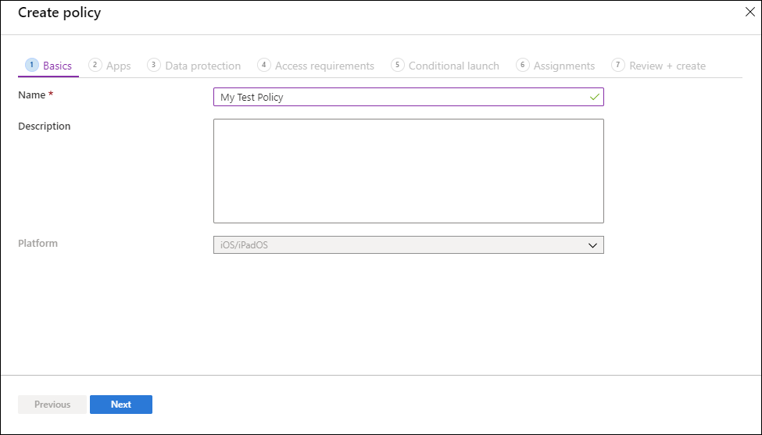
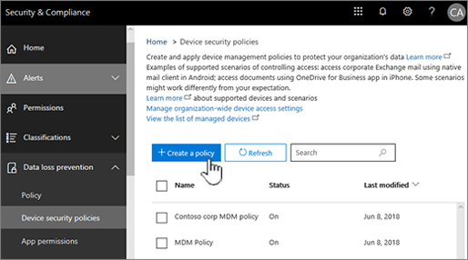

Let's examine how you can control Outlook for iOS and Android clients by using Enterprise Mobility + Security or by using the built-in Mobile Device Management (MDM) features of Microsoft 365.

## Use Enterprise Mobility + Security to manage Outlook for iOS and Android

Your Enterprise Mobility + Security subscription provides a versatile set of tools for managing your mobile clients. For example, you can selectively wipe your company's data from a device, require data encryption, and block access from compromised or lost devices. This unit focuses on Conditional Access policies and app protection policies.

### Create a Conditional Access policy

Conditional access policies impose requirements that users and devices must satisfy before they can connect to Exchange Online. You can assign different policies to different groups in your organization. This technique is useful, because more powerful administrators' accounts are targeted by attackers. It's sensible to apply stricter policies to administrative users than those that apply to users with fewer permissions.  

To create a Conditional Access policy, follow these steps. In this example, the policy requires users to authenticate with multifactor authentication:

1. In the Azure portal, go to **Azure Active Directory > Security > Conditional Access**, and then select **New Policy**.
2. Enter a descriptive name that will help other administrators to understand the purpose of the policy.  
3. Select **Users and groups** under **Assignments**. Add the groups that you want the policy to apply to the **Include** list. Add any groups that you don't want the policy to apply to the Exclude list. Click **Done**.  
4. Under **Cloud apps or actions > Include**, select **All cloud apps**, and then click **Done**.
5. Under **Conditions > Client apps > Configure**, select **Yes**, and then click **Done**.
6. Under **Access controls > Grant**, select **Grant access**, **require multi-factor authentication**, and then click **Select**.
7. To enable the new policy, under **Enable policy**, select **On**, and then click **Create**.

### Create an app protection policy

An app protection policy ensures that your organization's data remains secured, even when it is synchronized with a mobile device. For example, you can use app protection policies to prevent users from sharing your organization's data with other apps on the same device. You could also prevent users from using screen capture tools to save an image of sensitive data, which could be shared with others later, either deliberately or accidentally.  

In this example, you create a policy that prevents iOS devices from backing up your data or using copy and paste to transfer your data to another app:

1. In Microsoft Intune, go to **Apps > App protection policies**, click **Create policy**, and then select **iOS/iPadOS**.
2. On the **Basics** page of the **Create Policy** wizard, enter a name and description for the policy. Use these values to make the purpose of the policy clear to other administrators. Select **Next**.
   
3. On the **Apps** page, select **Yes** next to **Target to apps on all devices**.
4. On the **Data protection** page, select **Block** next to **Backup Org data to iTunes and iCloud backup**.
5. Select **Blocked** next to **Restrict cut, copy, and paste between other apps**, and then select **Next**.
6. Select **Next** on the **Access requirements** page and the **Conditional launch** page.
7. On the Assignments page, select **Next: Review + create**.
8. Click **Create**.

## Use Mobile Device Management (MDM) to manage Outlook Mobile

Mobile Device Management (MDM) is a Microsoft 365 feature that you can use to manage mobile devices at no extra cost.  

Before you can use MDM to secure any devices, you have to activate Mobile Device Management for Microsoft 365. Then you can create a device policy by following these steps:

1. In the Microsoft 365 admin center, search for "Mobile device management," and then select it in the search results.
2. Click **Device security policies** under **Device Management**, and then click **Create a policy**.
   

3. Specify your security requirements on the **Policy Settings** page.
4. Select the groups that you want to apply this policy to, and then click **Create this policy**.  

>[!NOTE]
> The settings that you can apply depend on the mobile operating system you are managing. For example, you can require a password for both iOS and Android devices, but you can only prevent simple passwords on iOS devices.

Once the policy has been created, its settings are pushed to the devices the next time they connect to Microsoft 365. If the device is connecting to Microsoft 365 for the first time, the user will receive a notification that explains how to enroll their device.  

## Learn more

[Managing Outlook for iOS and Android in Exchange Online](/exchange/clients-and-mobile-in-exchange-online/outlook-for-ios-and-android/manage-outlook-for-ios-and-android?azure-portal=true)
