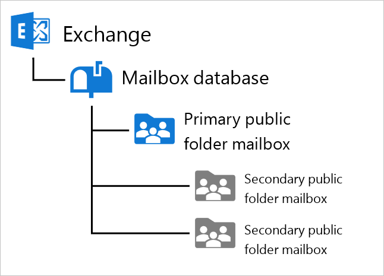
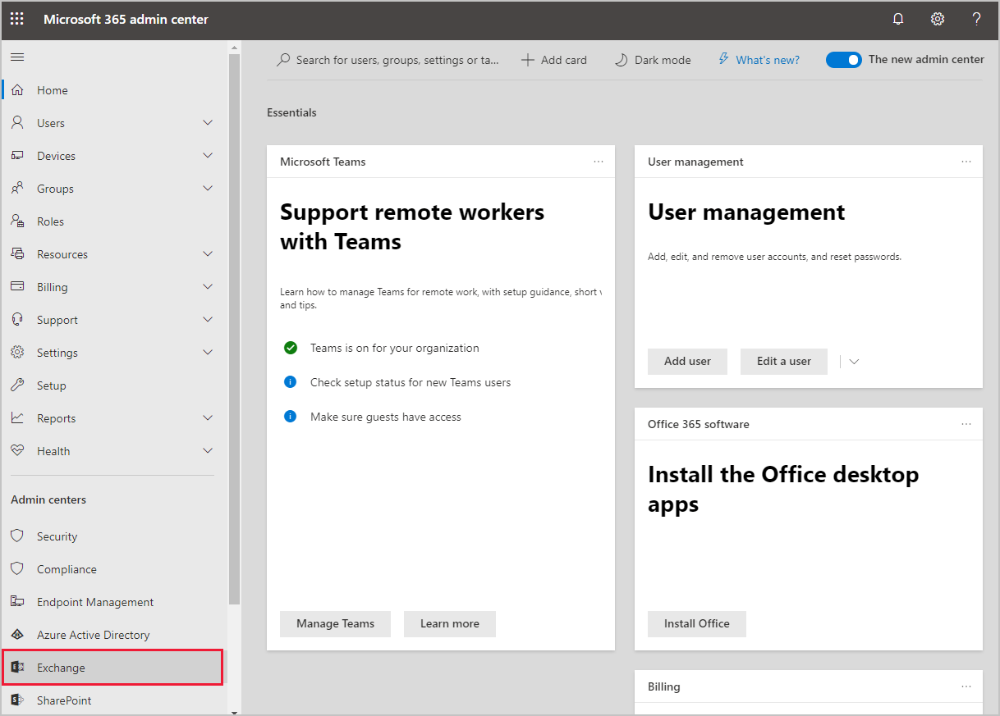
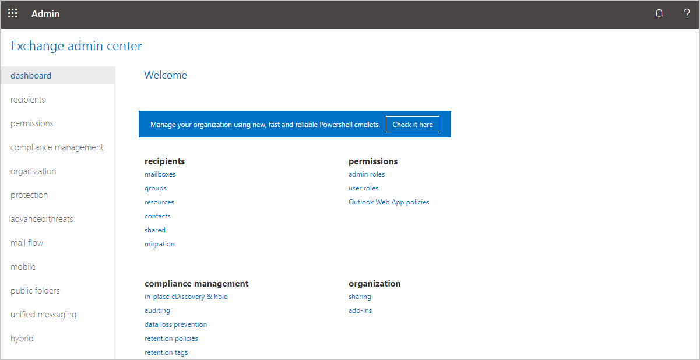
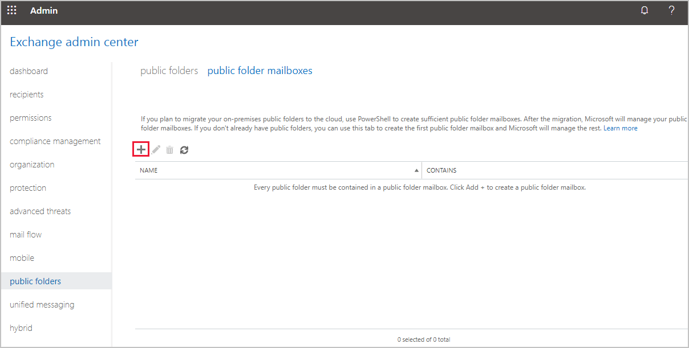
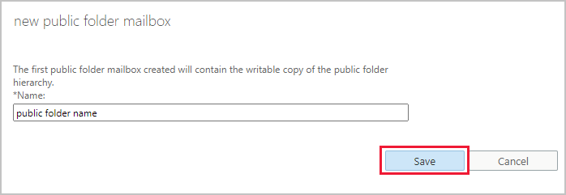

Exchange lets your organization store and organize content in a hierarchy that's easy to browse. Public folders and their contents are included in Outlook, where users can view, browse, and search them.

Because you can enable public folders to receive mail, you can also use them to archive discussions and distribution group threads. You can add a public folder's email address to any of your distribution groups, automatically archiving emails sent to the group.

However, there are better tools for sharing and collaborating on documents, like SharePoint or OneDrive. Unlike those tools, public folders don't provide any versioning or change control. Additionally, public folders aren't intended to function as personal email archives, as this undermines the goal of an organization's mailbox limits.

## Understand the public folder architecture

Public folders are supported in Exchange by specially designed mailboxes. Similar to a user's mailbox on Exchange, but with extra features, these mailboxes consist of both the hierarchy of the public folders, and the content stored inside them.



When you create the first public folder mailbox, it automatically becomes the primary hierarchy mailbox. The new mailbox contains the structure of all the organization's public folders, and this replicates to all the secondary hierarchy mailboxes. Secondary hierarchy mailboxes are created automatically by Exchange Online when the primary becomes full, or you can create them manually. You might need to create secondary hierarchy mailboxes if you intend to migrate large numbers of public folders from an existing on-premises Exchange server.

The hierarchy synchronizes between all the secondary folders every 15 minutes. If you add new public folders to the hierarchy, the synchronization is additionally triggered immediately.

Public folder mailboxes, therefore, contain both the hierarchy of the folders and their contents. Public folders can contain many kinds of content from messages, posts, documents, and forms.

## Create the primary public folder mailbox using the Exchange admin center (EAC)

You can access the EAC from the Microsoft 365 admin center. By default, the admin center's options are collapsed. To choose the EAC link, you'll first expand the menu by selecting **… Show all**, then selecting the **Exchange** link under **Admin centers**.



You could also use the direct link to the EAC in the **Learn more** section at the end of this unit.

> [!NOTE]
> You might need to use a new private browsing window to access the EAC, as your existing browser will use your current credentials.
>



> [!NOTE]
> If you don't see the Exchange admin center, make sure your Microsoft 365 user has the Exchange admin role assigned in the Microsoft 365 admin center.

1. In the navigation on the left, select **public folders**.
2. On the **public folders** page, select the **public folder mailboxes** link at the top.
3. Select **+** to create a new public folder mailbox.

   

4. In the new public folder mailbox window, enter the name for your public folder, then select **Save**.

   

This creates the primary public mailbox for Exchange Online. Repeat these steps to create more public folder mailboxes, which will all be secondary hierarchy public folder mailboxes.

## Create the primary public folder mailbox using PowerShell

Exchange Online allows you to connect using remote PowerShell to complete administration tasks. After you have connected a remote PowerShell session, you can create public folder mailboxes.

### Connect to Exchange Online

To control Exchange Online with PowerShell, you'll enable Windows 10 to execute remote scripts that have been signed. You only need to do this once for each machine.

1. On Windows 10, open a **Windows PowerShell** command prompt as an administrator.
2. Allow remote signed scripts to execute with this PowerShell command:

   ```powershell
   Set-ExecutionPolicy RemoteSigned
   ```

3. Store your Microsoft 365 credentials to enable PowerShell to connect to your instance of Microsoft 365:

   ```powershell
   $365UserCredentials = Get-Credential
   ```

4. Create the remote PowerShell session:

   ```powershell
   $Session = New-PSSession -ConfigurationName Microsoft.Exchange -ConnectionUri https://outlook.office365.com/powershell-liveid/ -Credential $365UserCredentials -Authentication Basic -AllowRedirection
   ```

5. Connect to the session:

   ```powershell
   Import-PSSession $Session -DisableNameChecking
   ```

### Create the primary public folder mailbox

You can now create public folder mailboxes using PowerShell:

```powershell
New-Mailbox -PublicFolder -Name PrimaryHierarchyPublicFolder
```

### Create additional public folder mailboxes

Repeat the above command to create additional secondary hierarchy public folder mailboxes.

### Check the commands worked

You can see a reference to the primary public folder mailbox by using this PowerShell command:

```powershell
Get-OrganizationConfig | Format-List RootPublicFolderMailbox
```

When you've finished managing Exchange Online, close your remote PowerShell session with:

```powershell
Remove-PSSession $Session
```

## Learn more

- [Exchange admin center](https://outlook.office365.com/ecp?azure-portal=true)
- [Public folders in Office 365 and Exchange Online](/Exchange/collaboration-exo/public-folders/public-folders?azure-portal=true)
- [Create public folder mailboxes](/Exchange/collaboration-exo/public-folders/create-public-folder-mailbox?azure-portal=true)
