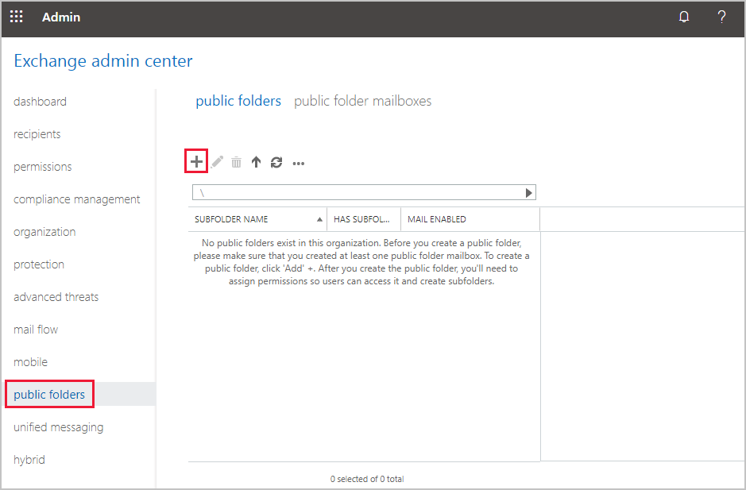
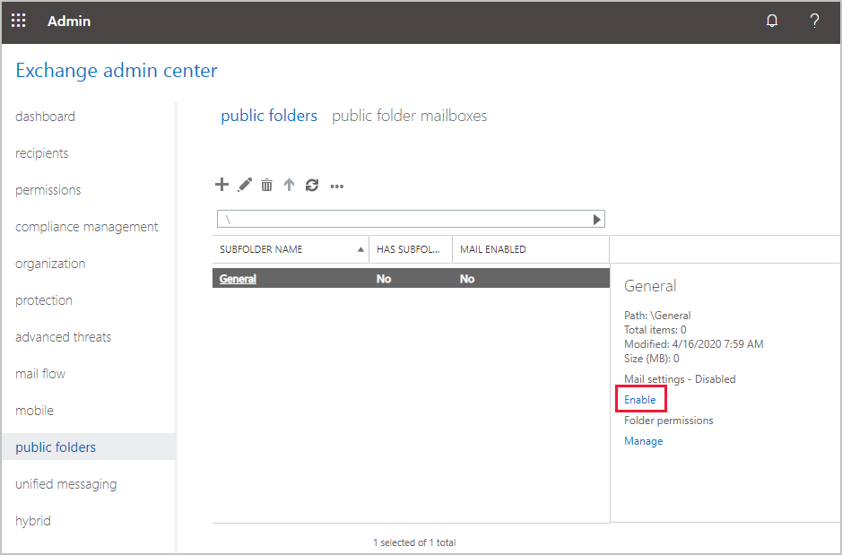
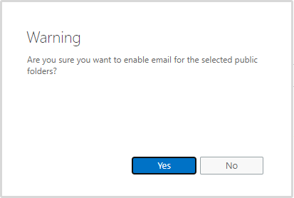
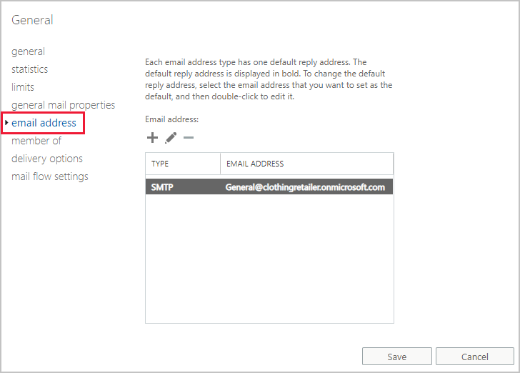
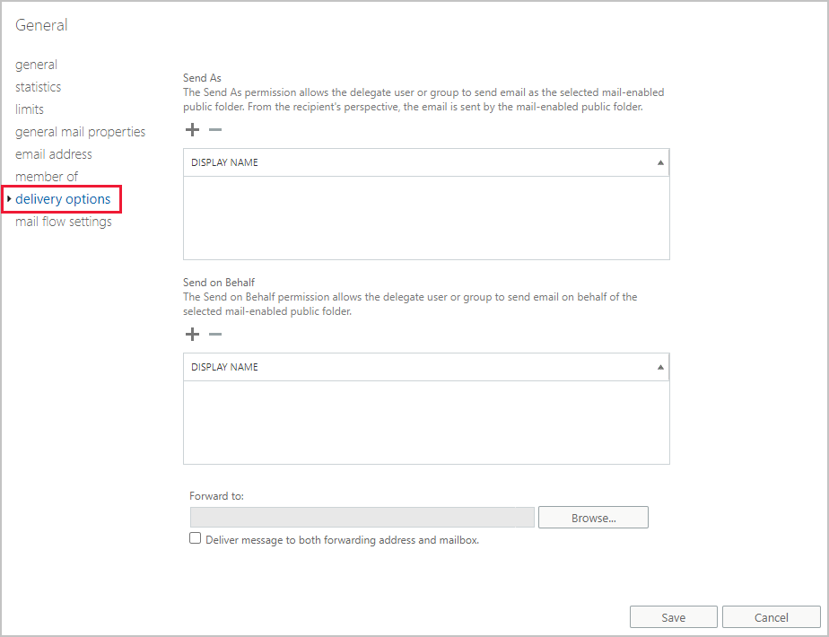
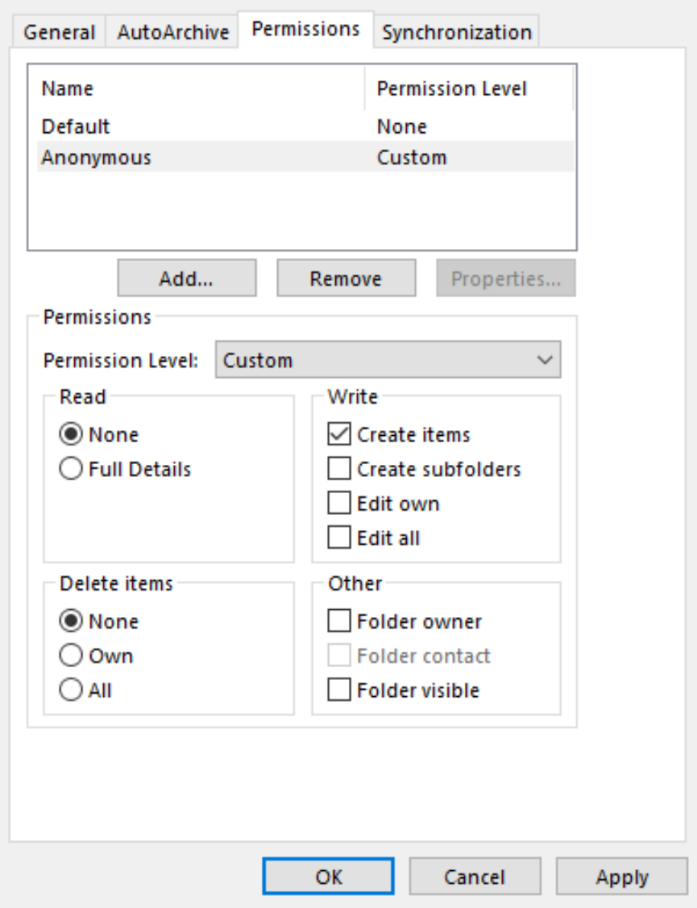

Now that you've created public folder mailboxes for the organization, you can start adding public folders. Public folders store shared information but become more powerful if they are mail-enabled. When a public folder has an email address, users can forward or send emails directly to it. You can also choose to allow users outside your company to send emails directly to these public folders.

## Mail-enable public folders using the EAC

1. Log in to the Exchange admin center and from the navigation menu on the left, select **public folders**.

   

2. To create a new public folder, select **+**.
3. In the opened public folder window, enter the name for your public folder.
4. For this example, name it **General**. Select **Save**.

   The new public folder appears highlighted in the Exchange admin center.

   

   In the information pane on the right, Mail settings is disabled.

5. Select the **Enable** link underneath.
6. In the Warning dialog, select **Yes**.

   

The default email address created for public folders is in the format **folder name @ organization URL**.

### Change or add an email address to a mail-enabled folder

You can add additional email addresses or change the associated email. Now that you've enabled mail settings for the folder, you can edit them in the Exchange admin center.

1. Select the **pencil** icon to edit the properties of the General public folder.
2. In the public folder window on the left navigation menu, select **email address**.

   

Note that there's an existing SMTP email address. On this pane you can add additional email addresses, and edit or remove existing email addresses.

## Mail-enable public folders using remote PowerShell commands

After you have connected to a remote PowerShell session, you can use Exchange PowerShell commands to mail-enable public folders. For example, if you have a top-level General public folder, use this command:

```powershell
Enable-MailPublicFolder -Identity "\General"
```

If you want to change the option for subfolders, you need to fully specify the path to that folder. For example, you'd enable a third-level folder with this command:

```powershell
Enable-MailPublicFolder -Identity "\Top Folder\First sub folder\Third level folder"
```

### Change or add an email address to a mail-enabled folder with remote PowerShell commands

After a public folder has been mail-enabled, you control the mail settings for the folder with the **Set-MailPublicFolder** PowerShell command. One of those options is to change the email address assigned to the public folder.

For example, to change a public folder named General's email address from general@clothingretailer.onmicrosoft.com to HelpDesk@clothingretailer.onmicrosoft.com, use this command:

```powershell
Set-MailPublicFolder -Identity General -PrimarySmtpAddress HelpDesk@clothingretailer.onmicrosoft.com -EmailAddressPolicyEnabled $false
```

## Change who can send ‘on behalf' and have emails ‘forwarded to' for public folders using the EAC

You control how mail is sent and received for the mail-enabled folders. The options to change these are in the same place as the settings to add new email addresses.

1. Using the Exchange admin center on the left navigation, select **public folders**.
2. Select the public folder you'd like to change the settings for, then select the **pencil** icon.
3. In the public folder window in the navigation on the left, select **delivery options**.

   

On this pane, you can add users to enable them to **Send As**, **Send on Behalf**, or choose users to have emails forwarded to.

## Change who can send ‘on behalf' and have emails ‘forwarded to' for public folders using remote PowerShell

As described earlier, the **Set-MailPublicFolder** PowerShell command allows you to also control who can Send As and Send on Behalf.
For example, to allow a user named User1 to send on behalf of a public folder named General, use this command:

```powershell
Set-MailPublicFolder -Identity '\General' -GrantSendOnBehalfTo "User1"
```

The option to Send As is managed with a different PowerShell command. Using the same user and public folder as the example above, use this command:

```powershell
Add-RecipientPermission -Identity 'General' -Trustee "User1" -AccessRights 'SendAs'
```

## Enable mail-enabled public folders to receive emails from outside your organization

An Anonymous account needs to be granted permission to send email to the folder, or to enable a public folder to receive email from the internet. You can't complete these steps using the EAC, but you can use Outlook or remote PowerShell commands.

To enable a public folder that's mail-enabled to receive emails from outside your organization, use this command:

```powershell
Add-PublicFolderClientPermission "\General" -AccessRights CreateItems -User Anonymous
```

Running this command will return:

```powershell
FolderName           User                 AccessRights                           SharingPermissionFlags
----------           ----                 ------------                           ----------------------
General              Anonymous            {CreateItems}
```

In Outlook, you'll need to use an account that has Owner permissions on the public folder. Using that account, you can change the properties of the folder, and add the **Anonymous** account to grant it **Create items** permission.



## Learn more

- [Mail-enable or mail-disable a public folder](/exchange/collaboration-exo/public-folders/enable-or-disable-mail-for-public-folder?azure-portal=true)
- [Assign **Send As** or **Send on Behalf** permissions for mail-enabled public folders](/exchange/collaboration-exo/public-folders/assign-permissions-mail-enabled-pfs?azure-portal=true)
