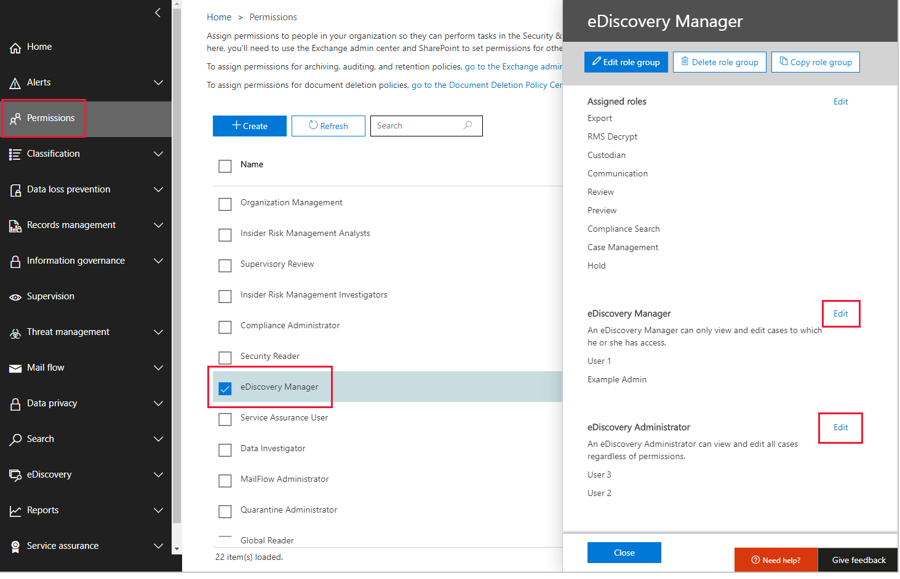
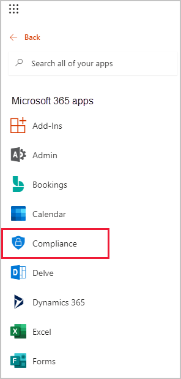
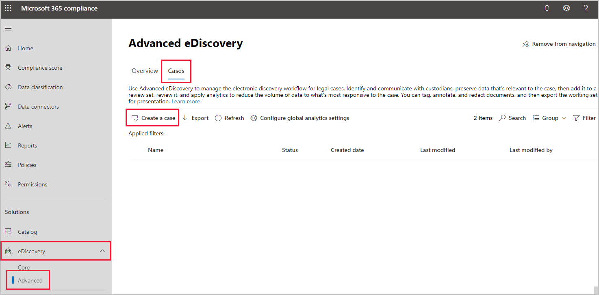
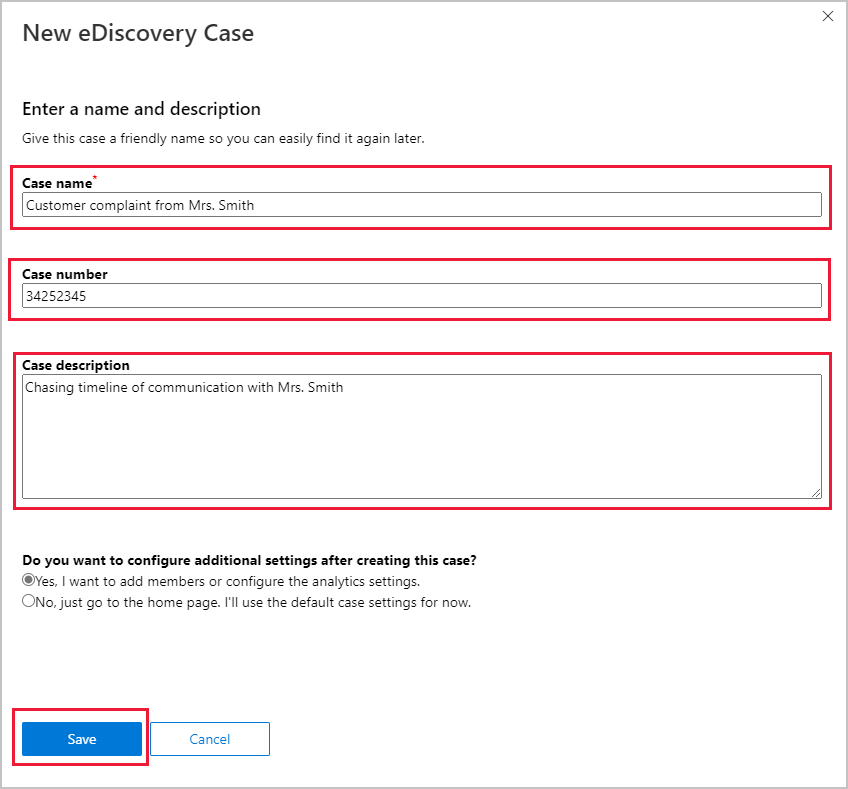
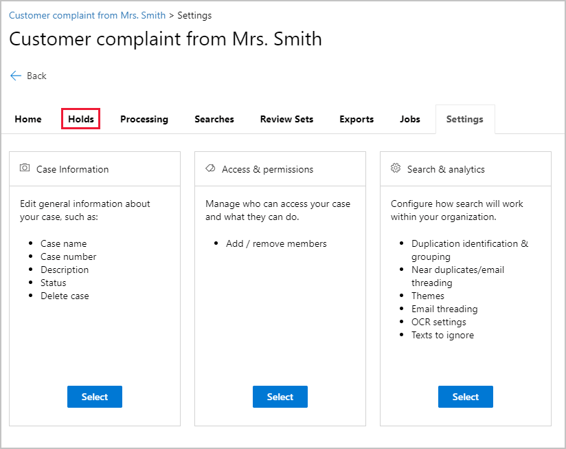
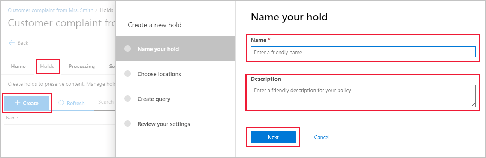
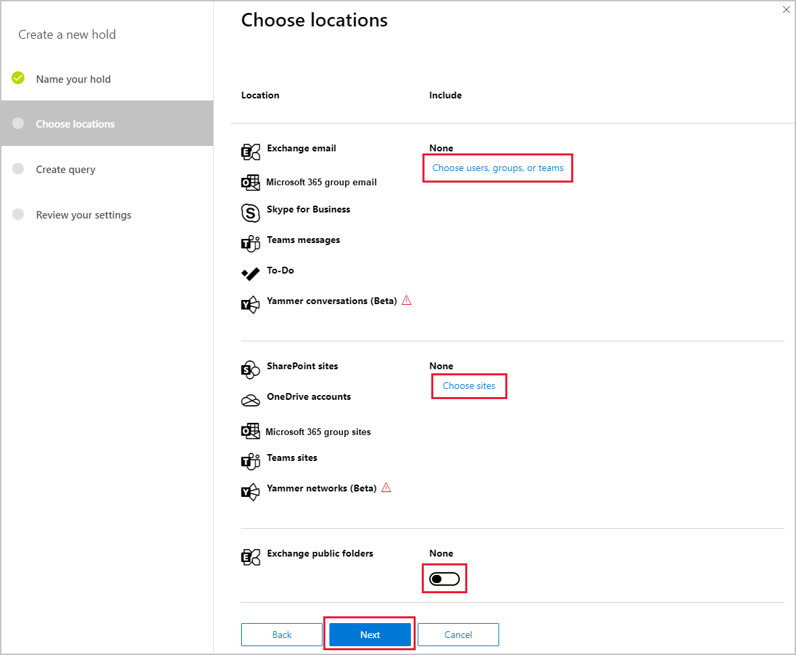

Microsoft 365 provides tools that run on-premises and in Exchange Online to support electronic discovery (eDiscovery). You use these tools to store, search, and process content stored throughout Microsoft 365. This includes emails in users' mailboxes or groups, chats in Teams, documents in SharePoint, or chats in Yammer.

As public folders might also contain valuable information required for eDiscovery, they can also be included.

## Grant access to eDiscovery

Within your organization, you'll need to add appropriate users to an eDiscovery Manager role. The role grants them access to the Microsoft 365 compliance center. The two roles you can use to grant this access are:

- **eDiscovery Manager**.Members of this role group can view and manage their own cases. Managers can add other managers, but by default will only see cases they own.
- **eDiscovery Administrator**. People in this role group have all the permissions of eDiscovery Managers, and they can view all cases in the organization. After assigning themselves, eDiscovery Administrators can also export case data and manage cases.

These roles are controlled in the **Permissions** section of the compliance center. Select the **eDiscovery Manager** permission and edit either the Manager or Administrator role.

## Creating cases in Microsoft 365 compliance center

Microsoft 365 compliance center allows you to manage your organization's compliance tasks—eDiscovery is just one of those activities. You'll create cases to control holds on information and search for content required for evidence in current or future legal cases.

You access the compliance center from the Microsoft 365 app launcher by selecting **Compliance**. After you've signed in with an account that has the correct permissions, you'll see the Compliance home page. You could also go directly to this page from the link in the **Learn more** section at the end of this unit.

### Create an eDiscovery case

1. Using the navigation pane on the left, expand **Solutions**, expand **eDiscovery**, select **Advance**, and then select the **Cases** tab.

   

2. On the Cases pane, select **Create a case**.
3. Enter the details of the case, for example "investigating a customer complaint," then select **Save**.

   

4. After the case is created, you can add information to it.

   

## Create an in-place hold to include public folders

You can instantly add hold details in the case summary screen, or access the case from the eDiscovery cases pane.

1. Select the **Holds** tab.

   

2. Select **+ Create**, enter a Name and Description in the **Create a new hold** panel, then select **Next**.

   

3. On the **Choose locations** page, add the users, groups, or teams you want to include.
4. Choose specific SharePoint sites, Team sites, or Yammer networks.
5. To include all the Exchange public folders, select the toggle switch, then select **Next**.

You can't choose individual public folders, as Microsoft 365 compliance center only allows for all the created public folders to be included in a case.

## Learn more

- [Microsoft 365 compliance center](https://compliance.microsoft.com/?azure-portal=true)
- [Get started with Advanced eDiscovery](/microsoft-365/compliance/get-started-with-advanced-ediscovery?azure-portal=true)
