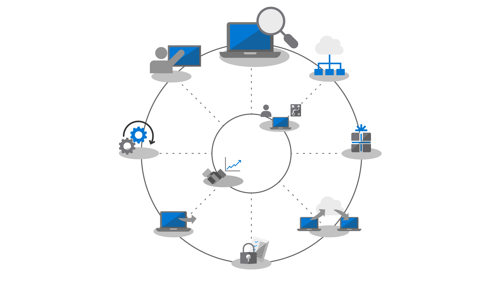

## Introduction to device and application readiness
=======

In the past, a major hurdle to upgrading users’ desktops was application and hardware compatibility. As you plan your shift to Windows 10 and Office 365 ProPlus, the good news is just about any application written in the last 10 years will run on Windows 10, and any COM add-ins and VBA macros your organization used on versions of Office dating back to Office 2010 will continue to work on the latest versions of Office without modification.

However, depending on the size and age of your organization, verifying application and hardware compatibility is likely still an essential initial step in the deployment process and should be continued through the deployment. In this module, we’ll cover the Microsoft readiness assessment tools, including Windows Analytics and the Readiness Toolkit for Office.

