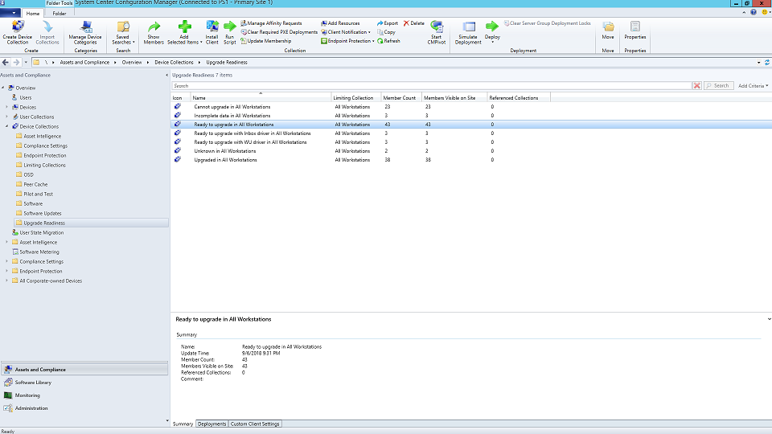
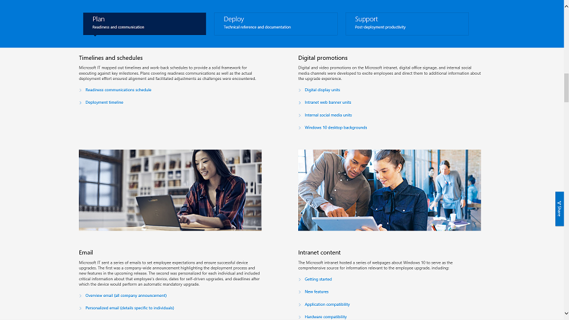

In addition to providing proactive end-user communications, you might also consider using deployment rings to control the rate of release within your organization. With a phased deployment and deployment rings, you start deploying to small groups and then broaden the deployment in a measured way over time. As you prepare a communication and training plan, form deployment rings and include them in your plan. This way you can reduce potential risk and validate your approach as you open the deployment valve or pause activities as needed, if, for example, you see more helpdesk calls than expected.

It's best to create deployment rings in cooperation with business units and managers. Buy-in from stakeholders can make it easier to get users on-board and comfortable with any changes coming their way.

## Phase 1: The IT team and early adopters

With these "insiders," you can test communications, impacts of the change, and the effectiveness of your training. During this phase, IT runs small pilots to develop troubleshooting and automation techniques to use during broader deployment phases.

It's important to have engaged members in this initial phase to ensure they're documenting their observations and providing feedback to the deployment team. It's also a good idea to include champions from outside the IT team to help spread word-of-mouth communications on new capabilities - they'll often be the first line of support when users in later phases need help. Business unit champions are great early adopters as they can help test the newest functionalities, provide feedback on communications and training, and drive adoption within their broader business units.

## Phase 2: Pilot

For this phase, it is especially important to communicate changes and help users take advantage of new features. Users often de-prioritize or ignore email or other comms coming from IT –you might want to meet with management to get their help in communicating the changes and drive adoption. You'll also want to identify time frames to avoid (based on end-user feedback) to minimize user disruption. For example, the finance team might be particularly busy at the end of the fiscal quarter, which can mean a lower tolerance of changes.

## Phase 3: Broad production deployment

By the time you start deploying broadly, the processes, communications, training, and self-service tools should be in place. New technology acceptance and adoption go on long after all of the users in your organization have installed Windows 10 and Microsoft 365 Apps. End users won't necessarily change how they work if the business doesn't take the time to train them on new functionalities. With new servicing models providing new capabilities semi-annually for Windows and, optionally monthly for Office, communication is an ongoing process.

## Learn more

- [Evaluate and select deployment options](/learn/modules/m365-modern-os-deployment/2-deployment-tools?azure-portal=true)
- [Build deployment rings](/windows/deployment/update/waas-deployment-rings-windows-10-updates?azure-portal=true)
- [Manage and troubleshoot provisioning packages](/windows/configuration/provisioning-packages/provisioning-packages?azure-portal=true)
