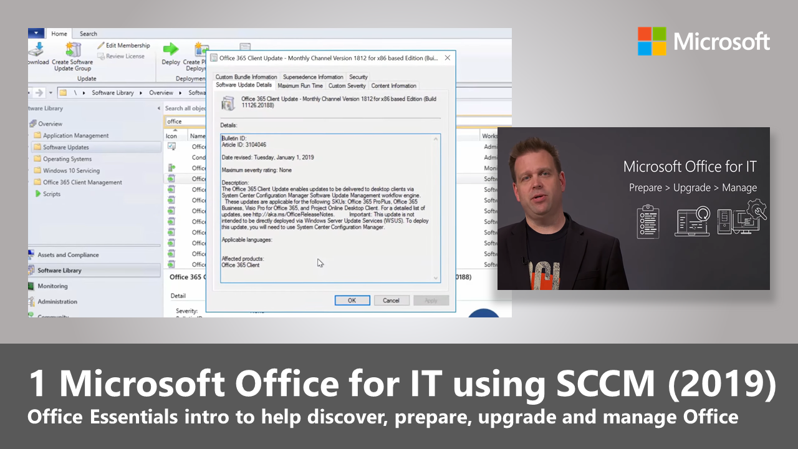

Microsoft Office applications are available for Windows, MacOS, mobile platforms, and the web. In this learning path we’ll focus on Office desktop apps for Windows and what you can do to prepare, upgrade and manage the Office suite on your systems. After completing this learning path, you should know the tools and best practices to move from an older version of Office to a current release, as well as what you can do to stay current as updates are released.

Current releases of Microsoft Office are designed to be compatible with existing files and Office add-ins – also known as COM add-ins – running in Microsoft Office 2010 and newer. In fact, more than 99% of COM add-ins will continue to work after your upgrade. We’ll show you the tools to discover both COM add-ins and VBA Macros in files and assess their compatibility with help from Microsoft’s compatibility data in the cloud.

Microsoft Office is available in both Office 365 and Volume Licensing editions. As of the 2019 release, both Office 365 ProPlus and Office 2019 Professional Plus and Standard use Click-to-Run packaging and specific tools designed for Click-to-Run. The MSI-based packages of Office Volume Licensing editions used until Office 2016 are no longer available; instead Volume Licensing editions use Click-to-Run and can be activated using Multiple Activation Keys (MAK) or Key Management Servers (KMS). A common misperception is that all Office Click-to-Run packages use Office 365 subscription-based activation, but this isn’t true. Both volume licensing and subscription-based activation are supported with Click-to-Run packages of Office.

Office 365 ProPlus and Office 2019 use updated deployment and management tools. The Office Deployment Tool is a lightweight setup.exe bootstrapper that can download, install, and configure Office using an XML configuration file. The new Office Customization Tool is a web-based interface used to author the XML configuration files. The Office Deployment Tool and the Office Customization Tool’s functionality is built into System Center Configuration Manager.  

Office servicing has also changed with the move to Click-to-Run packaging. In this learning path, we’ll explain monthly and semi-annual channel updates and how they work for both Office 365 and Office 2019 editions. We’ll also review your options to validate updates before release. We’ll also explore the following:

-	Post-deployment steps to manage software updates
-	how to add apps, languages, and other configurations to existing installations
-	Tools and processes to troubleshoot common configuration, update, and activation issues 
