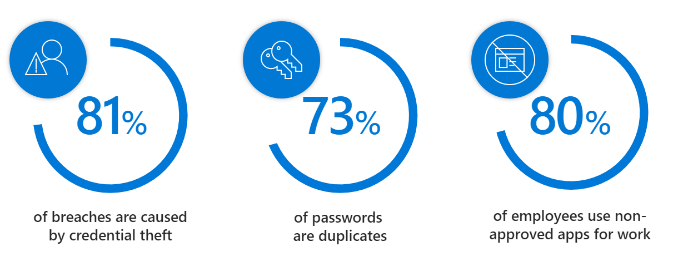

This material follows the steps to Prepare > Upgrade > Manage your Microsoft Office environment running on the Windows platform.

|Step |Description |
|-|-|
| **Prepare**|In the first step, Prepare, we'll walk through the requirements to prepare for your Office application upgrades in Windows: - Prerequisites, considerations, and update channel options - Network, language, policies, and common configurations - Readiness tools for discovering and assessing the compatibility of Office COM add-ins and VBA Macros|
| **Upgrade**|In the second step, Upgrade, we'll walk through the tools, options, and processes to deploy and upgrade Office applications in Windows: - Processes and tools to download and configure Office installation - Using the Office Customization Tool for application package creation - Monitoring Office upgrades and updates using Configuration Manager|
| **Manage**|In the third step, Manage, we'll explain the new options for Office software updates, post-deployment configuration, and common troubleshooting procedures: - Update management options across Microsoft 365 Apps and Office 2019 editions - Add apps, languages, or configurations to existing installations - Troubleshoot and manage common issues|
