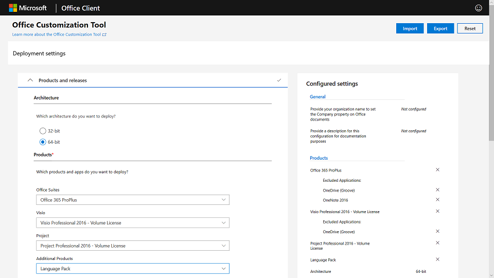
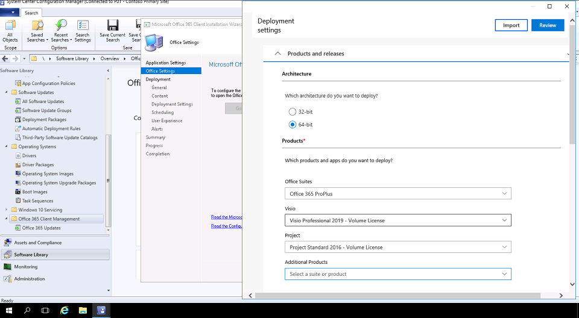

You can deploy Microsoft 365 Apps using several methods:

## Deploy Office with Click-to-Run technology

Microsoft 365 Apps and Office 2019 are both installed using **Click-to-Run,** which replaces MSI-based packaging in previous Office deployments. Click-to-run provides faster installations, faster and more efficient updating, and cleaner uninstallation than previous methods. Programs delivered with Click-to-Run run in a virtual application environment on your computer. They coexist with other applications without conflict. They also use about half the disk space of an MSI-based package.

## Deploy Office with the Office Deployment Tool

Office applications are delivered and managed via the **Office Deployment Tool** (also known as the Office Customization Tool), which is the Office setup engine needed to download, configure, and customize your Office apps. With this tool, you can set the applications and languages to be installed, the method for updating the applications, application preferences, and installation experience settings.

## Deploy Office with the Microsoft Endpoint Configuration Manager

If you use Configuration Manager, you can use it for broad deployment of Microsoft 365 Apps. Configuration Manager has native support for the updated Office Customization Tool, package customization for Click-to-Run at install time, and native support for software update management after installation. 

## Deploy Office using Intune

If your organization uses Microsoft Intune, you can assign Microsoft 365 Apps applications to Windows 10 devices. Intune supports both 32-bit and 64-bit versions of Microsoft 365 Apps.

> [!NOTE]
> If you are upgrading to Microsoft 365 Apps from a previous Office version, we recommend you uninstall versions of Office that use Windows Installer (MSI) as the installation technology. To help with this, you can use the Office Deployment Tool and specify the [RemoveMSI element]( /deployoffice/upgrade-from-msi-version) in your configuration.xml file.

### Explore options for deploying Microsoft 365 Apps

View a [video version](https://www.microsoft.com/videoplayer/embed/RE44vA8) of the interactive guide (captions available in more languages).

  
> [!NOTE]
> The video uses "Office 365 ProPlus" instead of "Microsoft 365 Apps." The video will be updated to use the current brand.

Be sure to click the full-screen option in the video player. When you're done, use the **Back** arrow in your browser to come back to this page.
