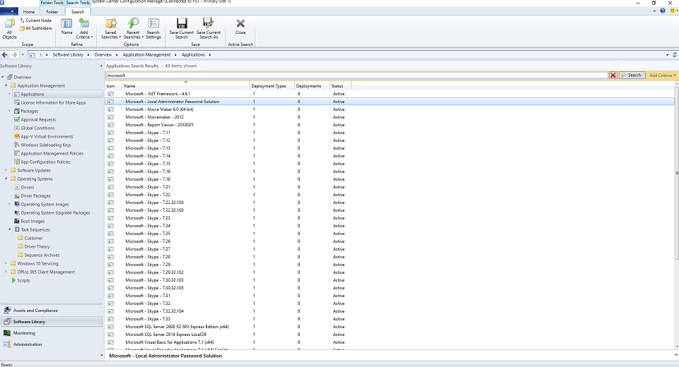

## MSI-based deployments

For line-of-business apps, Windows 10 continues to work with MSI-based packages and can install apps as part of an OS deployment task sequence. Software deployment tools like System Center Configuration Manager and Microsoft Intune are also optimized to deliver MSI-packaged apps. Once you have validated your apps on Windows 10, you can use System Center Configuration Manager for app delivery. The Company Portal in Microsoft Intune can extend the choice of IT sanctioned apps available to include the latest applications, and you can self-select what you need.

## PC imaging

Another popular method of app delivery is through PC imaging. In this case, applications are either installed via task sequence or manually on a sample PC. A system image is then captured with the required applications pre-installed. The imaging approach to build and capture can save time when provisioning new PCs but remember operating systems and apps within the image can become stale quickly. The cumulative update model in Windows 10 and Office 365 ProPlus helps with this problem but doesn’t eliminate it completely. This is why Microsoft recommends a thin image approach, where your applications are installed from outside the image at deployment time.

If you do want to include Office 365 ProPlus in your image, remember that Office employs a user-based activation, and cannot be pre-activated by the system admin. Use the Office Deployment Tool to pre-install Office on the device you are imaging and skip the user sign-in. Once the image is deployed, end users can sign-in using their Office 365 credentials and activate Office 365 ProPlus.

## Browser-based apps

There are a few considerations to make sure that browser-based applications continue to work as expected. If you have specific websites and apps that you know have compatibility problems with Microsoft Edge, you can use the Enterprise Mode site list to ensure that websites will automatically open using Internet Explorer 11.

Additionally, if you know that your intranet sites aren’t going to work properly with Microsoft Edge, you can set all intranet sites to open using Internet Explorer 11 automatically. This process uses an XML file to govern whether IE11 is used for each site, using Group Policy to enforce settings.