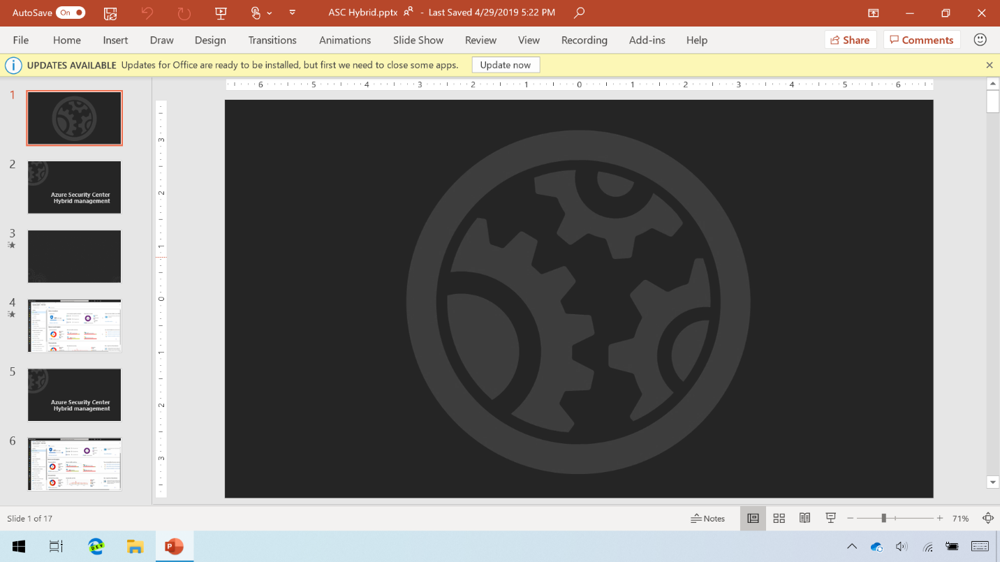

All Click-to-Run packages of Office share the same post-deployment servicing approaches. In the module **Prepare to upgrade and update Office at scale in Windows**, we explained the Office servicing channels used for software update management:

- Monthly channel
- Semi-annual channel

The monthly channel with Microsoft 365 editions includes new features, bug fixes, and most importantly, security fixes. The semi-annual channel releases continue to receive regular security and bug fixes between semi-annual releases.

Office 2019 editions resemble the semi-annual channel monthly servicing for security and bug fixes, but Office 2019 editions don't get new features in any monthly fixes.

In day-to-day operations, you can use any of these update types. Click-to-Run software updates are packaged and delivered in ways that are fundamentally different from MSI-based installations of the past. Click-to-Run updates are full application installation packages that you can also use to install Office. Click-to-Run doesn't use MSP files. Because updates are cumulative, you apply them to existing installations, whether or not they've been recently updated, even if they're very out-of-date. Also, you no longer need to restart Windows as part of the Office update process.

Software updates with Click-to-Run resemble in-place upgrades to the installed version of Office. The update process compares the update package with the installed version, sees what's already installed and still current, determines components that are out of date, and brings out-of-date replacement components plus net new components in from the update package. Like the initial Click-to-Run installation, you can point the Office update to files located on-premises with an SMB path, on a Microsoft Endpoint Configuration Manager Distribution Point or peer cache device, on the local hard drive, or the Internet using the Office Content Delivery Network (CDN). Office updates can happen without Internet connectivity if needed.

Once the update compares what's already installed with what is needed from the update source, it downloads the required files and saves them temporarily to the %ProgramFiles%\Microsoft Office\Updates\Download folder. The process then moves those files to the %ProgramFiles%\Microsoft Office\Updates\Apply\ folder. At that point, there are scheduled tasks that will run when the user signs in again or the next time the computer is idle. That means that restarting the device or closing and restarting an Office app can trigger the update process. This is similar to a straight file swap to the new files and is nearly instantaneous. Office is now up to date.

If the user doesn't close and reopen their Office apps or restart their device as part of their normal workflow, Office notifies users with system tray notifications after 4 days, by default. After 6 days, Office displays a message in the Office apps themselves informing the user that an update is ready to apply. You can use Group Policies to modify notification behavior and update timing.

Then when they're ready, users simply need to save their work, and then select Update Now. The update process itself usually takes a few seconds and will close and reopen apps. Again, it won't require Windows to restart.

Office update checks and processes use scheduled tasks. A few processes, such as OfficeC2RClient.exe, OLicenseHeartbeat.exe and others, run on regular schedules. These tasks do the following:

- Look for updates based on your channel and configuration.
- Check licensing status of the installation and rearm as required.
- Run background tasks to update Office data.

Office update detection runs, by default, 15, 45, and 75 minutes after the user signs in, daily at 3:00am, and when the device is idle (when there is no user interaction for 15 or more minutes).

If you're using Configuration Manager, the update engine works in a similar way, but it's governed by Configuration Manager client policies. You can manually discover and approve updates to your Click-to-Run-packaged Office apps using the standard update approval process.  
