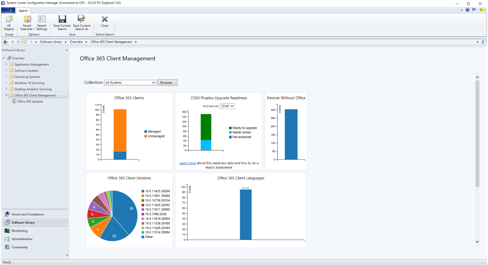

Configuration Manager version (1802 and newer) includes the Office 365 Client Management dashboard. You can use the Office 365 Client Management dashboard to see which Office versions are on your managed devices.

To view the Office 365 Client Management dashboard in Configuration Manager, go to **Software Library > Overview > Office 365 Client Management**. At the top of the dashboard, use the **Collection** setting to filter the dashboard data to members of a specific collection. Starting with Configuration Manager version 1802, you can click on different segments of a chart to see the relevant devices. For example, if you click the **Managed** segment of the **Office 365 Clients** in the following dashboard, you'd see a list of the managed devices with Office 365 clients installed.

The Office 365 Client Management dashboard provides charts with:

- Number of Office 365 clients
- Office 365 client versions
- Office 365 client languages
- Office 365 client channels
