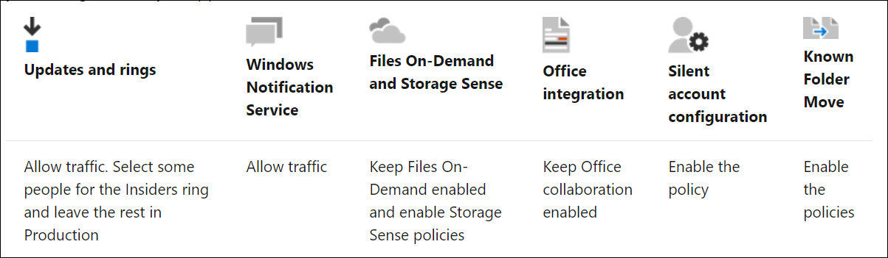

When the OneDrive sync app for Windows or Mac is installed, users can work with their OneDrive files in File Explorer or Finder. Users can easily save files to OneDrive from within the programs they use. The OneDrive sync app also supports SharePoint Server 2019.  Deploying the sync app is the first step in deploying OneDrive sync in the "ideal state". This sync state includes:

## Configuration tools for deployment

Depending on the size of your organization, it is common to use different deployment tools. For example, if you run a small business, you may want to keep your OneDrive deployment simple by installing the sync app manually on your computers and using the OneDrive admin center to manage settings. If you're in a larger organization, you may choose to deploy and manage OneDrive with advanced tools like Microsoft Endpoint Configuration Manager and Group Policy. If you are working directly with an OEM to optimize your Windows 10 deployments, you can ensure that you auto-enroll the device in Intune and set up the workstation, so OneDrive is preinstalled. If you are on macOS, you can use a deployment solution to package the OneDrive app and include different plist configurations as part of your deployment.

Manual installation by the users is normally not the best deployment approach, but it can work when combined with an administrative deployment. Manual deployment can also be used as a method for mobile device deployment while workstations have automated deployments. The manual setup of the sync app can also be started through the sync button in the toolbar in the web UI. To manage the rollout of the sync app to your organization, hide the Sync button on the OneDrive website to prevent your users from downloading the sync app themselves.

Primary desktop deployment mechanisms include:

- **Microsoft Endpoint Configuration Manager**. You can use Microsoft Endpoint Configuration Manager to deploy the new OneDrive sync app (OneDrive.exe) as well as the mobile apps for iOS and Android.
- **Intune**. Like Microsoft Endpoint Configuration Manager, you can use Intune to deploy the mobile apps for iOS, Android, and Windows.
- **Autopilot**. The OEM can install Windows 10 via hardware registration in Azure. As Windows 10 already includes OneDrive, the app will already be available, and any configurations can be done as part of the Autopilot build.

## Configuration options for deployment

There will always be management requirements beyond initial deployment. But you should decide in advance on configurations that may be needed first.

- **Silent account configuration**
  - We recommend enabling this feature to automatically sign in users with their work or school account when you deploy the sync app.
  - Silent account configuration won't work on devices for users who require multifactor authentication.
- **Files On-Demand**
  - OneDrive Files On-Demand enables users to view, search for, and interact with files stored in OneDrive from within File Explorer without downloading them all to their device.
  - The ability to automatically turn on Files On-Demand can be set or users can turn it on or off themselves.
- **Known Folder Move**
  - The two primary advantages for the users in your organization of moving or redirecting Windows known folders (Desktop, Documents, Pictures) to OneDrive are that they can continue to use the folders they're familiar with and that files are saved automatically to the cloud. Redirecting with Known Folder Move is normally an administrator process and can be deployed through Group Policy.
  - If your organization has a lot of files in their known folders, make sure to roll out slowly to minimize network impact on existing PCs.

## Deploying the sync app as a per-machine installation

By default, the OneDrive sync app installs per user under the %localappdata% folder. With the per-machine installation option, OneDrive installs under the "Program Files (x86)" or "Program Files" directory (depending on the OS architecture), meaning all profiles on the computer will use the same OneDrive.exe binary.

Other than where the sync app is installed, the behavior is the same. The per-machine sync app installation option is helpful especially for multi-user computers and when you don't want exe files running from the user profile.

The OneDrive sync app also supports virtual desktops.

## Network utilization planning for deploying OneDrive sync app

OneDrive sync can use considerable bandwidth. To ensure your network can effectively handle all users using OneDrive and syncing all their files, you should estimate the bandwidth required for your organization.

The most important time for managing bandwidth is during the initial deployment and initial sync. When users download files from locations for the first time, bandwidth usage will spike. Roll out a pilot or in smaller waves to minimize risk of excessive bandwidth usage. There are multiple options for controlling sync throughput during initial deployment, including using Group Policy to limit upload or download rate. Consider removing the sync restrictions and letting the sync tool manage bandwidth utilization if possible.

## Transition from the previous OneDrive for Business sync app

If you use the old sync app in your organization, you should deploy the newer sync app. The old app will be transitioned automatically through silent sign-in or manually by running the new OneDrive sync app.

Once the new sync app is deployed, the previous sync app should be blocked through PowerShell.

## Learn more

- [Deploy OneDrive apps using Microsoft Endpoint Configuration Manager](/onedrive/deploy-on-windows?azure-portal=true)
- [Deploy OneDrive apps by using Intune](/onedrive/deploy-intune?azure-portal=true)
- [Redirect and move Windows known folders to OneDrive](/onedrive/redirect-known-folders?azure-portal=true)
- [Use Group Policy to control OneDrive sync settings](/onedrive/use-group-policy#use-onedrive-files-on-demand?azure-portal=true)
