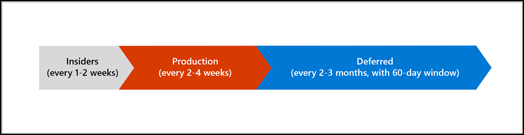
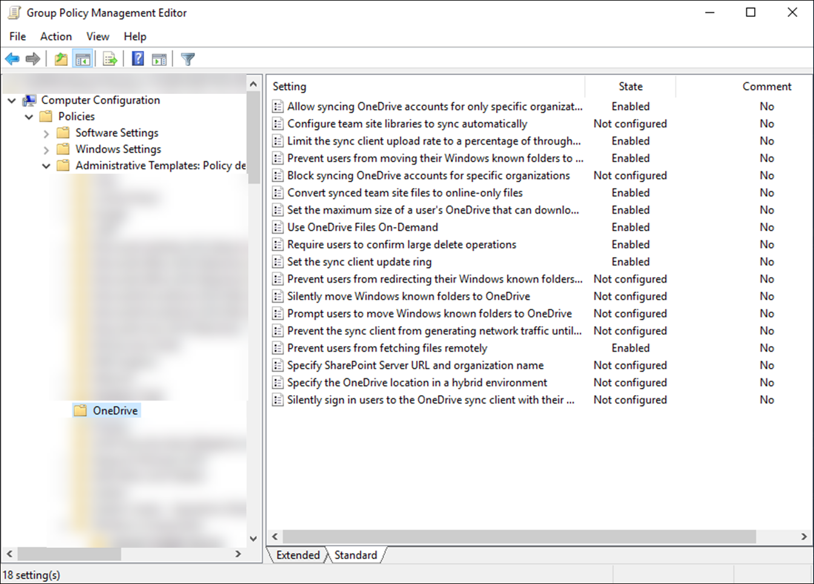

The OneDrive sync app syncs files between a computer and the cloud. After deploying the OneDrive sync app to your organization, you can deploy different configurations depending on your needs.

## OneDrive sync app update process

The OneDrive sync app is a standalone app that updates itself automatically is separate from other Office updates. OneDrive updates are released in three rings:

- Insider – every 1-2 weeks
- Production – every 2-4 weeks
- Deferred – every 2-3 months

As an admin, you can decide which ring works best for your users. We recommend that you select several people in your IT department as early adopters to join the Insiders ring and receive features early. Leave everyone else in the organization on the default Production ring to ensure they receive bug fixes and new features in a timely fashion. The Deferred ring is the slowest ring to receive performance improvements, reliability fixes, and new features, but it allows you to control when you deploy updates.

The OneDrive sync app checks for new updates every 24 hours when it is running.  Windows 10 has a scheduled task that updates the sync app even when it's not running.

## Manage OneDrive sync settings using Group Policy

You manage the OneDrive sync app in a Windows Server enterprise environment that uses Active Directory through Group Policy. OneDrive Group Policy objects work by setting registry keys on the computers in your domain. When you enable or disable a setting, the corresponding registry key is updated on computers in your domain.

Both user policies – which affect the user regardless of computer, and computer policies – which affect the computer regardless of user – are available.

When managing OneDrive Group Policy objects, review how they work together. Some policies will conflict with each other. Plan your policies and deploy them to a pilot group first. When planning, they can be grouped into topics such as:

- Controlling sync
  - Allow or block specific tenants to sync.
  - Prevent changing of the sync location and set a default location of the synced files.
  - Disable personal sync so users cannot sync OneDrive consumer locations on an organization's computer.
- Controlling network
  - Manage upload and download limits or allow automatic bandwidth percentage.
  - Control sync on metered or battery saving networks.
  - Prevent network traffic before sign-in.
- Deploying Known Folder Move (KFM) or Files On-Demand
  - Enable or block
  - Silently enable or provide user interaction.
  - Prevent KFM from redirecting folders to local computer.
- Managing Office integrations
  - Prevent remote file fetch.
  - Decide how office files in conflict are handled.
  - Enable coauthoring and in-app sharing.
- Administrative
  - Delaying app update to a future release.

This is not an inclusive list of all policies, and these policies can change often.

If you are managing devices in your organization using Intune, you can complete similar configurations using Administrative Templates. Administrative templates include hundreds of settings that control features in Microsoft Edge, Office, OneDrive, and more. This applies to Windows 10 and newer machines. The Windows settings are similar to Group Policy settings in AD. These settings are built into Windows and are ADMX backed settings.

## Learn more

- [OneDrive sync app release notes](https://support.office.com/article/845dcf18-f921-435e-bf28-4e24b95e5fc0?azure-portal=true)
- [Use Group Policy to control OneDrive sync settings](/onedrive/use-group-policy?azure-portal=true)
- [The OneDrive sync app update process](/onedrive/sync-client-update-process?azure-portal=true)
