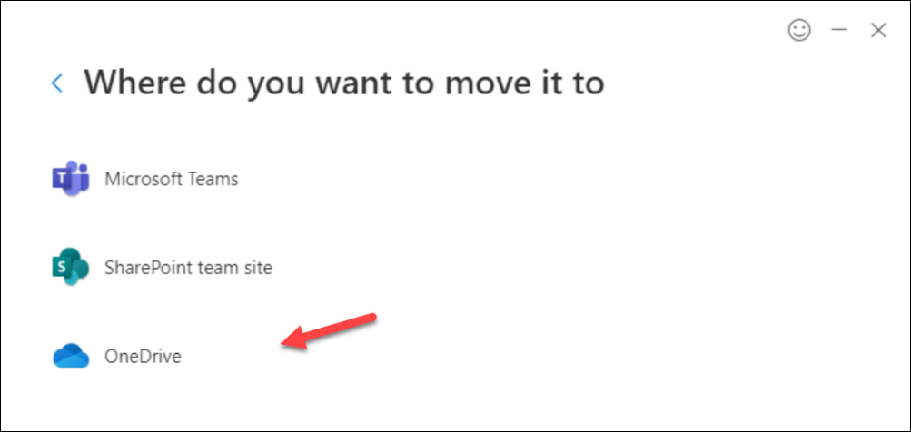

One of the most important decisions you make is about migration. Existing files can come from many locations such as file shares, local computers, other cloud providers, and commonly, on-premises SharePoint Server MySites.

Migrate individual users' files to OneDrive. Shared repositories should be migrated to SharePoint sites.

Identify if all files are worth migrating or just some. Old content doesn't always need to be migrated and doing so adds more time.

In your migration plan, there are multiple paths to consider:

## Self-service migrations

Self-service migrations allow the user to move files on their own and eases the burden on the administrative team. Self-service migration options include:

- **Self-service migration using OneDrive sync app**. The OneDrive sync app syncs files from your computer to your OneDrive site. Users can sync their new OneDrive site to their computer and then move files to the new synced folder with file explorer.
- **SharePoint Migration Tool**. The SharePoint Migration Tool (SPMT) works for both small and large migrations. Users download the tool and follow the prompts to migrate files to their OneDrive site.

## Administrative migrations

Administrative migrations that are not self-service are run by administrators or a migration team. For an administrative migration, all OneDrive sites need to be pre-provisioned prior to the migration. Administrative migrations options include:

- **SharePoint Migration Tool**. The SharePoint Migration Tool (SPMT) is a free tool that can migrate files, folders, list items, permissions, versions, run incremental migrations, and migrate other SharePoint specific features.  You can use JSON or CSV files for bulk migrations. The reporting functionality helps manage, audit, and troubleshoot the migration. Running SPMT as an administrator, you can also utilize PowerShell to automate the migration.
 
   
- **Cloud content migrations with Mover**. Another option for migrations is the cloud content migrations solution within the SharePoint admin center, which supports migrations from over a dozen cloud service providers – including Box, Dropbox, Egnyte, and Google Drive into OneDrive.
 
   
- **Migration Manager**. If files are hosted in file shares, they can be migrated to OneDrive through the Migration Manager in the SharePoint admin center. Migration Manager uses agents installed on machines and runs migration tasks created by the administrators. This uses the same technology as the SPMT but allows you to control your migrations from multiple machines through the admin center.

   
- **Third-party migration solutions**. There are many Microsoft partners that specialize in migrations and offer tools to make your move to OneDrive faster. Each tool has different capabilities, so you'll want to review the options to see which one meets your needs.
- **Microsoft FastTrack**. FastTrack is a Microsoft service that may be included in your subscription that provides you a set of best practices, tools, resources, and experts—including OneDrive onboarding guidance, migration benefits, and adoption guidance-for helping facilitate your experience with the Microsoft Cloud. Onboarding guidance includes help with discovering what's possible, creating a plan for success, and onboarding new users and capabilities.  FastTrack is available to customers with 500 or more licenses.

## Pilot administrative migration

An administrative migration should begin with a pilot to validate the process and gather data on migration performance, user communication, and user issues. The pilot should consist of three steps:

1. Select a small representative set of users for the pilot migration and ensure they have enough content to be representative of the overall migration.
1. Perform the migration. You should employ an incremental migration method in which the migration happens in the background with no user impact, followed by a cutover event in which network and local file shares are disabled and users are directed to OneDrive.
1. Analyze the pilot migration data to determine your migration schedule and address any issues that arise in the pilot.

When it comes time for the enterprise migration, you should employ the incremental migration method, just like in the pilot. Microsoft recommends a single cutover event to help prevent users from updating duplicate copies of content.

The more content that is migrated, the more complex a migration becomes and the chances that issues could occur will arise. Mitigation of issues occurs with a thorough content analysis, utilizing migration tools that fix issues prior to migration.

## Migrating to different geographic locations

With Microsoft 365 Multi-Geo, you can provision and store data at rest in the geographical locations that you choose to meet data residency requirements.  In a multi-geo configuration, your organization consists of a central location and one or more satellite geographical locations. Each user's OneDrive can be provisioned in or moved by an administrator to a satellite location in accordance with the user's preferred data location in Azure AD. Files stores in OneDrive are then kept in that geographical location, though they can be shared with users in other locations.

## Learn more

- [Migrate content to OneDrive for Business](/sharepointmigration/migrating-content-to-onedrive-for-business?azure-portal=true)
- [File share to OneDrive and SharePoint Migration Guide](/sharepointmigration/fileshare-to-odsp-migration-guide?azure-portal=true)
- [Migrate OneDrive for Business files from on-premises SharePoint 2013 to Office 365](https://support.office.com/article/migrate-onedrive-for-business-files-from-on-premises-sharepoint-2013-to-office-365-a9894a64-675a-4931-91f6-a76d94136edc?azure-portal=true)
- [Pre-provision OneDrive for users in your organization](/onedrive/pre-provision-accounts?azure-portal=true)
- [Get started with the Migration Manager](/sharepointmigration/mm-get-started?azure-portal=true)
- [FastTrack Center Benefit Overview](/fasttrack/O365-data-migration?azure-portal=true)
