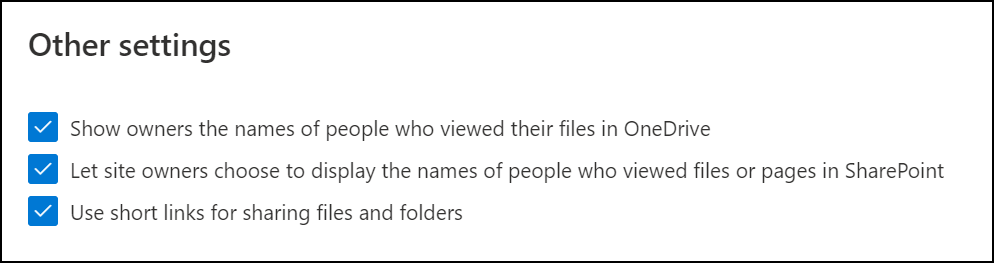

## Display to owners the names of people who viewed their files
This setting lets you control whether the owner of a shared file can see on the file card the people who have viewed (and don't edit) the file. The info includes the total number of views of the file, the number of people who viewed it, and the list of people who viewed it.

 

## Learn more
- [Manage sharing settings](https://docs.microsoft.com/sharepoint/turn-external-sharing-on-or-off?azure-portal=true)
- [Turn on external sharing notifications for OneDrive](https://docs.microsoft.com/onedrive/turn-on-external-sharing-notifications?azure-portal=true)
- [Shorter share link format in OneDrive and SharePoint](https://docs.microsoft.com/sharepoint/dev/spfx/shorter-share-link-format?azure-portal=true)
