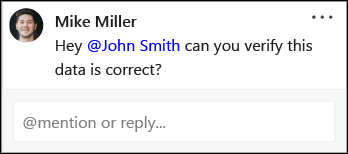
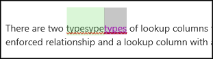

In Microsoft 365, users can coauthor documents in Word, PowerPoint, Excel, and OneNote when they are saved in OneDrive or SharePoint. This means users can work on those files with others at the same time, whether they are using Office for the web, the mobile apps, or the desktop apps.

With one shared file, a whole team can work together on the same document and see changes that each participant makes live. Users no longer need to worry about saving multiple versions of files and sending attachments. With coauthoring in Microsoft 365, users will always be working on document that is the most recent version.

Coauthoring is available for files stored in OneDrive and SharePoint. To coauthor with others, users need:

- **A supported storage location**. OneDrive, SharePoint, and SharePoint Server are storage locations that enable coauthoring.
- **Apps that support coauthoring**. OneNote, Word, and PowerPoint on all devices and Office 2010 or later desktop apps. The Excel mobile apps and the latest version of Excel for Office 365 also support coauthoring. 
- **A coauthoring-friendly document**. Coauthoring is only supported on modern file formats including: .docx (Word), .pptx (PowerPoint), and .xlsx (Excel).
- **Edit permissions for coauthors**. All coauthors must have permission to access and edit the documents. Users can use the sharing system in OneDrive or directly in Office to grant this access

The easiest way to initiate a coauthoring session is to share a file with others as described earlier. When multiple users have the same file open at the same time, they are now coauthoring. When coauthoring a document, all users can see who else is coauthoring:

Users will also be able to see where the other users in the file are:

Users can add comments and @mention other users, who will then receive an email with a link to the comment. They can click the link to open the document and the conversation or reply to the comment directly in email.

When a user reopens a Word file, they can view tracked changes by others. When a user reopens a changed PowerPoint, the changed slides are highlighted in the thumbnail pane.

Coauthoring requires users to be online. Some areas of an Office file are locked to avoid collisions.

If a user makes changes when offline, OneDrive will attempt to merge them when they go back online and then notify other users who have also been in the document. Users will also be notified of any conflicts and presented with a process of resolving them.

## Learn more

- [Document collaboration and coauthoring](https://support.office.com/article/document-collaboration-and-co-authoring-ee1509b4-1f6e-401e-b04a-782d26f564a4?azure-portal=true)
- [Work together on Office documents](https://support.office.com/article/work-together-on-office-documents-ea3807bc-2b73-406f-a8c9-a493de18258b?azure-portal=true)
- [Troubleshoot coauthoring in Office](https://support.office.com/article/troubleshoot-co-authoring-in-office-bd481512-3f3a-4b6d-b7eb-ebf9d3626ae7?azure-portal=true)
