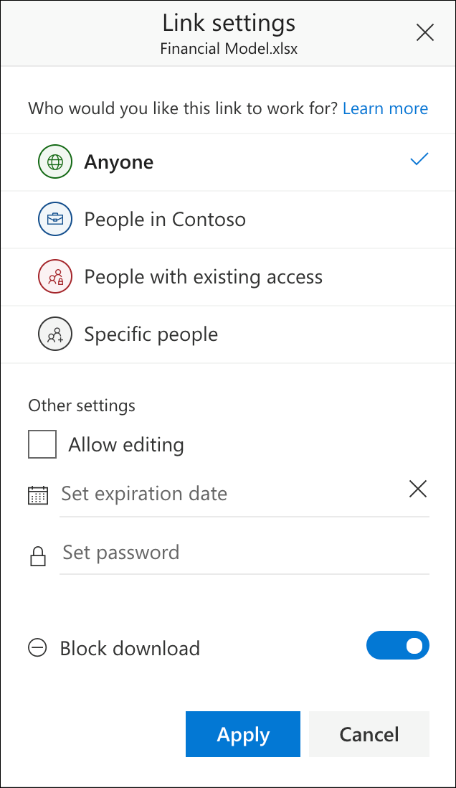
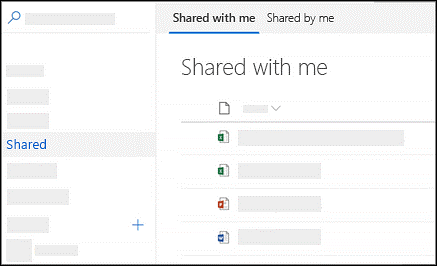
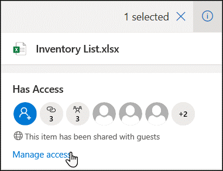
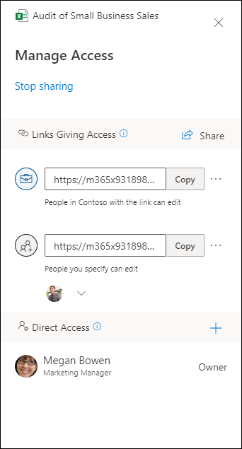
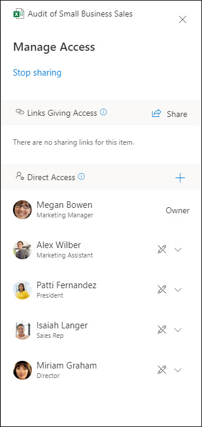

The files and folders stored in OneDrive are private until the owner decides to share them. The sharing UI in OneDrive is the same across all Microsoft 365 services, including SharePoint, File Explorer, Mac Finder, Outlook, etc. The module, *Plan & configure external sharing in OneDrive*, describes how you as an admin can configure what users see in the sharing experience.

Users share files in OneDrive by sharing links. Links are automatically created whenever a user shares a file or folder. The type of link the user chooses determines who the link will work for. Sharing also manages the direct permission of the files. When users share a file or folder, the user sharing retains management of the links that are created. The users who are shared to, cannot manage the created sharing links.

Sharing a file or folder allows users to select the people with whom they want to share and what permissions they will get. These options vary based on your configuration.
The options consist of:

- **Anyone**. gives access to anyone who receives the link, whether they receive it directly from the file or folder owner or it is forwarded from someone else, including people outside of their organization. This link is not discoverable and must be sent to users to get access. This type of link provides anonymous access.
- **People in *Your Organization***. gives anyone in an organization who has the link access to the file, whether they receive it directly from owner or it is forwarded from someone else. This type of link is not discoverable through search. It allows for unrestricted internal sharing.
- **People with existing access**. can be used by people who already have access to the document or folder. Use this option to send a link to somebody who already has access.
- **Specific people**. gives access only to the people the owner specifies.  If people forward the link, only people who have access/permission to the item will be able to use the link. Recipients can include people outside your organization if you've enabled guest sharing.

Once the user determines who they want to share with, they can select different options for controlling the sharing based on who they want to share with, including:

- **Allow editing**. Specifies if the recipient can edit the file. You can set the default setting for this control in the SharePoint admin center. Users can change the setting before they send the link.
- **Set expiration date**. The link will only work until the date you set. After that, you'll need to create a new link for users requiring access to your file or folder.
- **Set password**. Users will be prompted to enter a password before they can access the file. You'll need to provide this password separately to recipients. This is only available for Anyone links.
- **Block download**. Users can open the file but cannot save a local copy.

Users can also share files and folders through Outlook, Office apps, the OneDrive mobile app in iOS and Android, SharePoint, and even File Explorer or Mac Finder for files synced to their computer. All offer the same user experience.

Outlook offers an experience called modern attachments that helps guide users through a seamless sharing of OneDrive files just as if they were email attachments. This feature provides a familiar sharing experience but centralizes storage of attachments in OneDrive, providing collaborative benefits such as version control that are typically lost when users email documents back and forth. In addition, you can configure sharing permissions for files directly from within Outlook.

## Viewing shared files

OneDrive provides a way to find files users have both shared and been shared with them. This view is not a folder and users cannot move items in and out of these views. In the left navigation pane, select Shared.

If the owner of the original file revokes access or deletes the original file, it will disappear from the Shared view of anyone they shared it with.

## Managing access or controlling a share

The file owner can stop or change the sharing permissions at any time.

Once they select a file or folder they want to change sharing settings for, they click on the details pane and select Manage access:

The manage access panel opens and they have a collection of options for either **Links Giving Access** or **Direct Access**.

- **Links Giving Access** shows the links that have permissions to the file or folder. Click the ellipsis (…) to see users who the link has been shared with.

   
- The **Direct Access** section shows people and groups who have been granted access directly to the file or folder. (This includes groups that have access to the site where the file or folder resides.)

   

Owners can change permissions between view and edit.

Users can stop sharing files and folders at any time.

## Learn more

- [Share OneDrive files and folders](https://support.office.com/article/share-onedrive-files-and-folders-9fcc2f7d-de0c-4cec-93b0-a82024800c07?ui=en-US&rs=en-US&ad=US#BKMK_BusinessTab?azure-portal=true)
- [See files you shared in OneDrive](https://support.office.com/article/see-files-you-shared-in-onedrive-6b67b82b-9c5c-4348-ab10-fd5b0d8df76c?azure-portal=true)
- [See who a file is shared with in OneDrive or SharePoint](https://support.office.com/article/see-who-a-file-is-shared-with-in-onedrive-or-sharepoint-51bb79a9-b696-410d-a7a7-c320e541272d?azure-portal=true)
- [See files shared with you in OneDrive](https://support.office.com/article/see-files-shared-with-you-in-onedrive-2c14e8e6-4e52-4c61-9778-7155d33534a1#ID0EAACAAA=OneDrive_-_Business?azure-portal=true)
- [Stop sharing OneDrive or SharePoint files or folders, or change permissions](https://support.office.com/article/stop-sharing-onedrive-or-sharepoint-files-or-folders-or-change-permissions-0a36470f-d7fe-40a0-bd74-0ac6c1e13323?azure-portal=true)
