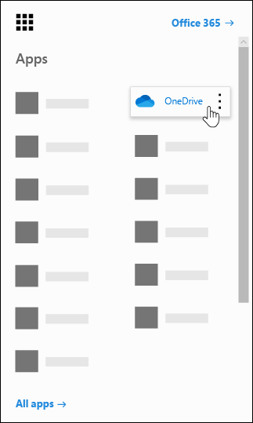
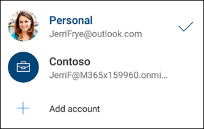

In OneDrive, your users can view their own files ("My files"), files that have been shared with them, and files that are on SharePoint sites ("Shared libraries"). They can also discover relevant files that their colleagues are working on.

There are multiple ways to interact with files in OneDrive, and it is important to understand how, where, and what scenarios your users can use OneDrive. Knowing what users will be doing is vital to you as an admin in providing guidance, support, and management for the service.

To access OneDrive from Office.com, users can browse to it from the **app launcher**.

In the OneDrive mobile app, users can add their work or school account and easily switch between accounts.

If OneDrive files are synced to a user's device, they are accessible in File Explorer under **OneDrive – [your company]**.

![If OneDrive files are synced to a user's device, they are accessible in File Explorer under OneDrive – [your company]](../media/file-explorer.png)

## Should users save files in OneDrive, SharePoint, or Teams?

A good way to think about OneDrive storage is that it's for "My files" while SharePoint and Teams are where we store "Our files". OneDrive files are private unless shared with others. That means every file users upload, create, or sync will by default only be viewable by them. A file or folder can be shared with others in an organization or, if the organization allows it, with people outside the organization. Once a file or folder is shared, it is viewable only by file owner and whoever they shared it with. When files are stored in SharePoint or Teams, they will be viewable by anyone who is a part of the team or has permissions to the SharePoint site.

## Learn more

- [Intro to OneDrive (work or school)](https://support.office.com/article/upload-and-save-files-and-folders-to-onedrive-for-business-a1397e56-61ec-4ed2-9dac-727bf8ac3357?azure-portal=true)
- [Should I save files to OneDrive or SharePoint](https://support.office.com/article/should-i-save-files-to-onedrive-or-sharepoint-d18d21a0-1f9f-4f6c-ac45-d52afa0a4a2e?azure-portal=true)
