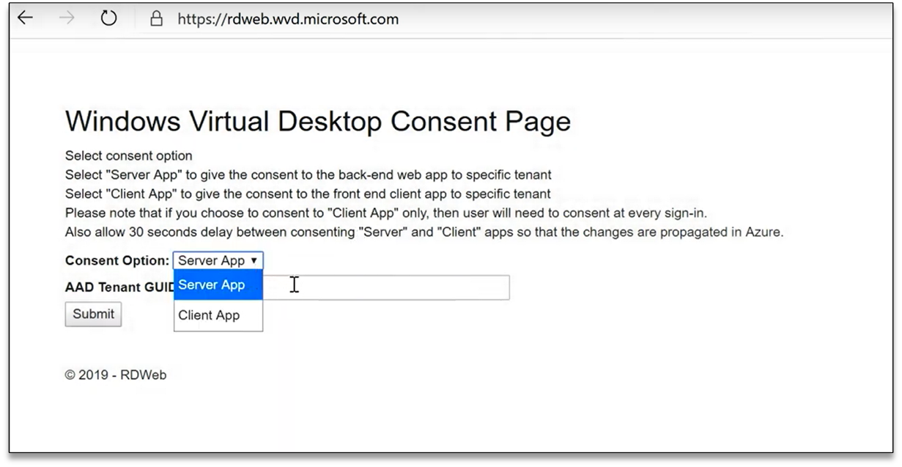
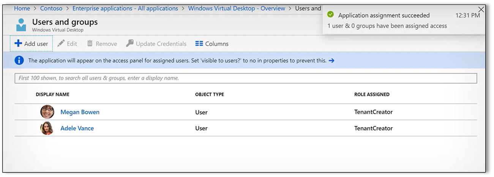

With all prerequisite steps complete, you're ready to create a Windows Virtual Desktop tenant. The tenant is used to group your host pools and to identify your resources in later provisioning and customization steps. 

## Provision a Windows Virtual Desktop Tenant Creator account 
You'll use An Azure AD global admin account to provision the Windows Virtual Desktop tenant.  

1. First, find your Azure AD Directory ID, also known as the *AAD tenant GUID*, from your Azure Microsoft tenant. (In Azure AD check under **Properties**.) Copy it to your clipboard or save it in a text file to use later.  

2. Next, go to https://rdweb.wvd.microsoft.com and grant the Windows Virtual Desktop tenant read access to your Azure AD information. You’ll do this once for the Server App used to administer Windows Virtual Desktop and a second time for the Client App for users to sign in to services.  
   >
3. In the Azure portal, navigate to Azure AD. In **All Applications** you add a new "Windows Virtual Desktop" app. Configure a user with the role of **Tenant Creator** to serve as the Windows Virtual Desktop administrator.  
   >
## Create the Windows Virtual Desktop tenant 
We'll use PowerShell cmdlets to create the Windows Virtual Desktop tenant. First, import and install the Windows Virtual Desktop PowerShell module, Microsoft.Rdinfra.RdPowershell. In an elevated PowerShell console or PowerShell ISE, running as administrator, run the following cmdlet to import the module:

```powershell
Import-module Microsoft.Rdinfra.RdPowershell 
```

You might need to install the NuGet provider to complete the import. If prompted, select **Yes**. 

Run the following cmdlet to install the module:

```powershell
Install-module Microsoft.Rdinfra.RdPowershell 
```

After you install and load the module, run the following PowerShell cmdlet to sign in to Windows Virtual Desktop: 

```powershell
Add-RdsAccount – DeploymentURL https://rdbroker.wvd.microsoft.com 
```

Sign in with the credentials for a user with the Tenant Creator role. 

Next run the following cmdlet to create your tenant: 

```powershell
New-RdsTenant -Name <TenantName> -AadTenantID <DirectoryID> -AzureSubscriptionID <SubscriptionID> 
```

Replace \<TenantName\> with a name for your tenant, something like your domain prefix. Replace \<DirectoryID\> with the Azure AD directory ID you copied to the clipboard. Finally, replace \<SubscriptionID\> with the Azure Subscription ID. (You can find this ID in the Azure portal in **All Services > Subscriptions**.)   

At this point, you've successfully created your Windows Virtual Desktop tenant. You're now ready to start building out your VMs in Windows Virtual Desktop host pools. 
