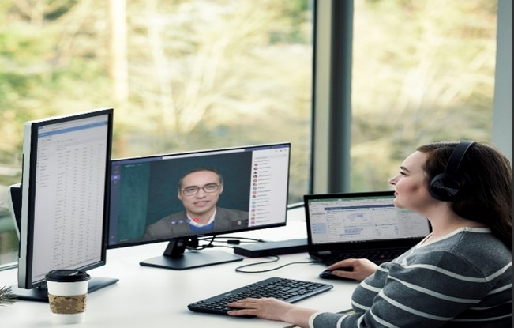

You learned the fundamentals of producing a virtual event using Microsoft Teams and Microsoft 365 services in the Virtual Event Producer fundamentals learning path., In this module, you’ll build on that knowledge and learn how to use an external app or encoder with Microsoft Teams to create custom layouts and mix multiple video and audio feeds. Custom virtual events can help your organization stand out to your audiences. 

## Scenario
We’ll use the following example: You’re the go-to person for producing virtual events at your organization. Your team’s been asked to produce an event for an executive panel with speakers from different sites. Multiple speakers means multiple cameras and audio feeds, so you're going to need custom production tools to create your event.

This module walks through the tools and processes you’ll need to take your event from a static shot of talking heads to a professional event that highlights each speaker.

**Note**: Make sure you’ve completed the Virtual Event fundamentals learning path before diving into this module. We’ll build upon the basic skills you learn there.   

## Learning Objectives
By the end of this module, you’ll be able to: 
- Understand the workflow for producing a virtual event with an external app or encoder 
- Schedule a Teams Live Event to be produced with an external application 
- Produce a custom virtual event in Teams using an external application 
- Leverage external applications like OBS Studio

## Prerequisites
- Familiarity with Microsoft 365 apps and Microsoft Teams. 
- Basic understanding of how to produce and deliver a virtual event using Microsoft Teams and Microsoft 365. 