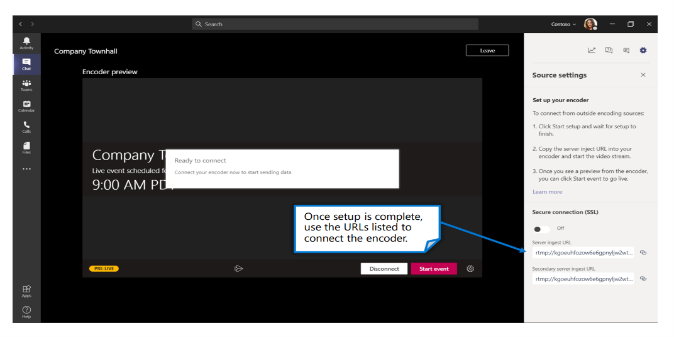
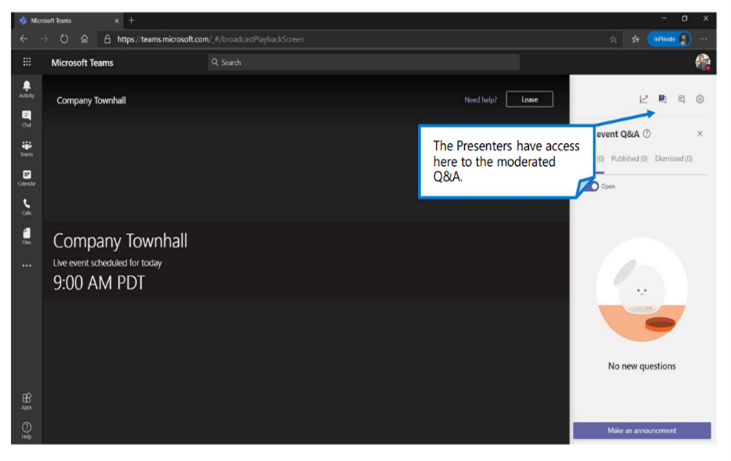

Once you’ve set up the live event and the content source, in this case, using Teams, there are several external applications for production (encoders) that you can use to customize the virtual event experience. An encoder compresses audio and video from various inputs and sends that output to a streaming service. Some popular encoders are OBS Studio, Halvision and Switcher Studio. For your custom live event, you’ll use OBS Studio. 
 

**Note**: Nothing can replace a dress rehearsal. This allows you to test all configurations and content switching to streamline the audience experience. 

## Produce your event using an app/device
To start the production setup, the Producer needs to join the live event from their Teams calendar or Outlook calendar.

After you have joined, click Start Setup to provision the event

Once the setup is complete, use the URLs listed on the bottom right to connect the encoder

**Note**: When a Teams Live Event is produced using an external app or encoder, Presenters for this event will not have any type of audio/video capabilities. They will be able to moderate the Q&A panel (if enabled), chat with the producer(s), and view the live stream within the client.

